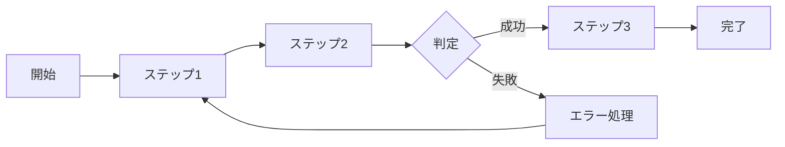
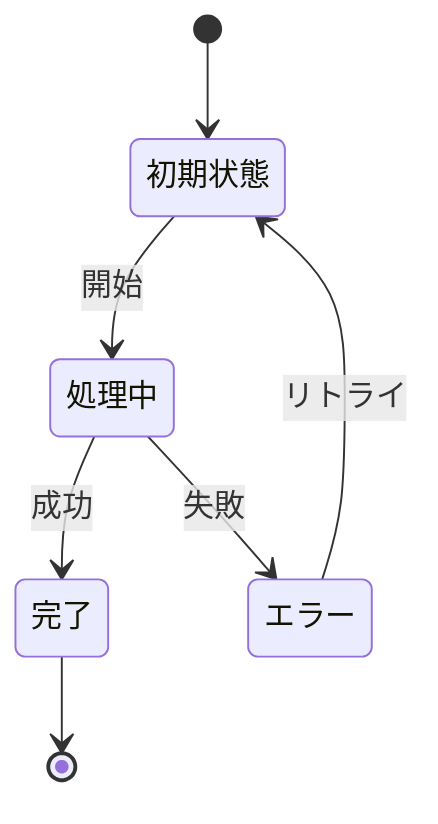

# ビジネスオペレーション: 会議を効率化する

## 概要
**目的**: 会議を効率化することで、ビジネス価値を創出する
**パターン**: CRUD
**ゴール**: 効率的かつ確実に会議を効率化する

## 関係者とロール
- **主要アクター**: このオペレーションを実行する主体
- **関係者1**: オペレーションに関与する関係者
- **関係者2**: オペレーションから影響を受ける関係者

## プロセスフロー

### ステップ詳細
1. **ステップ1**: 初期処理の実行
2. **ステップ2**: メイン処理の実行
3. **ステップ3**: 完了処理の実行

## ビジネス状態

## KPI
- **処理成功率**: 99%以上
- **平均処理時間**: 目標値以内
- **エラー率**: 1%未満

## ビジネスルール
- ルール1: 重要なビジネスルール
- ルール2: 制約事項
- ルール3: 必須要件

## 入出力仕様

### 入力
- **入力1**: 説明
- **入力2**: 説明

### 出力
- **出力1**: 説明
- **出力2**: 説明

## 例外処理
- **エラー1**: 対処方法
- **エラー2**: 対処方法

## 関連ユースケース
- ユースケース1
- ユースケース2
