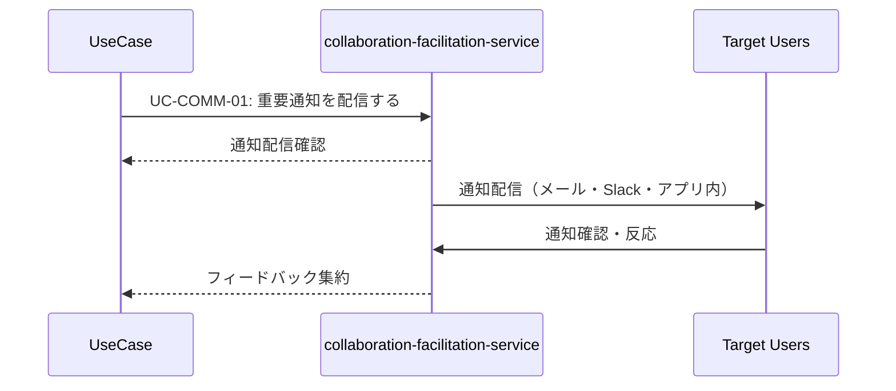

# 通知共通パターン (Notification Pattern)

**バージョン**: v1.0.0
**更新日**: 2025-10-13
**適用範囲**: 通知・コミュニケーションが必要な全ユースケース

## 📋 パターン概要

このパターンは、collaboration-facilitation-serviceを利用した標準的な通知・コミュニケーションフローを定義します。ユースケースの進捗や完了を関係者に効率的に伝達します。

## 🎯 適用ユースケース

- ✅ **必須適用**: 他者との協調が必要なユースケース
- ✅ **推奨適用**: 重要な処理完了時の通知が必要なユースケース
- ✅ **推奨適用**: 承認・レビューフローがあるユースケース
- ❌ **適用外**: 完全に個人内完結するユースケース

## 🔄 標準通知フロー

### 基本シーケンス


### API呼び出し詳細

#### 1. 重要通知配信
```http
POST /api/collaboration/usecases/send-priority-notification
```

**リクエスト**:
```json
{
  "notificationContext": {
    "sourceService": "knowledge-co-creation-service",
    "sourceOperation": "{operation_name}",
    "sourceUsecase": "{usecase_name}",
    "priority": "low|medium|high|critical"
  },
  "notification": {
    "title": "知識品質検証が完了しました",
    "message": "'{knowledge_title}'の品質検証が完了し、総合スコア{score}を獲得しました。",
    "type": "info|success|warning|error",
    "category": "knowledge_validation|knowledge_publication|collaboration"
  },
  "recipients": {
    "primary": ["{user_id}"],
    "secondary": ["{team_id}", "{role:knowledge_reviewer}"],
    "escalation": ["{manager_id}"]
  },
  "delivery": {
    "channels": ["email", "slack", "app_notification"],
    "immediacy": "immediate|batched|scheduled",
    "scheduledAt": "2025-10-13T14:00:00Z"
  },
  "actions": [
    {
      "label": "品質報告を確認",
      "url": "/knowledge/{knowledge_id}/quality-report",
      "type": "primary"
    },
    {
      "label": "知識を公開",
      "url": "/knowledge/{knowledge_id}/publish",
      "type": "secondary"
    }
  ]
}
```

**レスポンス**:
```json
{
  "success": true,
  "data": {
    "notificationId": "notification_uuid",
    "deliveryStatus": {
      "email": "sent",
      "slack": "pending",
      "app_notification": "delivered"
    },
    "estimatedDelivery": "2025-10-13T10:35:00Z",
    "recipients": {
      "successful": 5,
      "failed": 0,
      "pending": 2
    }
  }
}
```

#### 2. 協調空間提供
```http
POST /api/collaboration/usecases/create-collaboration-space
```

**リクエスト**:
```json
{
  "spaceContext": {
    "title": "知識品質向上セッション: {knowledge_title}",
    "description": "AI検証結果を元にした協調的品質向上",
    "resourceId": "{knowledge_id}",
    "resourceType": "knowledge",
    "workflowType": "quality_improvement|collaborative_editing|review_session"
  },
  "participants": [
    {
      "userId": "{user_id}",
      "role": "facilitator|contributor|reviewer|observer",
      "permissions": ["read", "write", "comment", "approve"]
    }
  ],
  "configuration": {
    "realTimeEditing": true,
    "versionControl": true,
    "conflictResolution": "automatic|manual|consensus",
    "sessionDuration": "2 hours",
    "autoSave": true
  }
}
```

**レスポンス**:
```json
{
  "success": true,
  "data": {
    "spaceId": "collaboration_space_uuid",
    "accessUrl": "https://collab.../spaces/{space_id}",
    "wsEndpoint": "wss://api.../ws/collaboration/{space_id}",
    "expiresAt": "2025-10-13T16:30:00Z",
    "participants": {
      "invited": 8,
      "joined": 3,
      "pending": 5
    }
  }
}
```

#### 3. フィードバック収集
```http
POST /api/collaboration/usecases/collect-feedback
```

**リクエスト**:
```json
{
  "feedbackContext": {
    "targetResource": {
      "resourceId": "{knowledge_id}",
      "resourceType": "knowledge",
      "version": "v1.2.0"
    },
    "feedbackType": "rating|comment|suggestion|approval|rejection",
    "scope": "quality|content|usability|accuracy|completeness"
  },
  "collection": {
    "anonymous": false,
    "required": true,
    "deadline": "2025-10-15T18:00:00Z",
    "template": "quality_assessment|general_feedback|expert_review"
  },
  "targets": [
    {
      "type": "role",
      "value": "knowledge_expert"
    },
    {
      "type": "team",
      "value": "quality_assurance_team"
    }
  ]
}
```

## 📨 通知タイプ別テンプレート

### 処理開始通知
```json
{
  "template": "process_started",
  "title": "{process_name}を開始しました",
  "message": "'{resource_name}'に対する{process_name}を開始しました。進捗は随時更新されます。",
  "priority": "medium",
  "actions": [
    {
      "label": "進捗を確認",
      "url": "/progress/{process_id}",
      "type": "primary"
    }
  ]
}
```

### 処理完了通知
```json
{
  "template": "process_completed",
  "title": "{process_name}が完了しました",
  "message": "'{resource_name}'の{process_name}が正常に完了しました。結果をご確認ください。",
  "priority": "high",
  "actions": [
    {
      "label": "結果を確認",
      "url": "/results/{process_id}",
      "type": "primary"
    },
    {
      "label": "次のステップ",
      "url": "/next-steps/{process_id}",
      "type": "secondary"
    }
  ]
}
```

### エラー・警告通知
```json
{
  "template": "process_error",
  "title": "{process_name}でエラーが発生しました",
  "message": "'{resource_name}'の{process_name}中にエラーが発生しました。対応が必要です。",
  "priority": "critical",
  "actions": [
    {
      "label": "エラー詳細",
      "url": "/errors/{process_id}",
      "type": "primary"
    },
    {
      "label": "サポートに連絡",
      "url": "/support/contact",
      "type": "secondary"
    }
  ]
}
```

### 承認・レビュー要求
```json
{
  "template": "approval_request",
  "title": "承認が必要です: {resource_name}",
  "message": "'{resource_name}'の{process_name}完了について、あなたの承認をお待ちしています。",
  "priority": "high",
  "actions": [
    {
      "label": "承認",
      "url": "/approval/{approval_id}/approve",
      "type": "primary"
    },
    {
      "label": "差戻し",
      "url": "/approval/{approval_id}/reject",
      "type": "secondary"
    },
    {
      "label": "詳細確認",
      "url": "/review/{resource_id}",
      "type": "tertiary"
    }
  ]
}
```

## ⚠️ エラーハンドリング

### 通知配信失敗
```json
{
  "error": "NOTIFICATION_DELIVERY_FAILED",
  "message": "通知の配信に失敗しました",
  "code": 500,
  "recovery": {
    "action": "retry_with_fallback",
    "fallbackChannels": ["email", "sms"],
    "retryInterval": "5m",
    "maxRetries": 3
  }
}
```

**対応策**:
1. 代替配信チャネルで再送
2. 重要度に応じたエスカレーション
3. 配信失敗ログの記録

### 受信者不在エラー
```json
{
  "error": "RECIPIENT_UNAVAILABLE",
  "message": "受信者が一時的に利用できません",
  "code": 404,
  "recovery": {
    "action": "queue_for_later",
    "queueDuration": "24h",
    "alternativeRecipients": ["{backup_user_id}"]
  }
}
```

### 配信レート制限
```json
{
  "error": "NOTIFICATION_RATE_LIMIT",
  "message": "通知頻度制限に達しました",
  "code": 429,
  "recovery": {
    "action": "prioritize_and_batch",
    "nextAvailable": "2025-10-13T11:00:00Z",
    "batchNotifications": true
  }
}
```

## 🔧 カスタマイズオプション

### 通知優先度設定
```json
{
  "priorityRules": {
    "critical": {
      "delivery": "immediate",
      "channels": ["email", "sms", "app_notification", "slack"],
      "escalation": true,
      "acknowledgment": "required"
    },
    "high": {
      "delivery": "immediate",
      "channels": ["email", "app_notification", "slack"],
      "escalation": false,
      "acknowledgment": "optional"
    },
    "medium": {
      "delivery": "batched",
      "channels": ["app_notification", "slack"],
      "batchInterval": "30m"
    },
    "low": {
      "delivery": "daily_digest",
      "channels": ["email"],
      "digestTime": "09:00"
    }
  }
}
```

### チャネル別設定
```json
{
  "channelPreferences": {
    "email": {
      "template": "professional",
      "includeActions": true,
      "richContent": true
    },
    "slack": {
      "template": "conversational",
      "includeActions": true,
      "threadReplies": true
    },
    "app_notification": {
      "template": "minimal",
      "includeActions": false,
      "sound": true
    }
  }
}
```

## 📊 分析・レポート

### 配信分析
```json
{
  "deliveryMetrics": {
    "sent": 1250,
    "delivered": 1180,
    "opened": 892,
    "clicked": 234,
    "responded": 89,
    "deliveryRate": 0.944,
    "engagementRate": 0.262
  }
}
```

### 効果測定
```json
{
  "effectivenessMetrics": {
    "responseTime": {
      "median": "2.5 hours",
      "p95": "8 hours",
      "p99": "24 hours"
    },
    "actionCompletionRate": 0.73,
    "satisfactionScore": 4.2
  }
}
```

## 🚀 パフォーマンス最適化

### 配信最適化
- **バッチ処理**: 低優先度通知の効率的バッチ配信
- **キャッシュ活用**: テンプレート・設定情報のキャッシュ
- **非同期処理**: メイン処理をブロックしない非同期配信

### 目標レスポンス時間
- **通知配信開始**: 95%ile < 1s、99%ile < 3s
- **協調空間作成**: 95%ile < 2s、99%ile < 5s
- **フィードバック収集開始**: 95%ile < 1s、99%ile < 3s

## 📝 使用例テンプレート

### 基本的な完了通知
```markdown
## 処理完了通知
{{INCLUDE: notification-pattern#completion-notification}}

### 通知設定
- 対象: 処理実行者、関係チーム
- 優先度: 高
- チャネル: メール、アプリ内通知
```

### 協調セッション開始
```markdown
## 協調作業セッション
{{INCLUDE: notification-pattern#collaboration-session}}

### セッション設定
- 期間: 2時間
- 参加者: 専門家チーム
- 機能: リアルタイム編集、コメント
```

## 🔄 バージョン履歴

- **v1.0.0** (2025-10-13): 初版作成
  - 基本通知フロー定義
  - テンプレート標準化
  - パフォーマンス目標設定

## 🔗 関連パターン

- **authentication-pattern.md**: 通知前の認証確認
- **audit-logging-pattern.md**: 通知配信の監査記録
- **collaboration-pattern.md**: 高度な協調作業パターン