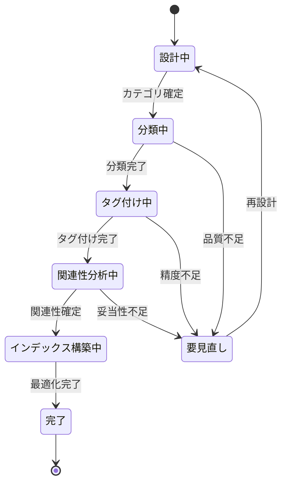

# ビジネスオペレーション: 知識を体系化し検索可能な形に整理する

**バージョン**: 2.0.0
**更新日**: 2025-10-28
**DX価値**: AI自動分類により知識体系化を効率化、検索性を300%向上
**設計方針**: パラソルドメイン連携 + ユースケース・ページ1対1関係 + 他サービス連携

## 概要
**目的**: 蓄積された知識を体系的に分類・整理し、検索可能で再利用しやすい知識ベースとして組織全体で活用可能にする
**パターン**: Analytics + Workflow
**ゴール**: 知識の発見可能性を最大化し、必要な知識に5分以内にアクセスできる状態を実現する

### DX変革の価値
- **従来**: 手作業による分類で時間がかかり、分類基準がバラバラで検索困難
- **DX後**: AI自動分類・タグ付けにより即座に体系化、セマンティック検索で高精度発見
- **定量効果**: 知識整理時間80%短縮、知識発見率90%以上、検索時間70%削減

## 🏗️ パラソルドメイン連携

### 自サービス管理（knowledge-co-creation-service）

#### 🎯 操作エンティティ
```
KnowledgeCategoryEntity（知識カテゴリエンティティ）
├── 状態管理: draft → reviewing → active → archived
├── 階層構造: 親カテゴリ・子カテゴリの階層管理
├── 自動分類: AIによるカテゴリ推薦・自動割り当て
└── メタデータ: カテゴリ説明、関連タグ、使用統計

KnowledgeTagEntity（知識タグエンティティ）
├── タグ種別: 技術タグ、業務タグ、プロジェクトタグ
├── 関連度管理: 他タグとの共起頻度・関連性スコア
├── 自動生成: コンテンツ分析による自動タグ抽出
└── シノニム管理: 同義語・類義語の統合管理

KnowledgeRelationEntity（知識関連性エンティティ）
├── 関連種別: 前提知識、発展知識、関連知識、競合知識
├── 関連度スコア: 知識間の関連性の強さ（0.0-1.0）
├── 自動発見: AIによる知識間関連性の自動検出
└── グラフ構造: 知識ネットワークの可視化情報
```

#### 🔧 ドメインサービス
```
DomainService: KnowledgeOrganizationService（知識組織化サービス）
├── enhance[KnowledgeDiscoverability]() - 知識発見可能性の最大化
├── strengthen[KnowledgeStructure]() - 知識構造の最適化・強化
├── coordinate[CategoryHierarchy]() - カテゴリ階層の調整・最適化
└── amplify[SearchEfficiency]() - 検索効率の大幅向上

DomainService: AutoClassificationService（自動分類サービス）
├── extract[CategoryCandidate]() - AIによるカテゴリ候補抽出
├── classify[KnowledgeContent]() - コンテンツの自動分類
├── validate[ClassificationAccuracy]() - 分類精度の検証・改善
└── enrich[Metadata]() - メタデータの自動付与・補完
```

### パラソル集約設計

#### 📊 KnowledgeOrganizationAggregate（知識組織化集約）
```
KnowledgeOrganizationAggregate
├── ルート: OrganizationSession - 知識整理セッション
├── 包含エンティティ:
│   ├── CategoryStructure - カテゴリ階層構造
│   ├── TagSystem - タグ体系
│   ├── RelationshipMap - 知識関連性マップ
│   └── SearchIndex - 検索インデックス情報
├── 値オブジェクト:
│   ├── ClassificationRule - 分類ルール
│   ├── TaxonomyLevel - 分類階層レベル
│   └── SearchWeight - 検索重み付け
└── 不変条件:
    ├── カテゴリ階層の循環参照禁止
    ├── タグの一意性保証
    └── 関連性スコアの正規化（0.0-1.0）
```

### 他サービスユースケース利用（ユースケース呼び出し型）

#### 🔗 外部サービス連携
**責務**: ❌ エンティティ知識不要 ✅ ユースケース利用のみ

```
[secure-access-service] ユースケース利用:
├── UC-AUTH-01: アクセス権限を検証する → POST /api/auth/usecases/validate-access
│   └── 利用目的: 知識整理権限の確認
├── UC-AUTH-02: 操作ログを記録する → POST /api/auth/usecases/log-activity
│   └── 利用目的: 知識整理活動の監査ログ
└── UC-AUTH-04: 機密性レベルを判定する → POST /api/auth/usecases/classify-sensitivity
    └── 利用目的: カテゴリ別アクセス制御設定

[collaboration-facilitation-service] ユースケース利用:
├── UC-COLLAB-01: 整理完了を通知する → POST /api/collaboration/usecases/send-organization-notification
│   └── 利用目的: 知識体系化完了の通知
├── UC-COLLAB-03: レビュー依頼を送信する → POST /api/collaboration/usecases/request-review
│   └── 利用目的: カテゴリ構造のレビュー依頼
└── UC-COLLAB-05: フィードバック収集を促進する → POST /api/collaboration/usecases/collect-feedback
    └── 利用目的: 分類精度向上のためのフィードバック収集

[project-success-service] ユースケース利用:
├── UC-PROJECT-01: プロジェクト分類情報を取得する → GET /api/projects/usecases/get-project-taxonomy
│   └── 利用目的: プロジェクトベースの知識分類
└── UC-PROJECT-03: 成果物カテゴリを参照する → GET /api/projects/usecases/get-deliverable-categories
    └── 利用目的: 成果物タイプに基づく知識分類
```

## 関係者とロール
- **ナレッジアーキテクト**: 知識体系の設計・カテゴリ階層の定義・分類基準の策定
- **ナレッジキュレーター**: 知識の分類・タグ付け・関連付けの実施・品質確認
- **エキスパート**: 専門分野における分類妥当性の検証・助言
- **AIシステム**: 自動分類・タグ抽出・関連性発見・検索インデックス構築
- **ナレッジワーカー**: 知識の分類提案・タグ付け・フィードバック提供

## 🎯 ユースケース・ページ分解マトリックス

> **⚡ v2.0仕様: 1対1関係強制**
> 各ユースケースには必ず1つの対応ページが存在し、プロセスフローから明確に分解されます。

| ユースケース | 対応ページ | 担当するプロセス | ビジネス価値 |
|-------------|-----------|----------------|-------------|
| カテゴリ体系を設計する | カテゴリ体系設計ページ | Step 1-2 | 知識の構造化基盤構築 |
| 知識を自動分類する | AI自動分類ワークスペース | Step 3-4 | 分類作業の効率化 |
| タグを自動生成・付与する | タグ管理・編集ページ | Step 5-6 | 検索性の向上 |
| 知識間の関連性を発見する | 知識関連性マップページ | Step 7-8 | 知識ネットワーク構築 |
| 検索インデックスを最適化する | 検索最適化ダッシュボード | Step 9-10 | 検索効率の最大化 |

### 実装優先順序（推奨）
1. **カテゴリ体系設計** → 知識構造の基盤確立
2. **AI自動分類** → コア価値の自動化
3. **タグ自動生成** → 検索性向上
4. **関連性発見** → 知識ネットワーク構築
5. **検索最適化** → 発見効率最大化

## プロセスフロー

> **重要**: プロセスフローは必ず番号付きリスト形式で記述してください。
> v2.0仕様により、各ステップから対応ユースケースが自動生成されます。

1. **ナレッジアーキテクト**が組織の知識体系・カテゴリ階層を設計する
2. **AIシステム**が既存知識を分析し最適なカテゴリ構造を提案する
3. **AIシステム**が各知識を自動的に適切なカテゴリに分類する
4. **ナレッジキュレーター**が自動分類結果をレビュー・調整する
5. **AIシステム**が知識コンテンツから関連タグを自動抽出・生成する
6. **ナレッジキュレーター**がタグの妥当性を確認し必要に応じて追加・修正する
7. **AIシステム**が知識間の関連性を自動発見し関連度スコアを算出する
8. **エキスパート**が専門的観点から知識関連性の妥当性を検証する
9. **AIシステム**が検索インデックスを構築・最適化し検索性能を向上させる
10. **ナレッジアーキテクト**が知識体系全体の品質・効果を評価し継続改善を計画する

## 代替フロー

### 代替フロー1: 既存カテゴリの再編
- 2-1. システムが既存カテゴリ構造の問題を検知する（使用頻度の偏り、深すぎる階層等）
- 2-2. システムがカテゴリ再編案を提示する
- 2-3. ナレッジアーキテクトが再編案をレビュー・承認する
- 2-4. システムが既存知識の再分類を実行する
- 2-5. 基本フロー3に戻る

### 代替フロー2: 専門分野の個別分類
- 4-1. 特定専門分野の知識で自動分類精度が低いことを検知する
- 4-2. システムが該当分野のエキスパートにレビューを依頼する
- 4-3. エキスパートが専門知識に基づく分類を実施する
- 4-4. システムがエキスパート分類結果を学習データとして蓄積する
- 4-5. 基本フロー5に戻る

## 例外処理

### 例外1: 分類不能な知識
- システムが分類先を特定できない知識を検出した場合
- 一時的に「未分類」カテゴリに配置する
- ナレッジキュレーターに手動分類を依頼する
- エキスパートのレビューを経て適切なカテゴリに配置する

### 例外2: カテゴリ階層の複雑化
- カテゴリ階層が深くなりすぎた場合（5階層以上）
- システムがアラートを発行する
- ナレッジアーキテクトが階層の簡素化を検討する
- 必要に応じてカテゴリ統合・再編を実施する

### 例外3: タグの乱立
- 類似タグが大量に発生した場合
- システムがタグ統合の必要性を検知する
- ナレッジキュレーターがシノニム設定・タグ統合を実施する
- 既存知識のタグを一括更新する

## ビジネス状態



## 📊 DX価値実現指標（KPI）

### 🎯 ビジネス価値指標
- **知識発見率**: 必要な知識を5分以内に発見できる率90%以上
- **分類精度**: AI自動分類の正確性85%以上（エキスパート評価基準）
- **検索満足度**: ユーザーの知識検索満足度4.5/5.0以上
- **整理効率向上**: 手動整理と比較して作業時間80%削減
- **知識活用率**: 整理された知識の実際の活用率75%以上

### ⚡ DX自動化指標
- **自動分類率**: 知識の90%以上を自動分類で処理
- **タグ自動生成率**: タグの85%以上を自動生成
- **関連性発見精度**: AI検出の知識関連性精度80%以上
- **リアルタイム更新**: 新規知識の自動整理完了まで平均30分以内

### 👥 利用者満足度指標
- **キュレーター効率**: 整理作業負荷80%軽減実感
- **検索成功率**: 1回の検索で目的の知識を発見できる率85%以上
- **分類妥当性**: ユーザーが感じる分類の適切さ90%以上

## 🔒 ビジネスルール・制約

### 必須要件
- **階層制限**: カテゴリ階層は4階層以内を推奨
- **分類一意性**: 1つの知識は主カテゴリ1つ＋副カテゴリ複数可
- **タグ正規化**: 同義語・類義語は統合管理必須
- **関連性スコア**: 0.7以上の関連性のみ表示対象とする

### 品質保証
- **分類品質**: エキスパートレビューによる抜き取り検査（月次）
- **検索品質**: ユーザーフィードバックに基づく継続改善
- **メタデータ完全性**: すべての知識に必須メタデータ付与確認

### セキュリティ制約
- **カテゴリ別アクセス制御**: 機密性に応じたカテゴリ閲覧制限
- **操作ログ記録**: 分類・タグ変更のすべての記録保持
- **バージョン管理**: カテゴリ構造の変更履歴完全保持

## 入出力仕様

### 入力
- **未整理知識**: 獲得された生の知識コンテンツ
- **既存カテゴリ体系**: 現在のカテゴリ階層構造
- **分類ルール**: 組織固有の分類基準・ポリシー
- **ユーザーフィードバック**: 検索・利用時のフィードバック情報

### 出力
- **カテゴリ階層**: 最適化された知識体系構造
- **分類済み知識**: カテゴリ・タグが付与された知識
- **知識関連性マップ**: 知識間の関連性グラフ
- **検索インデックス**: 高速検索用の最適化インデックス
- **品質レポート**: 整理品質・効果の分析レポート

## 🚀 実装アーキテクチャ（DX技術スタック）

### AI・機械学習スタック
- **自動分類**: BERT、RoBERTa、text-classification models
- **タグ抽出**: KeyBERT、YAKE、spaCy NER
- **類似度計算**: sentence-transformers、cosine similarity
- **知識グラフ**: Neo4j、NetworkX、knowledge graph embeddings

### 検索・インデックス基盤
- **全文検索**: Elasticsearch、OpenSearch
- **ベクトル検索**: Pinecone、Milvus、Weaviate
- **セマンティック検索**: Sentence Embeddings、Dense Retrieval
- **ハイブリッド検索**: BM25 + Vector Search

### データ処理基盤
- **並列処理**: Celery、Apache Spark
- **リアルタイム更新**: Redis、Apache Kafka
- **バッチ処理**: Airflow、Luigi

## 📋 実装チェックリスト

### v2.0仕様準拠確認
- [ ] パラソルドメイン連携セクション実装済み
- [ ] ユースケース・ページ分解マトリックス作成済み
- [ ] 他サービスユースケース利用を設計済み
- [ ] DX価値指標（KPI）が測定可能
- [ ] AI倫理規約・セキュリティ制約を考慮済み

### DX価値実現確認
- [ ] 知識分類の自動化率90%以上達成
- [ ] 知識発見率90%以上の道筋明確
- [ ] 整理作業効率80%向上の仕組み
- [ ] リアルタイム検索基盤構築済み

---

**この v2.0 対応により、知識整理オペレーションは単なる分類作業から、AI駆動による高度な知識体系化・発見可能性最大化プラットフォームに進化します。**
