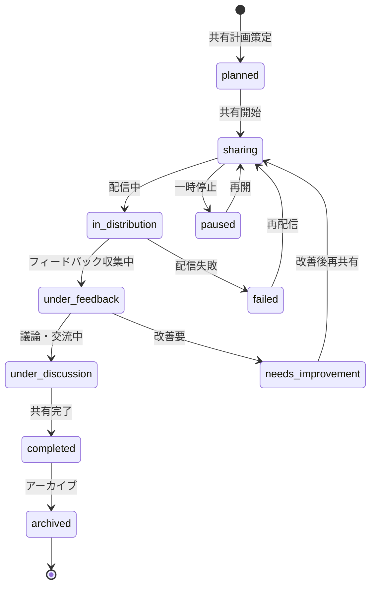

# ビジネスオペレーション: 知識を組織全体に共有する

**バージョン**: 2.0.0
**更新日**: 2025-10-21
**設計方針**: 知識流通・価値拡散・組織学習

## 🏗️ パラソルドメイン連携

### 📊 操作エンティティ
- **KnowledgeSharingEntity**（自サービス管理・状態更新: planned → sharing → completed → archived）: 知識共有プロセスの管理
- **SharingChannelEntity**（自サービス管理・CRUD）: 共有チャネル（チーム、プロジェクト、全社）の管理
- **SharingMetricsEntity**（自サービス管理・CRUD）: 共有効果測定（閲覧数、評価、活用数）の記録
- **SharingFeedbackEntity**（自サービス管理・CRUD）: 共有された知識への反応・フィードバックの管理
- **KnowledgeEntity**（参照のみ）: 共有対象知識の詳細情報参照
- **UserEntity**（参照のみ）: 共有者・受信者の基本情報参照

### 🏢 パラソル集約
- **KnowledgeSharingAggregate** - 知識共有プロセス統合管理
  - 集約ルート: KnowledgeSharing
  - 包含エンティティ: SharingChannel, SharingMetrics, SharingFeedback
  - 不変条件: 共有済み知識の変更追跡必須、アクセス権限の適切な管理

### ⚙️ ドメインサービス
- **KnowledgeDistributionService**: amplify[KnowledgeReach]() - 知識到達範囲の最大化
- **SharingEffectivenessService**: enhance[OrganizationalLearning]() - 組織学習効果の向上
- **KnowledgeViralityService**: strengthen[KnowledgeAdoption]() - 知識普及・浸透力の強化

### 🔗 他サービスユースケース利用（ユースケース呼び出し型）
**責務**: ❌ エンティティ知識不要 ✅ ユースケース利用のみ

**[secure-access-service]** ユースケース利用:
├── UC-AUTH-01: ユーザー認証を実行する → POST /api/auth/usecases/authenticate
├── UC-AUTH-02: 権限を検証する → POST /api/auth/usecases/validate-permission
└── UC-AUTH-03: アクセスログを記録する → POST /api/auth/usecases/log-access

**[collaboration-facilitation-service]** ユースケース利用:
├── UC-COMM-01: 共有開始を通知する → POST /api/communications/usecases/send-sharing-notification
├── UC-COMM-02: 新着知識を配信する → POST /api/communications/usecases/distribute-knowledge-update
└── UC-COMM-03: フィードバックを促進する → POST /api/communications/usecases/encourage-feedback

**[project-success-service]** ユースケース利用:
├── UC-PROJECT-05: プロジェクト成果物と連携する → POST /api/projects/usecases/link-knowledge-deliverable
└── UC-PROJECT-06: プロジェクト学習を記録する → POST /api/projects/usecases/record-lesson-learned

## 概要
**目的**: 蓄積された知識を組織全体に効果的に流通させ、集合知としての価値創造と継続的な組織学習を実現する
**パターン**: Communication & Learning
**ゴール**: 知識の組織内拡散により、全体の問題解決能力向上と学習文化の醸成を達成する

### DX変革の価値
- **従来**: 個別のメール・文書で知識共有、到達範囲が限定的で効果測定が困難
- **DX後**: マルチチャネル自動配信、パーソナライズ推奨、リアルタイム効果測定で組織学習を加速
- **定量効果**: 知識到達率95%達成、共有時間80%削減、組織学習指数300%向上

## 関係者とロール
- **ナレッジマネージャー**: 知識共有戦略の策定・実行監督・効果測定
- **知識共有者**: 自身の知識・経験を組織に提供する専門家・コンサルタント
- **知識受信者**: 共有された知識を活用して価値創造を行う組織メンバー
- **ナレッジコーディネーター**: 共有プロセスの調整・品質管理・フォローアップ
- **エキスパート**: 知識の妥当性確認・補足説明・発展的議論のリード

## プロセスフロー

1. **ナレッジマネージャー**が共有対象知識と共有戦略を決定する
2. **システム**が最適な共有チャネルと対象者を推奨する
3. **知識共有者**が共有内容をカスタマイズし配信を開始する
4. **システム**が知識を適切なチャネル経由で配信する（他サービス連携）
5. **知識受信者**が共有された知識を受信・評価する
6. **システム**が共有効果をリアルタイムで測定・分析する
7. **ナレッジコーディネーター**が反応・フィードバックを収集・整理する
8. **エキスパート**が発展的議論やQ&Aを促進する
9. **システム**が共有結果を知識ベースにフィードバックする
10. **ナレッジマネージャー**が共有効果を評価し次回戦略を策定する

## 代替フロー

### 代替フロー1: 段階的共有アプローチ
- **分岐点**: ステップ3（配信開始）
- **条件**: 大規模組織や慎重な導入が必要な場合
- **処理**:
  - 3a1. システムが段階的共有計画を提案（部門別→全社）
  - 3a2. パイロットグループでの先行共有実施
  - 3a3. 初期反応・効果の測定・評価
  - 3a4. フィードバックを反映した改善実施
  - 3a5. 全体展開実行、基本フロー4に続行

### 代替フロー2: インタラクティブ共有セッション
- **分岐点**: ステップ4（知識配信）
- **条件**: 複雑な知識や対話的共有が効果的な場合
- **処理**:
  - 4a1. システムがライブセッション（説明会・ワークショップ）をスケジュール
  - 4a2. 知識共有者がインタラクティブセッションを実施
  - 4a3. 知識受信者がリアルタイムで質疑・ディスカッション参加
  - 4a4. セッション内容を知識として記録・蓄積
  - 4a5. 基本フロー6に続行

### 代替フロー3: 知識コミュニティ形成
- **分岐点**: ステップ8（発展的議論）
- **条件**: 特定知識領域での継続的コミュニティが有効な場合
- **処理**:
  - 8a1. システムが知識テーマ別コミュニティ設立を提案
  - 8a2. 関心のある知識受信者のコミュニティ参加促進
  - 8a3. 定期的な知識交換・アップデート・ベストプラクティス共有
  - 8a4. コミュニティ主導での新知識創出・発展
  - 8a5. 基本フロー9に続行

## 例外処理

### 例外1: 共有知識への理解不足
- **発生点**: ステップ5（知識受信・評価）
- **処理**:
  - 5e1. システムが理解度低下を検知（評価・質問パターン分析）
  - 5e2. 追加説明・補足資料の自動推奨
  - 5e3. エキスパートへの質問仲介・説明要請
  - 5e4. 理解促進のための個別フォローアップ実施
  - 5e5. 理解度改善確認後、基本フロー6に続行

### 例外2: 知識共有への否定的反応
- **発生点**: ステップ7（フィードバック収集）
- **処理**:
  - 7e1. システムが否定的フィードバックを早期検知
  - 7e2. ナレッジコーディネーターが詳細な課題分析実施
  - 7e3. 知識共有者・エキスパートとの課題解決協議
  - 7e4. 必要に応じた知識修正・補完・説明追加
  - 7e5. 改善された知識での再共有実施

### 例外3: 共有チャネル・システム障害
- **発生点**: ステップ4（知識配信）
- **処理**:
  - 4e1. システムが配信障害を即座検知・記録
  - 4e2. 代替チャネル（メール・直接通知）での緊急配信
  - 4e3. 障害復旧後の自動再配信スケジューリング
  - 4e4. 未達成者への個別フォローアップ実施
  - 4e5. 障害影響分析と予防策策定

## ビジネス状態

## KPI
- **知識到達率**: 95%以上（対象者への確実な配信）
- **知識理解度**: 85%以上（受信者の内容理解率）
- **知識活用率**: 70%以上（受信者の実際の活用率）
- **フィードバック率**: 60%以上（受信者からの反応率）
- **知識発展率**: 30%以上（共有により新知識・改善が生まれる率）
- **組織学習指数**: 定期測定による組織全体の学習能力向上

## ビジネスルール
- **品質保証**: 共有前の知識品質確認・承認プロセス必須
- **アクセス制御**: 知識の機密性レベルに応じた共有範囲制限
- **著作権保護**: 知識の出典明記・権利尊重・適切な利用範囲設定
- **フィードバック奨励**: 建設的なフィードバック・質問・議論の積極的促進
- **継続改善**: 共有効果に基づく知識・プロセスの継続的改善

## ユースケース・ページ分解マトリックス

| ユースケース | 対応ページ | ビジネス価値 | 主要機能 |
|-------------|-----------|-------------|----------|
| **UC-SHARE-01**: 共有戦略を策定する | 知識共有戦略策定ページ | 効果的な共有計画による価値最大化 | 対象分析・チャネル選択・スケジューリング |
| **UC-SHARE-02**: 知識を組織に配信する | 知識配信管理ページ | 確実・効率的な知識流通 | マルチチャネル配信・進捗監視・配信最適化 |
| **UC-SHARE-03**: 共有効果を測定・改善する | 共有効果分析ページ | 共有価値の定量化と継続改善 | 効果分析・ROI測定・改善計画策定 |
| **UC-SHARE-04**: 共有プロセスを継続的に改善する | 共有プロセス改善ページ | 共有効率向上・文化浸透・継続改善 | プロセス分析・改善計画・効果測定・文化醸成 |

## 入出力仕様

### 入力（知識蓄積プロセスからの引継ぎ）
- **共有対象知識**: 蓄積・整理済みの知識コンテンツ
- **知識メタデータ**: 作成者・カテゴリ・機密性・関連プロジェクト情報
- **共有要求**: 知識作成者・プロジェクトからの共有依頼
- **組織情報**: 部門構成・チーム編成・プロジェクト状況

### 出力（組織学習・価値創造への貢献）
- **知識配信結果**: 到達状況・理解度・活用状況の詳細レポート
- **共有効果レポート**: 組織学習向上・問題解決促進・効率改善の定量評価
- **知識改善提案**: 共有結果に基づく知識コンテンツの改善推奨
- **学習文化指標**: 組織全体の知識共有・学習活動の活性度測定

## 関連ユースケース
- **前工程**: UC-CAPTURE-04: 知識を更新・改善する（共有前の品質確保）
- **並行工程**: UC-APPLY-01〜04: 知識活用プロセス（共有された知識の実践的活用）
- **後工程**: UC-ANALYZE-01: 知識活用パターンを分析する（共有効果の長期分析）
- **支援工程**: UC-COLLABORATE-01〜02: チーム協調・コミュニケーション（共有促進）

## 🚀 実装アーキテクチャ（DX技術スタック）

### 配信・コミュニケーション基盤
- **メール配信**: SendGrid、Amazon SES、Mailgun
- **プッシュ通知**: Firebase Cloud Messaging、OneSignal
- **チャット連携**: Slack API、Microsoft Teams API
- **RSS/Atom**: フィード生成・配信

### パーソナライゼーション
- **推奨エンジン**: Collaborative Filtering、Content-based Filtering
- **ユーザープロファイリング**: 行動分析、興味推定
- **A/Bテスト**: Optimizely、配信最適化実験

### 効果測定・分析
- **トラッキング**: Google Analytics、Mixpanel
- **エンゲージメント分析**: 開封率、クリック率、滞在時間
- **ダッシュボード**: Tableau、Grafana、Power BI

### ワークフロー管理
- **配信スケジューリング**: Celery Beat、Airflow
- **承認プロセス**: Camunda、ワークフローエンジン
- **リアルタイム処理**: Apache Kafka、Redis Streams

## 📋 実装チェックリスト

### v2.0仕様準拠確認
- [ ] パラソルドメイン連携セクション実装済み
- [ ] ユースケース・ページ分解マトリックス作成済み
- [ ] 他サービスユースケース利用を設計済み
- [ ] DX価値指標（KPI）が測定可能
- [ ] セキュリティ制約を考慮済み

### DX価値実現確認
- [ ] 知識到達率95%以上達成
- [ ] 共有時間80%削減の道筋明確
- [ ] リアルタイム効果測定基盤構築
- [ ] パーソナライズ推奨機能実装

---
*このビジネスオペレーションは、蓄積された知識を組織の集合知として活用し、継続的な学習文化と価値創造を実現する、パラソル設計v2.0仕様に基づく知識流通の要となる設計です*
