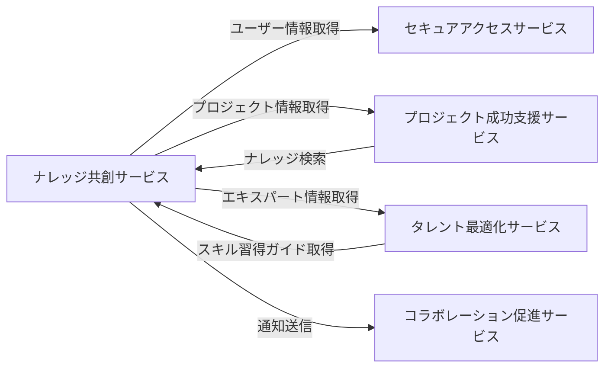

# 統合仕様: ナレッジ共創サービス

## 統合概要
**目的**: ナレッジ共創サービスが他のサービスと連携し、組織の知識を統合的に管理・活用する
**統合パターン**: REST API、イベント駆動、共有データベース参照
**データ形式**: JSON

## サービス間連携マップ



## 依存サービスとの統合

### 1. セキュアアクセスサービス統合

#### 1.1 ユーザー情報取得
**エンドポイント**: `GET /api/v1/secure-access/users/{userId}`
**用途**: 著者・エキスパート情報の取得

#### 1.2 権限チェック
**エンドポイント**: `POST /api/v1/secure-access/authorize`
**用途**: ナレッジの閲覧・編集権限確認

### 2. プロジェクト成功支援サービス統合

#### 2.1 プロジェクト情報取得
**エンドポイント**: `GET /api/v1/project-success/projects/{projectId}`

**使用ケース**:
- プロジェクト関連ナレッジの紐付け
- プロジェクト完了時の教訓登録
- ベストプラクティスの実績証明

#### 2.2 ナレッジ検索の提供
**エンドポイント**: `GET /api/v1/knowledge-co-creation/knowledge/search`

**リクエスト例**:
```json
{
  "q": "アジャイル開発",
  "projectType": "DX",
  "category": "Technical",
  "limit": 10
}
```

### 3. タレント最適化サービス統合

#### 3.1 エキスパート情報登録
**エンドポイント**: `POST /api/v1/knowledge-co-creation/experts`

**リクエスト例**:
```json
{
  "userId": "uuid",
  "expertiseAreas": ["Java", "Spring Boot"],
  "yearsOfExperience": 10,
  "certifications": ["AWS SAA"]
}
```

#### 3.2 スキル開発ガイド提供
**エンドポイント**: `GET /api/v1/knowledge-co-creation/learning-paths`

**パラメータ**:
- `targetSkill`: 目標スキル
- `currentLevel`: 現在のレベル

### 4. コラボレーション促進サービス統合

#### 4.1 ナレッジ公開通知
**エンドポイント**: `POST /api/v1/collaboration-promotion/notifications`

**リクエスト例**:
```json
{
  "type": "KnowledgePublished",
  "title": "新しいナレッジが公開されました",
  "message": "「DXプロジェクトでのアジャイル適用事例」が公開されました",
  "recipients": ["all_members"],
  "relatedResource": {
    "type": "Knowledge",
    "id": "uuid"
  }
}
```

#### 4.2 質問アラート送信
**エンドポイント**: `POST /api/v1/collaboration-promotion/notifications`

**リクエスト例**:
```json
{
  "type": "QuestionAsked",
  "title": "新しい質問が投稿されました",
  "message": "「スクラムでの見積もり方法について」",
  "recipients": ["experts_in_agile"],
  "priority": "Normal"
}
```

## イベント駆動統合

### 発行イベント

#### KnowledgePublished
**発生条件**: ナレッジが公開された時
**サブスクライバー**: コラボレーション促進、タレント最適化

**ペイロード**:
```json
{
  "eventId": "uuid",
  "eventType": "KnowledgePublished",
  "occurredAt": "2024-01-15T00:00:00Z",
  "data": {
    "knowledgeId": "uuid",
    "title": "DXプロジェクトでのアジャイル適用事例",
    "authorId": "uuid",
    "category": "Technical",
    "tags": ["DX", "Agile", "Scrum"]
  }
}
```

#### QuestionAsked
**発生条件**: 新しい質問が投稿された時
**サブスクライバー**: コラボレーション促進、タレント最適化

**ペイロード**:
```json
{
  "eventId": "uuid",
  "eventType": "QuestionAsked",
  "occurredAt": "2024-01-10T00:00:00Z",
  "data": {
    "questionId": "uuid",
    "title": "スクラムでの見積もり方法について",
    "askedBy": "uuid",
    "category": "Process"
  }
}
```

#### ExpertIdentified
**発生条件**: 新しいエキスパートが認定された時
**サブスクライバー**: タレント最適化、コラボレーション促進

**ペイロード**:
```json
{
  "eventId": "uuid",
  "eventType": "ExpertIdentified",
  "occurredAt": "2024-01-05T00:00:00Z",
  "data": {
    "expertId": "uuid",
    "userId": "uuid",
    "expertiseAreas": ["Java", "Spring Boot"]
  }
}
```

#### KnowledgeShareScheduled
**発生条件**: 知識共有セッションが予定された時
**サブスクライバー**: コラボレーション促進

**ペイロード**:
```json
{
  "eventId": "uuid",
  "eventType": "KnowledgeShareScheduled",
  "occurredAt": "2024-01-20T00:00:00Z",
  "data": {
    "sessionId": "uuid",
    "title": "アジャイル実践事例共有会",
    "presenterId": "uuid",
    "scheduledAt": "2024-02-01T14:00:00Z"
  }
}
```

### サブスクライブイベント

#### ProjectCompleted（プロジェクト成功支援サービス）
**用途**: プロジェクト完了時に教訓録を促す通知

#### SkillAcquired（タレント最適化サービス）
**用途**: スキル習得完了時にナレッジ登録を推奨

#### UserCreated（セキュアアクセスサービス）
**用途**: 新規ユーザーに推奨学習パスを提案

## データ同期戦略

### 参照データの同期

#### ユーザー情報キャッシュ
**方式**: イベント駆動 + 定期同期
**更新頻度**: リアルタイム + 日次
**キャッシュ期間**: 24時間

#### プロジェクト情報キャッシュ
**方式**: オンデマンド取得
**更新頻度**: プロジェクト更新イベント受信時
**キャッシュ期間**: 1時間

### 整合性担保
- イベント再送機構（3回まで）
- 定期的な整合性チェックバッチ
- Knowledge集約内はACID保証

## エラーハンドリング

### リトライポリシー
```json
{
  "maxRetries": 3,
  "retryIntervals": [1000, 3000, 10000],
  "retryableErrors": [500, 502, 503, 504],
  "timeoutMs": 5000
}
```

### フォールバック戦略
- ユーザー情報: キャッシュデータを使用
- プロジェクト情報: 前回取得データを使用
- エキスパート情報: デフォルトリストを表示

## セキュリティ

### サービス間認証
- **方式**: JWT（Service-to-Service Token）
- **有効期間**: 1時間

### データ暗号化
- **通信**: TLS 1.3
- **機密データ**: AES-256（Restrictedナレッジ）

### APIレート制限
```json
{
  "service": "knowledge-co-creation",
  "limits": {
    "search": {"requests": 100, "period": "1h"},
    "upload": {"requests": 50, "period": "1h"},
    "general": {"requests": 1000, "period": "1h"}
  }
}
```

## モニタリング

### メトリクス
- ナレッジ公開数（日次/月次）
- 検索クエリ数とヒット率
- エキスパート相談応答率
- セッション参加率

### アラート条件
- 検索ヒット率 < 50%
- 質問未回答率 > 30%
- セッション参加率 < 50%
