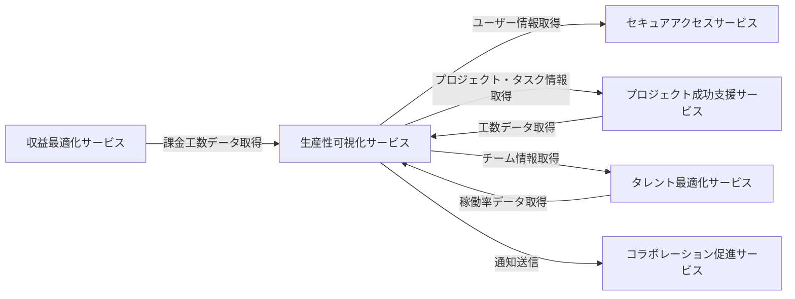

# 統合仕様: 生産性可視化サービス

## 統合概要
**目的**: 生産性可視化サービスが他のサービスと連携し、工数データを統合的に管理・分析する
**統合パターン**: REST API、イベント駆動、共有データベース参照
**データ形式**: JSON

## サービス間連携マップ



## 依存サービスとの統合

### 1. セキュアアクセスサービス統合

#### 1.1 ユーザー情報取得
**エンドポイント**: `GET /api/v1/secure-access/users/{userId}`
**用途**: タイムシート作成者・承認者情報の取得

#### 1.2 権限チェック
**エンドポイント**: `POST /api/v1/secure-access/authorize`
**用途**: タイムシートの閲覧・承認権限確認

**リクエスト例**:
```json
{
  "userId": "uuid",
  "resource": "timesheet",
  "action": "approve",
  "resourceId": "uuid"
}
```

### 2. プロジェクト成功支援サービス統合

#### 2.1 プロジェクト情報取得
**エンドポイント**: `GET /api/v1/project-success/projects/{projectId}`

**使用ケース**:
- 工数記録時のプロジェクト検証
- プロジェクト別工数集計
- プロジェクト進捗と工数の関連分析

#### 2.2 タスク情報取得
**エンドポイント**: `GET /api/v1/project-success/tasks/{taskId}`

**使用ケース**:
- 工数記録時のタスク検証
- タスク別工数トラッキング
- タスク見積もりと実績の比較

#### 2.3 工数データの提供
**エンドポイント**: `GET /api/v1/productivity-visualization/timesheets/by-project`

**リクエスト例**:
```json
{
  "projectId": "uuid",
  "startDate": "2024-01-01",
  "endDate": "2024-01-31"
}
```

**レスポンス例**:
```json
{
  "projectId": "uuid",
  "totalHours": 320.0,
  "billableHours": 280.0,
  "breakdown": [
    {
      "userId": "uuid",
      "userName": "山田太郎",
      "hours": 160.0,
      "billableHours": 140.0
    }
  ]
}
```

### 3. タレント最適化サービス統合

#### 3.1 チーム情報取得
**エンドポイント**: `GET /api/v1/talent-optimization/teams/{teamId}`

**使用ケース**:
- チーム稼働率の計算
- チームメンバーの工数集計

#### 3.2 チーム稼働率の提供
**エンドポイント**: `GET /api/v1/productivity-visualization/utilization-rates/team/{teamId}`

**パラメータ**:
- `periodType`: 期間タイプ (Weekly/Monthly/Quarterly)
- `periodStart`: 期間開始日
- `periodEnd`: 期間終了日

**レスポンス例**:
```json
{
  "teamId": "uuid",
  "periodType": "Monthly",
  "periodStart": "2024-01-01",
  "periodEnd": "2024-01-31",
  "teamUtilizationRate": 87.5,
  "teamBillableRate": 78.3,
  "members": [
    {
      "userId": "uuid",
      "userName": "山田太郎",
      "utilizationRate": 95.0,
      "billableRate": 84.2
    }
  ]
}
```

### 4. 収益最適化サービス統合

#### 4.1 課金工数データの提供
**エンドポイント**: `GET /api/v1/productivity-visualization/timesheets/billable`

**使用ケース**:
- 請求額計算のための課金工数提供
- プロジェクト収益性分析

**リクエスト例**:
```json
{
  "projectId": "uuid",
  "startDate": "2024-01-01",
  "endDate": "2024-01-31",
  "status": "Approved"
}
```

**レスポンス例**:
```json
{
  "projectId": "uuid",
  "period": {
    "start": "2024-01-01",
    "end": "2024-01-31"
  },
  "totalBillableHours": 280.0,
  "breakdown": [
    {
      "userId": "uuid",
      "userName": "山田太郎",
      "billableHours": 140.0,
      "hourlyRate": 10000,
      "amount": 1400000
    }
  ]
}
```

### 5. コラボレーション促進サービス統合

#### 5.1 タイムシート提出通知
**エンドポイント**: `POST /api/v1/collaboration-promotion/notifications`

**リクエスト例**:
```json
{
  "type": "TimesheetSubmitted",
  "title": "タイムシートが提出されました",
  "message": "山田太郎さんのタイムシート（2024/01/01-2024/01/07）が提出されました",
  "recipients": ["approver_id"],
  "priority": "Normal",
  "relatedResource": {
    "type": "Timesheet",
    "id": "uuid"
  }
}
```

#### 5.2 承認リマインド送信
**エンドポイント**: `POST /api/v1/collaboration-promotion/notifications`

**リクエスト例**:
```json
{
  "type": "ApprovalReminder",
  "title": "タイムシート承認のリマインダー",
  "message": "承認待ちのタイムシートが5件あります",
  "recipients": ["approver_id"],
  "priority": "High"
}
```

#### 5.3 残業アラート送信
**エンドポイント**: `POST /api/v1/collaboration-promotion/notifications`

**リクエスト例**:
```json
{
  "type": "OvertimeAlert",
  "title": "残業時間超過アラート",
  "message": "山田太郎さんの残業時間が月40時間を超えました",
  "recipients": ["manager_id", "hr_id"],
  "priority": "High",
  "relatedResource": {
    "type": "User",
    "id": "uuid"
  }
}
```

## イベント駆動統合

### 発行イベント

#### TimesheetSubmitted
**発生条件**: タイムシートが提出された時
**サブスクライバー**: コラボレーション促進、プロジェクト成功支援

**ペイロード**:
```json
{
  "eventId": "uuid",
  "eventType": "TimesheetSubmitted",
  "occurredAt": "2024-01-08T09:00:00Z",
  "data": {
    "timesheetId": "uuid",
    "userId": "uuid",
    "periodStart": "2024-01-01",
    "periodEnd": "2024-01-07",
    "totalHours": 40.0,
    "billableHours": 32.0,
    "submittedBy": "uuid",
    "submittedAt": "2024-01-08T09:00:00Z"
  }
}
```

#### TimesheetApproved
**発生条件**: タイムシートが承認された時
**サブスクライバー**: 収益最適化、プロジェクト成功支援、コラボレーション促進

**ペイロード**:
```json
{
  "eventId": "uuid",
  "eventType": "TimesheetApproved",
  "occurredAt": "2024-01-08T14:00:00Z",
  "data": {
    "timesheetId": "uuid",
    "userId": "uuid",
    "periodStart": "2024-01-01",
    "periodEnd": "2024-01-07",
    "billableHours": 32.0,
    "approvedBy": "uuid",
    "approvedAt": "2024-01-08T14:00:00Z"
  }
}
```

#### OvertimeDetected
**発生条件**: 規定時間を超える残業が記録された時
**サブスクライバー**: タレント最適化、コラボレーション促進

**ペイロード**:
```json
{
  "eventId": "uuid",
  "eventType": "OvertimeDetected",
  "occurredAt": "2024-01-15T18:00:00Z",
  "data": {
    "userId": "uuid",
    "date": "2024-01-15",
    "overtimeHours": 3.0,
    "totalHours": 11.0,
    "monthlyOvertimeTotal": 45.0
  }
}
```

#### LowUtilizationAlert
**発生条件**: 稼働率が閾値を下回った時
**サブスクライバー**: タレント最適化、プロジェクト成功支援

**ペイロード**:
```json
{
  "eventId": "uuid",
  "eventType": "LowUtilizationAlert",
  "occurredAt": "2024-02-01T00:00:00Z",
  "data": {
    "userId": "uuid",
    "period": "2024-01",
    "utilizationRate": 65.0,
    "threshold": 70.0,
    "availableHours": 160.0,
    "actualHours": 104.0
  }
}
```

#### HighUtilizationAlert
**発生条件**: 稼働率が上限閾値を超えた時
**サブスクライバー**: タレント最適化、コラボレーション促進

**ペイロード**:
```json
{
  "eventId": "uuid",
  "eventType": "HighUtilizationAlert",
  "occurredAt": "2024-02-01T00:00:00Z",
  "data": {
    "userId": "uuid",
    "period": "2024-01",
    "utilizationRate": 120.0,
    "threshold": 100.0,
    "availableHours": 160.0,
    "actualHours": 192.0
  }
}
```

### サブスクライブイベント

#### ProjectCreated（プロジェクト成功支援サービス）
**用途**: 新規プロジェクトの工数記録準備

#### TaskCreated（プロジェクト成功支援サービス）
**用途**: タスク別工数記録の準備

#### TeamMemberAdded（タレント最適化サービス）
**用途**: チーム稼働率計算対象の更新

#### WorkPatternChanged（タレント最適化サービス）
**用途**: 個人の勤務パターン変更に伴う稼働率再計算

## データ同期戦略

### 参照データの同期

#### ユーザー情報キャッシュ
**方式**: イベント駆動 + 定期同期
**更新頻度**: リアルタイム + 日次
**キャッシュ期間**: 24時間

#### プロジェクト情報キャッシュ
**方式**: オンデマンド取得
**更新頻度**: プロジェクト更新イベント受信時
**キャッシュ期間**: 1時間

#### チーム情報キャッシュ
**方式**: イベント駆動
**更新頻度**: チーム変更イベント受信時
**キャッシュ期間**: 12時間

### 整合性担保
- イベント再送機構（3回まで）
- 定期的な整合性チェックバッチ（日次）
- Timesheet集約内はACID保証
- 承認ワークフローのトランザクション管理

## エラーハンドリング

### リトライポリシー
```json
{
  "maxRetries": 3,
  "retryIntervals": [1000, 3000, 10000],
  "retryableErrors": [500, 502, 503, 504],
  "timeoutMs": 5000
}
```

### フォールバック戦略
- **ユーザー情報**: キャッシュデータを使用
- **プロジェクト情報**: 前回取得データを使用
- **チーム情報**: デフォルトリストを表示
- **承認処理エラー**: 管理者に通知し手動承認へ

### エラー通知
```json
{
  "severity": "Error",
  "service": "productivity-visualization",
  "operation": "approveTimesheet",
  "errorCode": "APPROVAL_WORKFLOW_ERROR",
  "message": "承認ワークフローの実行に失敗しました",
  "timesheetId": "uuid",
  "timestamp": "2024-01-08T14:00:00Z"
}
```

## セキュリティ

### サービス間認証
- **方式**: JWT（Service-to-Service Token）
- **有効期間**: 1時間
- **更新**: 30分前に自動更新

### データ暗号化
- **通信**: TLS 1.3
- **機密データ**: AES-256（個人の工数詳細データ）

### APIレート制限
```json
{
  "service": "productivity-visualization",
  "limits": {
    "timesheetQuery": {"requests": 100, "period": "1h"},
    "timesheetSubmit": {"requests": 50, "period": "1h"},
    "utilizationCalculate": {"requests": 20, "period": "1h"},
    "general": {"requests": 1000, "period": "1h"}
  }
}
```

### データアクセス制御
```json
{
  "resource": "timesheet",
  "policies": [
    {
      "role": "owner",
      "actions": ["read", "create", "update", "submit"]
    },
    {
      "role": "approver",
      "actions": ["read", "approve", "reject"]
    },
    {
      "role": "manager",
      "actions": ["read", "view_team"]
    },
    {
      "role": "admin",
      "actions": ["*"]
    }
  ]
}
```

## モニタリング

### メトリクス
- タイムシート提出数（日次/週次）
- 承認処理時間（平均/最大）
- 稼働率分布（チーム別/個人別）
- 残業時間トレンド
- 課金率推移

### アラート条件
- 承認待ちタイムシート > 50件
- 承認処理時間 > 24時間
- 平均稼働率 < 70% または > 100%
- 月間残業時間 > 45時間/人
- タイムシート提出率 < 80%

### ダッシュボード
```json
{
  "metrics": {
    "timesheetSubmissionRate": {
      "current": 92.5,
      "target": 95.0,
      "trend": "Improving"
    },
    "averageApprovalTime": {
      "current": 8.5,
      "target": 12.0,
      "unit": "hours"
    },
    "teamUtilizationRate": {
      "current": 87.5,
      "target": 85.0,
      "range": [80, 90]
    },
    "overtimeRate": {
      "current": 12.3,
      "target": 10.0,
      "unit": "hours/person/month"
    }
  }
}
```

## バッチ処理

### 定期実行ジョブ

#### 稼働率計算ジョブ
**実行頻度**: 日次（深夜1時）
**処理内容**:
- 前日の個人稼働率計算
- 週次・月次・四半期稼働率の更新
- 稼働率アラートの発行

#### 承認リマインダージョブ
**実行頻度**: 日次（朝9時）
**処理内容**:
- 承認待ちタイムシートの抽出
- 承認者へのリマインダー通知送信

#### 生産性指標計算ジョブ
**実行頻度**: 月次（月初）
**処理内容**:
- 前月の生産性指標計算
- トレンド分析
- 改善提案の生成

### データクリーンアップ
```sql
-- 古いドラフトタイムシートの削除（30日以上前）
DELETE FROM timesheets
WHERE status = 'Draft' AND created_at < NOW() - INTERVAL '30 days';

-- 古い工数記録のアーカイブ（2年以上前）
INSERT INTO time_entries_archive
SELECT * FROM time_entries
WHERE date < NOW() - INTERVAL '2 years';
```

## SLA（Service Level Agreement）

### 可用性
- **目標**: 99.5%以上
- **計測期間**: 月次
- **ダウンタイム許容**: 3.6時間/月

### パフォーマンス
- **タイムシート登録**: 95%のリクエストが200ms以内
- **稼働率計算**: 95%のリクエストが500ms以内
- **承認処理**: 95%のリクエストが300ms以内

### データ整合性
- **タイムシート合計工数**: 100%正確
- **稼働率計算**: 99.9%正確
- **承認ワークフロー**: 100%信頼性
