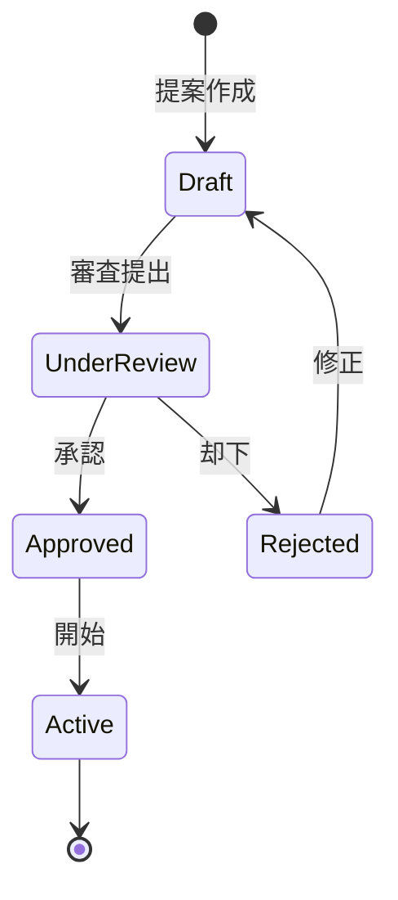
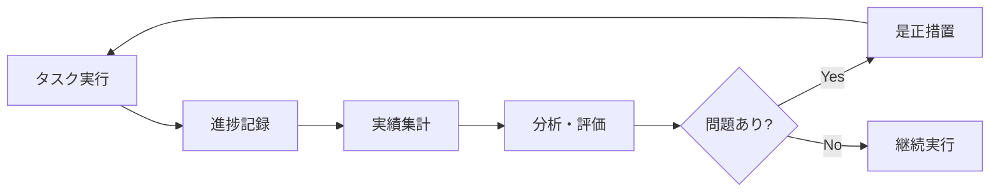
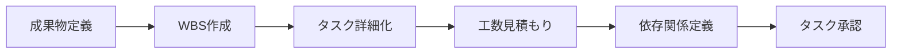
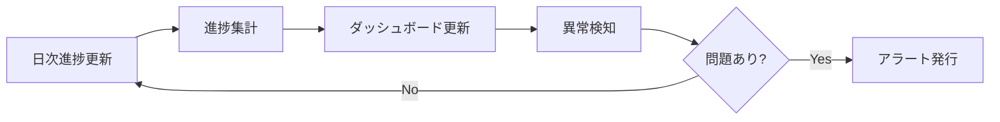
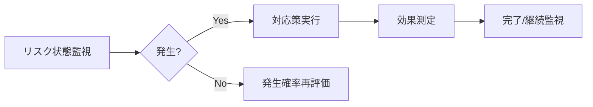
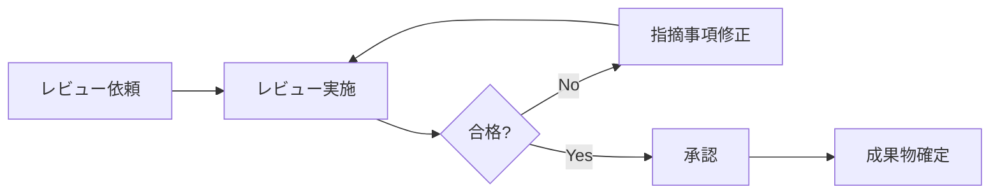

# プロジェクト成功支援サービス - ケーパビリティとビジネスオペレーション設計

**バージョン**: 1.0.0
**更新日**: 2024-12-30

## サービス概要

プロジェクトを成功に導くための包括的な管理・支援サービス。プロジェクト計画、タスク管理、リスク管理、成果物管理、マイルストーン管理を通じて、プロジェクトの確実な完遂を実現する。

## ビジネスケーパビリティ定義

### 1. プロジェクトを計画し実行する能力

**定義**: プロジェクトの立ち上げから完了まで、体系的に計画・実行・監視・完了する組織能力

**責務**:
- プロジェクト計画の策定と承認
- プロジェクト実行の管理と監視
- プロジェクト進捗の可視化
- プロジェクト完了と評価

**提供価値**:
- **計画的実行**: 体系的な計画により、プロジェクトの成功確率を向上
- **進捗可視化**: リアルタイムな進捗把握により、早期の問題発見と対応
- **品質保証**: 一貫したプロセスにより、成果物の品質を担保

**実現手段**: 以下のビジネスオペレーション
- プロジェクトを立ち上げる
- プロジェクトを実行し監視する
- プロジェクトを完了し評価する

---

### 2. タスクを管理し完遂する能力

**定義**: プロジェクト内のタスクを効率的に分解・割り当て・追跡・完了する組織能力

**責務**:
- タスクの適切な分解と定義
- タスクの優先順位付けと割り当て
- タスク進捗の追跡と管理
- タスク完了の確認と品質チェック

**提供価値**:
- **実行効率化**: 適切なタスク分解により、チームの生産性を向上
- **責任明確化**: タスク割り当てにより、誰が何をするかを明確化
- **ボトルネック解消**: タスク進捗の可視化により、遅延を早期発見

**実現手段**: 以下のビジネスオペレーション
- タスクを分解し定義する
- タスクを割り当て実行する
- タスクの進捗を追跡する

---

### 3. リスクを予見し対処する能力

**定義**: プロジェクトに影響を与える潜在的リスクを早期発見し、適切に対処する組織能力

**責務**:
- リスクの識別と評価
- リスク対応計画の策定
- リスク監視と早期警告
- リスク対応の実行と効果測定

**提供価値**:
- **予防的対応**: 事前のリスク識別により、問題の未然防止
- **損失最小化**: 適切な対応計画により、リスク発生時の影響を最小化
- **意思決定支援**: リスク情報の可視化により、経営判断を支援

**実現手段**: 以下のビジネスオペレーション
- リスクを識別し評価する
- リスク対応計画を策定する
- リスクを監視し対処する

---

### 4. 成果物を管理し品質を保証する能力

**定義**: プロジェクトの成果物を一元管理し、品質基準を満たすことを保証する組織能力

**責務**:
- 成果物の定義と品質基準設定
- 成果物の作成と承認プロセス管理
- 成果物のバージョン管理
- 成果物の品質レビューと承認

**提供価値**:
- **品質保証**: 体系的なレビュープロセスにより、高品質な成果物を担保
- **トレーサビリティ**: バージョン管理により、変更履歴を追跡可能
- **再利用促進**: 成果物の一元管理により、ナレッジの再利用を促進

**実現手段**: 以下のビジネスオペレーション
- 成果物を定義し作成する
- 成果物をレビューし承認する
- 成果物をバージョン管理する

---

## ビジネスオペレーション詳細定義

### ケーパビリティ1: プロジェクトを計画し実行する能力

#### オペレーション1-1: プロジェクトを立ち上げる

**パターン**: Workflow

**目的**: プロジェクトの目的・スコープ・体制を定義し、承認を得て正式に開始する

**ゴール**: 承認されたプロジェクト計画書が作成され、プロジェクトが正式に開始される

**関係者とロール**:
- **エグゼクティブ**: プロジェクト承認、予算承認
- **PM**: プロジェクト計画策定、チーム編成
- **コンサルタント**: 計画支援、実行可能性評価

**プロセスフロー**:

**ビジネス状態**:

**KPI**:
- **計画策定期間**: 平均2週間以内
- **承認率**: 80%以上
- **計画変更率**: 初回計画からの変更20%以内

**入出力**:
- **入力**: プロジェクト提案書、ビジネス要件
- **出力**: プロジェクト計画書、承認文書、チーム体制図

---

#### オペレーション1-2: プロジェクトを実行し監視する

**パターン**: Workflow + Analytics

**目的**: 計画に基づきプロジェクトを実行し、進捗・コスト・品質を継続的に監視する

**ゴール**: 計画通りにプロジェクトが進行し、逸脱が早期に発見・対処される

**関係者とロール**:
- **PM**: 全体進捗管理、課題解決、ステークホルダー調整
- **コンサルタント**: タスク実行、進捗報告
- **クライアント**: レビュー、フィードバック提供

**プロセスフロー**:

**ビジネス状態**:
- OnTrack（順調）
- AtRisk（リスクあり）
- Delayed（遅延）
- Blocked（ブロック）

**KPI**:
- **スケジュール遵守率**: 90%以上
- **コスト遵守率**: 予算内95%以上
- **課題解決時間**: 平均3日以内

---

#### オペレーション1-3: プロジェクトを完了し評価する

**パターン**: Workflow + Analytics

**目的**: プロジェクトの成果物を確定し、目標達成度を評価し、教訓を抽出する

**ゴール**: 成果物が承認され、プロジェクトが正式に完了し、教訓が次に活かされる

**関係者とロール**:
- **PM**: 完了報告作成、振り返り実施
- **エグゼクティブ**: 最終承認、評価
- **全チームメンバー**: 振り返り参加、教訓提供

**プロセスフロー**:

**KPI**:
- **目標達成率**: 90%以上
- **クライアント満足度**: 4.0/5.0以上
- **教訓文書化率**: 100%

---

### ケーパビリティ2: タスクを管理し完遂する能力

#### オペレーション2-1: タスクを分解し定義する

**パターン**: CRUD + Workflow

**目的**: プロジェクトの成果物を実現可能な作業単位（タスク）に分解し、明確に定義する

**ゴール**: すべての必要作業が漏れなく、適切な粒度でタスク化される

**関係者とロール**:
- **PM**: WBS作成、タスク定義レビュー
- **コンサルタント**: タスク詳細定義、工数見積もり

**プロセスフロー**:

**KPI**:
- **タスク粒度**: 1タスク = 0.5〜5日
- **見積もり精度**: 実績との差異±20%以内
- **タスク完全性**: 計画外タスク発生率10%以下

---

#### オペレーション2-2: タスクを割り当て実行する

**パターン**: Workflow

**目的**: タスクを適切なメンバーに割り当て、効率的に実行する

**ゴール**: 各メンバーのスキルと稼働状況に応じた最適な割り当てが行われる

**関係者とロール**:
- **PM**: タスク割り当て、リソース調整
- **コンサルタント**: タスク実行、完了報告

**プロセスフロー**:

**KPI**:
- **稼働率**: メンバー平均80-90%
- **タスク完了率**: 計画通り90%以上
- **品質合格率**: 1回目レビュー80%以上

---

#### オペレーション2-3: タスクの進捗を追跡する

**パターン**: Analytics

**目的**: すべてのタスクの進捗状況を可視化し、遅延やボトルネックを早期発見する

**ゴール**: リアルタイムな進捗把握により、問題の早期対処が可能になる

**関係者とロール**:
- **PM**: 進捗レビュー、課題抽出
- **コンサルタント**: 進捗報告、課題報告

**プロセスフロー**:

**KPI**:
- **進捗報告頻度**: 日次更新率95%以上
- **遅延検知時間**: 発生から24時間以内
- **ボトルネック解消率**: 発見から3日以内80%

---

### ケーパビリティ3: リスクを予見し対処する能力

#### オペレーション3-1: リスクを識別し評価する

**パターン**: CRUD + Analytics

**目的**: プロジェクトに影響を与える可能性のあるリスクを洗い出し、影響度を評価する

**ゴール**: 重要なリスクが漏れなく識別され、優先順位が明確になる

**関係者とロール**:
- **PM**: リスク管理全体統括
- **全チームメンバー**: リスク識別、報告

**プロセスフロー**:

**KPI**:
- **リスク識別数**: プロジェクト規模に応じて適切な数
- **重大リスク発現率**: 未識別の重大リスク発現0件
- **リスク評価精度**: 実際の影響との差異±1段階以内

---

#### オペレーション3-2: リスク対応計画を策定する

**パターン**: Workflow

**目的**: 識別されたリスクに対する具体的な対応策を計画する

**ゴール**: すべての重要リスクに対して実行可能な対応策が準備される

**関係者とロール**:
- **PM**: 対応戦略決定、計画承認
- **担当コンサルタント**: 具体的対応策立案

**プロセスフロー**:

**KPI**:
- **対応計画策定率**: 高・中リスク100%
- **計画実行可能性**: 実行率90%以上
- **対応策有効性**: リスク低減率70%以上

---

#### オペレーション3-3: リスクを監視し対処する

**パターン**: Workflow + Analytics

**目的**: リスクの状態を継続的に監視し、発生時に迅速に対処する

**ゴール**: リスクの早期発見と迅速な対応により、プロジェクトへの影響を最小化する

**関係者とロール**:
- **PM**: リスク状況レビュー、対応指示
- **担当者**: リスク監視、対応実行

**プロセスフロー**:

**KPI**:
- **監視頻度**: 週次レビュー実施率100%
- **対応開始時間**: リスク発生から24時間以内
- **影響最小化率**: 計画通り対処80%以上

---

### ケーパビリティ4: 成果物を管理し品質を保証する能力

#### オペレーション4-1: 成果物を定義し作成する

**パターン**: CRUD + Workflow

**目的**: プロジェクトで作成すべき成果物を明確に定義し、計画通りに作成する

**ゴール**: 品質基準を満たした成果物が期限通りに作成される

**関係者とロール**:
- **PM**: 成果物定義、品質基準設定
- **コンサルタント**: 成果物作成
- **クライアント**: 要件提供、中間確認

**プロセスフロー**:

**KPI**:
- **納期遵守率**: 95%以上
- **初回品質合格率**: 80%以上
- **要件充足率**: 100%

---

#### オペレーション4-2: 成果物をレビューし承認する

**パターン**: Workflow

**目的**: 成果物の品質を複数の視点でレビューし、基準を満たすことを確認する

**ゴール**: 高品質な成果物のみが承認され、次工程に進む

**関係者とロール**:
- **作成者**: 指摘事項への対応
- **レビュアー**: 品質チェック、改善指摘
- **承認者**: 最終承認判断

**プロセスフロー**:

**KPI**:
- **レビュー完了時間**: 依頼から3営業日以内
- **指摘事項対応率**: 100%
- **再レビュー率**: 20%以下

---

#### オペレーション4-3: 成果物をバージョン管理する

**パターン**: CRUD

**目的**: 成果物の変更履歴を記録し、任意の時点に戻せるようにする

**ゴール**: すべての成果物の変更が追跡可能で、過去バージョンへのアクセスが可能

**関係者とロール**:
- **PM**: バージョン管理ルール策定
- **全メンバー**: バージョン管理ルール遵守

**プロセスフロー**:

**KPI**:
- **バージョン管理率**: 100%
- **変更履歴記録率**: 100%
- **ロールバック成功率**: 100%

---

## ユースケース一覧（各オペレーションから派生）

### オペレーション1-1: プロジェクトを立ち上げる
1. プロジェクト提案を作成する
2. プロジェクト計画を策定する
3. プロジェクト承認を得る
4. プロジェクトチームを編成する

### オペレーション1-2: プロジェクトを実行し監視する
1. タスクを実行する
2. 進捗を記録する
3. 進捗レポートを作成する
4. 課題を識別し対処する

### オペレーション1-3: プロジェクトを完了し評価する
1. 最終成果物を確定する
2. プロジェクト完了報告を作成する
3. プロジェクト振り返りを実施する
4. 教訓を文書化する

### オペレーション2-1: タスクを分解し定義する
1. WBSを作成する
2. タスクを詳細定義する
3. タスク工数を見積もる
4. タスク依存関係を定義する

### オペレーション2-2: タスクを割り当て実行する
1. タスクをメンバーに割り当てる
2. タスクを開始する
3. タスクを完了する
4. 成果物を提出する

### オペレーション2-3: タスクの進捗を追跡する
1. 進捗率を更新する
2. 進捗ダッシュボードを表示する
3. 遅延アラートを発行する
4. 進捗レビュー会議を実施する

### オペレーション3-1: リスクを識別し評価する
1. リスクを登録する
2. リスク影響度を評価する
3. リスク発生確率を評価する
4. リスクマトリクスを表示する

### オペレーション3-2: リスク対応計画を策定する
1. リスク対応戦略を決定する
2. 具体的対応策を立案する
3. 対応計画を承認する
4. 対応責任者を割り当てる

### オペレーション3-3: リスクを監視し対処する
1. リスク状態を更新する
2. リスクアラートを発行する
3. リスク対応を実行する
4. リスク対応効果を評価する

### オペレーション4-1: 成果物を定義し作成する
1. 成果物テンプレートを選択する
2. 成果物を作成する
3. 成果物をセルフチェックする
4. 成果物を提出する

### オペレーション4-2: 成果物をレビューし承認する
1. レビューを依頼する
2. レビューコメントを記入する
3. 指摘事項を修正する
4. 成果物を承認する

### オペレーション4-3: 成果物をバージョン管理する
1. 新バージョンを保存する
2. 変更履歴を表示する
3. 過去バージョンを復元する
4. バージョン差分を比較する