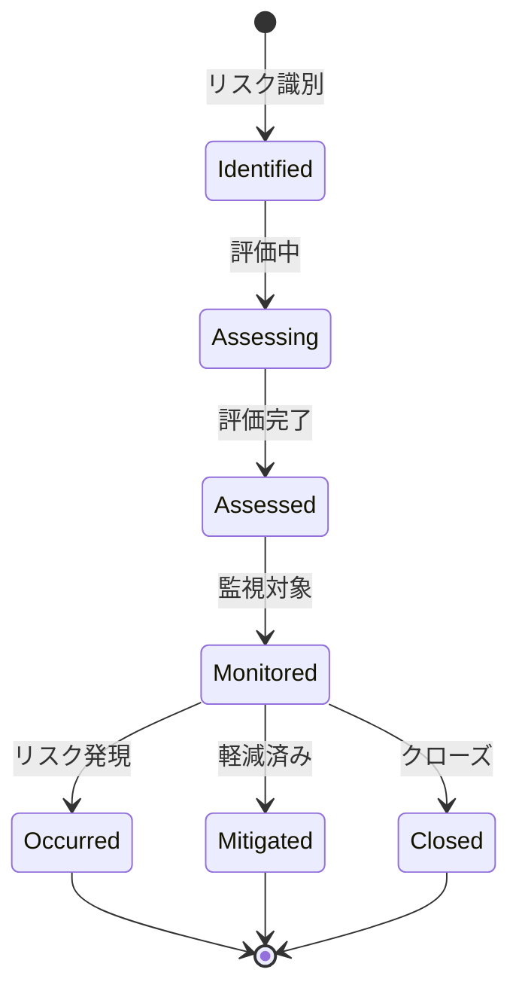

# ビジネスオペレーション: リスクを識別し評価する

**バージョン**: 1.0.0
**更新日**: 2024-12-30

## 概要

**目的**: プロジェクトに影響を与える可能性のあるリスクを洗い出し、影響度を評価する

**パターン**: CRUD + Analytics

**ゴール**: 重要なリスクが漏れなく識別され、優先順位が明確になる

## 関係者とロール

- **PM**: リスク管理全体統括、リスク評価の最終判断
- **全チームメンバー**: リスク識別、報告
- **エグゼクティブ**: 重大リスクの認識、対応方針の承認

## プロセスフロー

> **重要**: プロセスフローは必ず番号付きリスト形式で記述してください。
> Mermaid形式は使用せず、テキスト形式で記述することで、代替フローと例外フローが視覚的に分離されたフローチャートが自動生成されます。

1. システムがリスク識別を処理する
2. システムが影響度評価を処理する
3. システムが発生確率評価を処理する
4. システムがリスクスコア算出を処理する
5. システムが優先順位付けを処理する
6. ユーザーがリスク登録を行う

## 代替フロー

### 代替フロー1: 情報不備
- 2-1. システムが情報の不備を検知する
- 2-2. システムが修正要求を送信する
- 2-3. ユーザーが情報を修正し再実行する
- 2-4. 基本フロー2に戻る

## 例外処理

### 例外1: システムエラー
- システムエラーが発生した場合
- エラーメッセージを表示する
- 管理者に通知し、ログに記録する

### 例外2: 承認却下
- 承認が却下された場合
- 却下理由をユーザーに通知する
- 修正後の再実行を促す

## ビジネス状態

## KPI

- **リスク識別数**: プロジェクト規模に応じて適切な数（中規模で10-20件）
- **重大リスク発現率**: 未識別の重大リスク発現0件
- **リスク評価精度**: 実際の影響との差異±1段階以内（80%以上）
- **リスク識別の網羅性**: プロジェクト完了後の振り返りで追加すべきリスクが10%以下
- **チームメンバーのリスク報告率**: 全メンバーの70%以上がリスクを報告

## ビジネスルール

- すべてのリスクは5つの観点（スケジュール、コスト、品質、リソース、技術）で評価すること
- 影響度「重大」以上、または発生確率「高い」以上のリスクは必ず対応計画を策定
- リスクスコア15以上（影響度×発生確率が3×5以上）は経営層に報告
- リスク識別はプロジェクト開始時、フェーズ移行時、週次レビュー時に実施
- 発現したリスクは「インシデント」として別管理
- リスクの所有者（Risk Owner）を必ず明確にすること

## 入出力仕様

### 入力

- **プロジェクト計画書**: スコープ、スケジュール、予算、前提条件
- **過去プロジェクトのリスクデータベース**: 類似プロジェクトで発生したリスク
- **リスクチェックリスト**: 標準的なリスクカテゴリ
- **ステークホルダー情報**: 組織的・政治的リスクの識別

### 出力

- **リスク一覧**: 識別されたすべてのリスク
- **リスク評価表**: 影響度、発生確率、リスクスコア
- **リスクマトリクス**: 影響度×発生確率のマトリクス図
- **優先順位付きリスク**: 対応優先度順のリスクリスト
- **リスクレジスター**: 正式に登録されたリスク台帳

## 例外処理

- **リスク過多**: カテゴリ統合、低リスクの除外
- **リスク評価の意見対立**: 複数人評価の平均値、PMの最終判断
- **新規リスクの頻発**: リスク識別プロセスの見直し
- **重大リスクの発見**: 緊急対応会議の開催、プロジェクト計画の見直し
- **リスク報告の文化欠如**: 心理的安全性の確保、報奨制度の導入

## 派生ユースケース

このビジネスオペレーションから以下のユースケースが派生します：

1. リスクを登録する
2. リスク影響度を評価する
3. リスク発生確率を評価する
4. リスクマトリクスを表示する