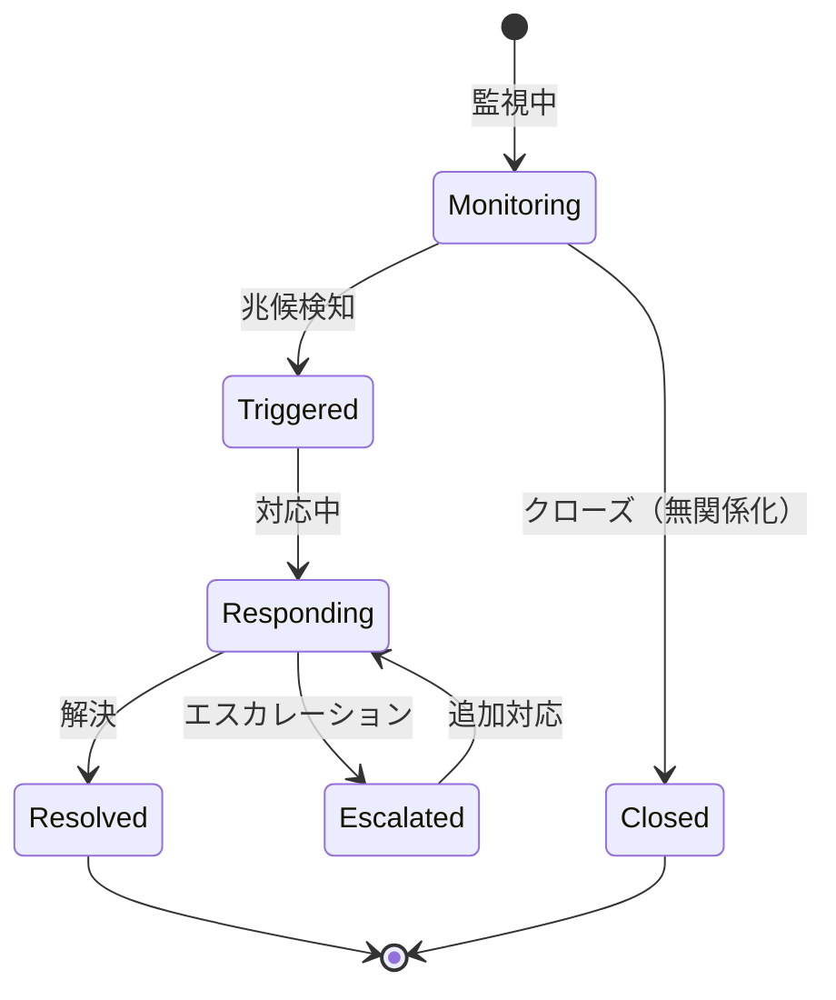

# ビジネスオペレーション: リスクを監視し対処する

**バージョン**: 1.0.0
**更新日**: 2024-12-30

## 概要

**目的**: リスクの状態を継続的に監視し、発生時に迅速に対処する

**パターン**: Workflow + Analytics

**ゴール**: リスクの早期発見と迅速な対応により、プロジェクトへの影響を最小化する

## 関係者とロール

- **PM**: リスク状況レビュー、対応指示、エスカレーション判断
- **担当者**: リスク監視、対応実行、効果測定
- **全チームメンバー**: リスク兆候の報告

## プロセスフロー

> **重要**: プロセスフローは必ず番号付きリスト形式で記述してください。
> Mermaid形式は使用せず、テキスト形式で記述することで、代替フローと例外フローが視覚的に分離されたフローチャートが自動生成されます。

1. システムがリスク状態監視を処理する
2. システムが対応策実行を実行する
3. システムが発生確率再評価を処理する
4. システムが効果測定を処理する
5. システムが監視継続を処理する
6. システムがリスククローズを処理する

## 代替フロー

### 代替フロー1: 情報不備
- 2-1. システムが情報の不備を検知する
- 2-2. システムが修正要求を送信する
- 2-3. ユーザーが情報を修正し再実行する
- 2-4. 基本フロー2に戻る

## 例外処理

### 例外1: システムエラー
- システムエラーが発生した場合
- エラーメッセージを表示する
- 管理者に通知し、ログに記録する

### 例外2: 承認却下
- 承認が却下された場合
- 却下理由をユーザーに通知する
- 修正後の再実行を促す

## ビジネス状態

## KPI

- **監視頻度**: 週次レビュー実施率100%
- **対応開始時間**: リスク発生から24時間以内に対応開始
- **影響最小化率**: 事前計画通りに対処できた割合80%以上
- **二次リスク発生率**: リスク対応による新たなリスク発生10%以下
- **早期警戒成功率**: 兆候段階での対応成功率70%以上

## ビジネスルール

- すべてのリスクは最低週1回レビューすること
- 重大リスク（スコア15以上）は毎日確認すること
- リスク発生の兆候を検知したら24時間以内に報告
- 対応策を実行したら効果を必ず測定すること
- 対応が計画通りに進まない場合は即座にエスカレーション
- リスクが発現した場合はインシデントとして記録
- プロジェクト環境の変化があった場合はリスク再評価を実施

## 入出力仕様

### 入力

- **リスクレジスター**: 登録済みリスクとその対応計画
- **早期警戒指標**: リスク発生の兆候を示す指標
- **プロジェクト実績データ**: 進捗、コスト、品質の実績
- **環境変化情報**: 組織変更、技術動向、市場変化等

### 出力

- **リスク状況レポート**: 現在のリスク状態サマリー
- **対応実行記録**: 実施した対応策とその結果
- **効果測定結果**: 対応策の効果を定量評価
- **更新されたリスク評価**: 状況変化を反映した最新評価
- **エスカレーション通知**: 上位者への重大リスク報告
- **教訓**: リスク対応から得られた学び

## 例外処理

- **対応策が無効**: 代替対応策の実施、専門家への相談
- **複数リスク同時発生**: トリアージの実施、優先順位付け
- **リソース不足**: 緊急リソース調達、スコープ削減検討
- **二次リスク発生**: 新規リスクとして登録、対応計画策定
- **エスカレーション必要**: 経営層への報告、追加予算・期間の要請

## 派生ユースケース

このビジネスオペレーションから以下のユースケースが派生します：

1. リスク状態を更新する
2. リスクアラートを発行する
3. リスク対応を実行する
4. リスク対応効果を評価する