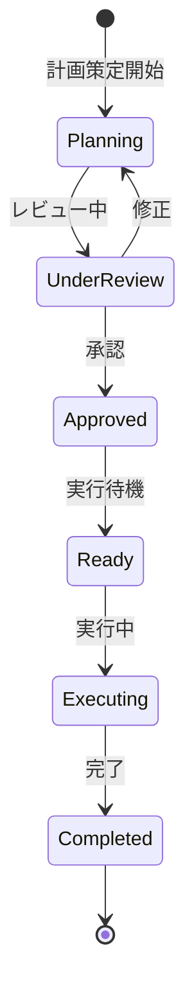

# ビジネスオペレーション: リスク対応計画を策定する

**バージョン**: 1.0.0
**更新日**: 2024-12-30

## 概要

**目的**: 識別されたリスクに対する具体的な対応策を計画する

**パターン**: Workflow

**ゴール**: すべての重要リスクに対して実行可能な対応策が準備される

## 関係者とロール

- **PM**: 対応戦略決定、計画承認、リソース確保
- **担当コンサルタント**: 具体的対応策立案、実行計画の作成
- **エグゼクティブ**: 高額な対応策の承認、戦略的判断

## プロセスフロー

> **重要**: プロセスフローは必ず番号付きリスト形式で記述してください。
> Mermaid形式は使用せず、テキスト形式で記述することで、代替フローと例外フローが視覚的に分離されたフローチャートが自動生成されます。

1. システムがリスク選択を処理する
2. システムが対応戦略決定を処理する
3. システムが具体的対応策立案を処理する
4. システムがコスト・工数見積もりを処理する
5. システムが承認を行う
6. ユーザーが対応計画登録を行う

## 代替フロー

### 代替フロー1: 情報不備
- 2-1. システムが情報の不備を検知する
- 2-2. システムが修正要求を送信する
- 2-3. ユーザーが情報を修正し再実行する
- 2-4. 基本フロー2に戻る

## 例外処理

### 例外1: システムエラー
- システムエラーが発生した場合
- エラーメッセージを表示する
- 管理者に通知し、ログに記録する

### 例外2: 承認却下
- 承認が却下された場合
- 却下理由をユーザーに通知する
- 修正後の再実行を促す

## ビジネス状態

## KPI

- **対応計画策定率**: 高・中リスク100%、低リスク50%以上
- **計画実行可能性**: 承認された計画の実行率90%以上
- **対応策有効性**: リスク低減率70%以上（事前対策実施後）
- **コスト効率**: 対応コストが想定損失額の30%以下
- **計画策定時間**: 優先度高リスクは識別から3日以内

## ビジネスルール

- リスクスコア15以上（影響度×発生確率が3×5以上）は必ず対応計画を策定
- 対応戦略は以下の4種類から選択：
  - **回避（Avoid）**: リスクの原因を排除
  - **軽減（Mitigate）**: 影響度または発生確率を下げる
  - **転嫁（Transfer）**: 第三者にリスクを移転（保険、外注等）
  - **受容（Accept）**: リスクを許容し、発生時の対応のみ準備
- 対応策には必ず実行責任者と期限を設定すること
- 対応コストが予算の5%を超える場合はエグゼクティブ承認が必要
- すべての対応策に効果測定指標を設定すること

## 入出力仕様

### 入力

- **リスク評価結果**: 影響度、発生確率、優先順位
- **プロジェクト予算**: 利用可能なリスク対応予算
- **リソース情報**: 利用可能な人材とスキル
- **過去の対応策事例**: 類似リスクへの過去の対応策

### 出力

- **対応戦略**: 回避、軽減、転嫁、受容の決定
- **具体的対応策**: 実行可能なアクションプラン
- **実行スケジュール**: 対応策の実施時期
- **コスト見積もり**: 対応に必要な予算
- **効果予測**: 対応後のリスクスコア予測
- **担当者割り当て**: 対応策の実行責任者

## 例外処理

- **対応策が見つからない**: 専門家へのエスカレーション、外部コンサルタント活用
- **コスト過大**: 段階的実施、代替策の検討、リスク受容への変更
- **リソース不足**: 外部リソースの調達、既存タスクの優先順位変更
- **技術的実現困難**: PoC（概念実証）の実施、技術調査タスクの追加
- **承認遅延**: 暫定的な対応策の実施、エスカレーション

## 派生ユースケース

このビジネスオペレーションから以下のユースケースが派生します：

1. リスク対応戦略を決定する
2. 具体的対応策を立案する
3. 対応計画を承認する
4. 対応責任者を割り当てる