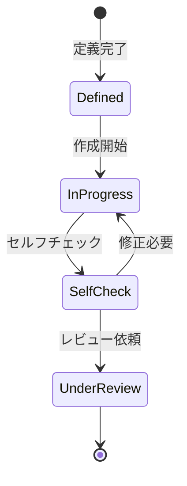

# ビジネスオペレーション: 成果物を定義し作成する

**バージョン**: 1.0.0
**更新日**: 2024-12-30

## 概要

**目的**: プロジェクトで作成すべき成果物を明確に定義し、計画通りに作成する

**パターン**: CRUD + Workflow

**ゴール**: 品質基準を満たした成果物が期限通りに作成される

## 関係者とロール

- **PM**: 成果物定義、品質基準設定、全体調整
- **コンサルタント**: 成果物作成、品質チェック
- **クライアント**: 要件提供、中間確認、フィードバック

## プロセスフロー

> **重要**: プロセスフローは必ず番号付きリスト形式で記述してください。
> Mermaid形式は使用せず、テキスト形式で記述することで、代替フローと例外フローが視覚的に分離されたフローチャートが自動生成されます。

1. システムが成果物要件定義を処理する
2. システムが品質基準設定を処理する
3. システムが作成計画を行う
4. システムが成果物作成を行う
5. システムがセルフチェックを処理する
6. システムがレビュー提出を処理する

## 代替フロー

### 代替フロー1: 情報不備
- 2-1. システムが情報の不備を検知する
- 2-2. システムが修正要求を送信する
- 2-3. ユーザーが情報を修正し再実行する
- 2-4. 基本フロー2に戻る

## 例外処理

### 例外1: システムエラー
- システムエラーが発生した場合
- エラーメッセージを表示する
- 管理者に通知し、ログに記録する

### 例外2: 承認却下
- 承認が却下された場合
- 却下理由をユーザーに通知する
- 修正後の再実行を促す

## ビジネス状態

## KPI

- **納期遵守率**: 95%以上の成果物が計画通りに提出される
- **初回品質合格率**: 80%以上が一度のレビューで合格
- **要件充足率**: 100%の要件が満たされる
- **テンプレート活用率**: 70%以上の成果物でテンプレートを活用
- **セルフチェック実施率**: 100%（すべての成果物で実施）

## ビジネスルール

- すべての成果物は事前に定義され、承認されていること
- 成果物には必ず品質基準と完了条件（DoD）を設定すること
- テンプレートが存在する場合は必ず使用すること
- セルフチェックは必須であり、チェックリストに従って実施
- 成果物のファイル命名規則に従うこと（例: [プロジェクトコード]_[成果物種別]_[バージョン]）
- 作成中の成果物は共有フォルダの適切な場所に保存すること

## 入出力仕様

### 入力

- **成果物定義書**: プロジェクト計画書に記載された成果物一覧
- **クライアント要件**: 成果物に求められる内容と品質
- **テンプレート**: 標準テンプレート、過去プロジェクトの事例
- **ガイドライン**: 成果物作成のガイドライン、スタイルガイド

### 出力

- **成果物**: ドキュメント、設計書、コード、レポート等
- **品質チェックリスト**: セルフチェック結果の記録
- **作成履歴**: 作成にかかった時間、参考資料
- **レビュー依頼**: 正式なレビュー要求

## 例外処理

- **要件不明確**: クライアントとの要件明確化セッションの実施
- **テンプレート不適合**: 新規テンプレートの作成またはカスタマイズ
- **技術的困難**: 技術調査タスクの追加、専門家への相談
- **納期遅延**: リソース追加、スコープの段階的実施
- **品質基準達成困難**: 品質基準の見直し、追加支援の投入

## 派生ユースケース

このビジネスオペレーションから以下のユースケースが派生します：

1. 成果物テンプレートを選択する
2. 成果物を作成する
3. 成果物をセルフチェックする
4. 成果物を提出する