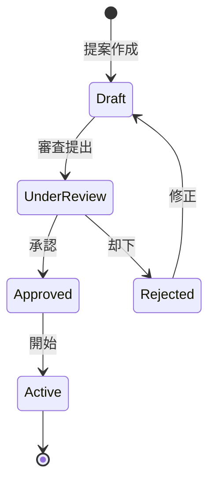

# ビジネスオペレーション: プロジェクトを立ち上げる

**バージョン**: 1.0.0
**更新日**: 2024-12-30

## 概要

**目的**: プロジェクトの目的・スコープ・体制を定義し、承認を得て正式に開始する

**パターン**: Workflow

**ゴール**: 承認されたプロジェクト計画書が作成され、プロジェクトが正式に開始される

## 関係者とロール

- **エグゼクティブ**: プロジェクト承認、予算承認
- **PM**: プロジェクト計画策定、チーム編成
- **コンサルタント**: 計画支援、実行可能性評価

## プロセスフロー

> **重要**: プロセスフローは必ず番号付きリスト形式で記述してください。
> Mermaid形式は使用せず、テキスト形式で記述することで、代替フローと例外フローが視覚的に分離されたフローチャートが自動生成されます。

1. システムがプロジェクト提案を処理する
2. システムがスコープ定義を処理する
3. システムが予算・スケジュール策定を処理する
4. システムがリスク初期評価を処理する
5. システムが承認審査を行う
6. システムがプロジェクト開始を処理する

## 代替フロー

### 代替フロー1: 情報不備
- 2-1. システムが情報の不備を検知する
- 2-2. システムが修正要求を送信する
- 2-3. ユーザーが情報を修正し再実行する
- 2-4. 基本フロー2に戻る

## 例外処理

### 例外1: システムエラー
- システムエラーが発生した場合
- エラーメッセージを表示する
- 管理者に通知し、ログに記録する

### 例外2: 承認却下
- 承認が却下された場合
- 却下理由をユーザーに通知する
- 修正後の再実行を促す

## ビジネス状態

## KPI

- **計画策定期間**: 平均2週間以内
- **承認率**: 80%以上
- **計画変更率**: 初回計画からの変更20%以内

## ビジネスルール

- プロジェクト計画は承認されるまで正式なプロジェクトとして扱わない
- 予算が100万円以上のプロジェクトは経営会議での承認が必須
- スコープ変更は変更管理プロセスを経ること
- リスク評価は最低でも5つの観点（スケジュール、コスト、品質、リソース、技術）で実施

## 入出力仕様

### 入力

- **プロジェクト提案書**: ビジネス要件、目的、背景
- **ビジネス要件**: クライアントからの要求事項
- **リソース可用性情報**: 利用可能なメンバーとスキル

### 出力

- **プロジェクト計画書**: スコープ、スケジュール、予算、体制
- **承認文書**: 経営層の承認記録
- **チーム体制図**: プロジェクトメンバーと役割分担
- **リスク評価書**: 初期リスク一覧と評価結果

## 例外処理

- **承認却下**: 却下理由を明確にし、修正案を再提出
- **リソース不足**: リソース調達計画を策定、または外部委託を検討
- **予算超過**: スコープ削減または段階的実施を提案
- **技術的実現困難性**: PoC（概念実証）を先行実施

## 派生ユースケース

このビジネスオペレーションから以下のユースケースが派生します：

1. プロジェクト提案を作成する
2. プロジェクト計画を策定する
3. プロジェクト承認を得る
4. プロジェクトチームを編成する