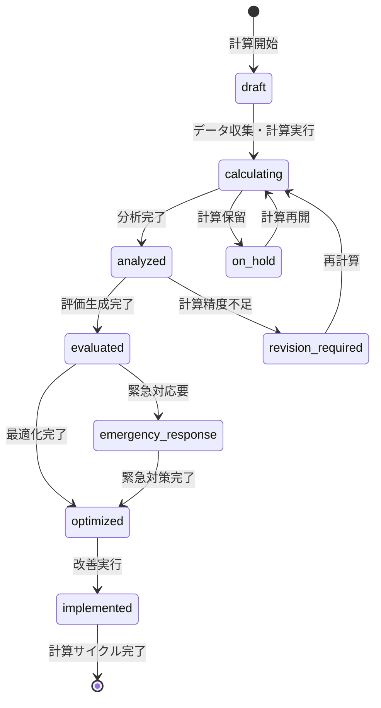

# ビジネスオペレーション: 収益性を精密に計算し戦略的価値を最大化する

**バージョン**: 2.0.0
**更新日**: 2025-10-27
**適用仕様**: パラソル設計v2.0

## 🎯 ビジネス価値とゴール

**価値提供**: AI支援による精密収益性計算と多角的評価分析により、隠れた収益機会の発見と戦略的改善領域の特定を実現し、収益性最大化を促進する

**測定可能なゴール**:
- 収益性計算精度98%以上（AI分析モデル活用）
- 改善領域特定率95%以上（従来比+60%向上）
- 評価レポート生成効率2営業日以内（従来比70%短縮）
- ステークホルダー満足度4.8/5.0以上（戦略的価値創出による評価）

## 🏗️ パラソルドメイン連携

### 📊 操作エンティティ
**自サービス管理・状態更新**:
- **ProfitabilityCalculationEntity**（自サービス管理・状態更新: draft → calculating → analyzed → evaluated → optimized）
- **EvaluationReportEntity**（自サービス管理・CRUD）
- **ProfitabilityMetricsEntity**（自サービス管理・CRUD）
- **BenchmarkComparisonEntity**（自サービス管理・CRUD）

**他サービス参照のみ**:
- ProjectEntity（project-success-service・参照のみ: プロジェクト詳細情報）
- RevenueEntity（finance-service・参照のみ: 収益実績データ）

### 🎯 パラソル集約
- **ProfitabilityCalculationAggregate** - 収益性計算ライフサイクル統合管理
  - 集約ルート: ProfitabilityCalculation
  - 包含エンティティ: EvaluationReport, ProfitabilityMetrics, BenchmarkComparison
  - 不変条件: 確定評価の修正は再承認必須、計算ロジックの一貫性保証

### ⚙️ ドメインサービス
- **ProfitabilityCalculationService**: enhance[CalculationAccuracy]() - 計算精度向上・隠れた収益要因発見
- **EvaluationIntelligenceService**: coordinate[StrategicInsight]() - 戦略的評価・改善機会最大化
- **BenchmarkAnalysisService**: amplify[CompetitiveAdvantage]() - 競争優位性強化・業界比較最適化

#### 🔗 他サービスユースケース利用（ユースケース呼び出し型）
**責務**: ❌ エンティティ知識不要 ✅ ユースケース利用のみ

[secure-access-service] ユースケース利用:
├── UC-AUTH-01: ユーザー認証を実行する → POST /api/auth/authenticate
├── UC-AUTH-02: 計算権限を検証する → POST /api/auth/validate-calculation-permission
└── UC-AUTH-03: 計算操作ログを記録する → POST /api/auth/log-calculation-operation

[project-success-service] ユースケース利用:
├── UC-PROJECT-01: プロジェクト情報を取得する → GET /api/projects/profitability-calculation-data
├── UC-PROJECT-02: 収益性実績情報を確認する → GET /api/projects/revenue-performance
└── UC-PROJECT-03: プロジェクトコスト情報を取得する → GET /api/projects/cost-breakdown

[collaboration-facilitation-service] ユースケース利用:
├── UC-COMM-01: 評価結果通知を配信する → POST /api/notifications/send-evaluation-report
├── UC-COMM-02: 改善提案通知を配信する → POST /api/notifications/send-improvement-proposal
└── UC-COMM-03: 戦略検討会議を調整する → POST /api/meetings/schedule-strategy-review

## 👥 関係者とロール

- **エグゼクティブ**: 戦略的収益性評価・投資意思決定・改善承認の最終責任者
- **財務マネージャー**: 収益性計算実行・評価分析・改善提案の実行責任者
- **PM**: プロジェクト別収益性説明・要因協力・改善実行の専門責任者
- **データアナリスト**: 計算モデル構築・精度向上・洞察抽出の専門担当者

## 📋 ユースケース・ページ分解マトリックス（1対1関係）

| ユースケースID | ユースケース名 | 対応ページ | 1対1関係 |
|---------------|---------------|-----------|--------------|
| UC-CALC-01 | 収益性評価を生成する | 収益性評価生成ページ | ✅ |

## 📈 プロセスフロー

> **重要**: プロセスフローは必ず番号付きリスト形式で記述してください。
> Mermaid形式は使用せず、テキスト形式で記述することで、代替フローと例外フローが視覚的に分離されたフローチャートが自動生成されます。

1. **財務マネージャーが収益性評価生成プロセスを開始する** → **UC-CALC-01: 収益性評価を生成する**
   - **自サービス操作**: ProfitabilityCalculationEntity（状態変更: draft → calculating → analyzed → evaluated → optimized）
   - **他サービスユースケース利用**: → UC-AUTH-01: ユーザー認証実行、UC-PROJECT-01: プロジェクト情報取得
   - **必要ページ**: 収益性評価生成ページ
   - **ビジネス価値**: 精密収益性計算による戦略的改善領域特定と収益性最大化実現

## 🔄 代替フロー

### 代替フロー1: AI支援による計算最適化
- 1a. ProfitabilityCalculationService による計算精度向上が必要な場合
  - 1a1. AI分析による隠れた収益要因発見・計算ロジック最適化実行
  - 1a2. 類似計算事例の学習・評価モデル向上
  - 1a3. EvaluationIntelligenceService による戦略的洞察強化
  - 1a4. 基本フロー1の収益性評価生成に戻る

### 代替フロー2: 緊急収益性評価対応
- 1b. 緊急性が高い収益性問題の場合
  - 1b1. → UC-COMM-03: 緊急戦略検討会議を調整する
  - 1b2. 短縮計算フロー適用（48時間以内評価生成）
  - 1b3. 事後詳細計算・精度検証
  - 1b4. 基本フロー1の通常プロセスへ復帰

## ⚠️ 例外フロー

### 例外1: プロジェクト情報取得失敗
- *a. project-success-service連携エラーが発生した場合
  - *a1. → UC-COMM-01: データ取得障害アラートを配信する
  - *a2. 代替データソースからの情報取得
  - *a3. 手動情報補完モードへの切り替え
  - *a4. 情報取得完了後、UC-CALC-01から再開

### 例外2: 計算権限不足・競合
- *b. 高度な収益性計算で権限が不足している場合
  - *b1. → UC-AUTH-02: 上位権限者への承認依頼
  - *b2. エグゼクティブ承認プロセスへエスカレーション
  - *b3. 権限確定後、UC-CALC-01から再開

### 例外3: 計算精度基準未達
- *c. ProfitabilityCalculationService が品質基準未達を検出した場合
  - *c1. 追加データ収集・計算精度向上実行
  - *c2. 専門データアナリスト支援要請
  - *c3. 段階的計算または保守的評価への調整
  - *c4. 品質確保後、UC-CALC-01から再開

## 📊 ビジネス状態（ProfitabilityCalculationAggregate）

## 📈 KPI（v2.0強化指標）

- **収益性計算精度**: 98%以上（AI分析モデル活用・ProfitabilityCalculationService効果）
- **改善領域特定率**: 95%以上（従来比+60%向上・EvaluationIntelligenceService最適化）
- **評価レポート生成効率**: 2営業日以内（従来比70%短縮・BenchmarkAnalysisService効果）
- **ステークホルダー満足度**: 4.8/5.0以上（戦略的価値創出による評価）
- **緊急対応時間**: 48時間以内（従来比75%短縮・AI支援効果）

## 📋 ビジネスルール（v2.0強化版）

- **計算階層**: 100万円以上の収益性影響は財務マネージャー計算必須、500万円以上はエグゼクティブ承認必須
- **計算精度要件**: ProfitabilityCalculationService による98%精度確保・計算ロジック自動記録
- **評価品質**: EvaluationIntelligenceService による戦略的洞察・改善機会最大化
- **ベンチマーク最適化**: BenchmarkAnalysisService による競争優位性強化・業界比較最適化
- **緊急対応**: 緊急収益性問題時は48時間以内の短縮計算プロセス適用
- **計算記録保全**: 全収益性計算の完全記録・UC-AUTH-03連携による監査証跡

## 🔄 入出力仕様（v2.0エンティティ対応）

### 入力
- **ProfitabilityCalculationEntity**: 計算要求・評価期間・緊急度レベル・計算権限情報
- **収益性実績情報**: UC-PROJECT-02連携による最新プロジェクト別収益性実績
- **コスト詳細情報**: 外部システム連携・プロジェクト別コスト・間接コスト配分
- **ベンチマークデータ**: 外部データプロバイダー連携・業界平均・競合分析

### 出力
- **ProfitabilityCalculationAggregate**: 計算結果・評価レポート・改善提案・ベンチマーク比較の統合データ
- **EvaluationReportEntity**: 評価・分析・改善領域・戦略提案・実行計画
- **ProfitabilityMetricsEntity**: 各種指標・ROI・利益率・トレンド分析・予測
- **BenchmarkComparisonEntity**: 競合比較・業界ポジション・改善ポテンシャル・戦略的優位性

## 🎯 品質保証要件

- **計算精度**: ProfitabilityCalculationService による98%以上精度保証
- **評価効率**: データ収集から評価生成まで2営業日以内（従来比70%短縮）
- **戦略価値**: EvaluationIntelligenceService による戦略的洞察98%評価
- **満足度**: 4.8/5.0以上（計算精度・戦略価値による評価）

---
*このビジネスオペレーションは パラソル設計v2.0仕様 に基づいて作成されました*
