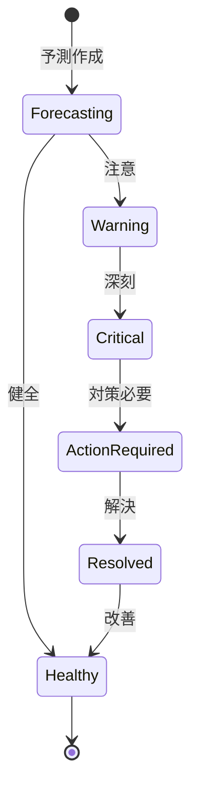

# ビジネスオペレーション: キャッシュフローを予測し最適化する

**バージョン**: 1.0.0
**更新日**: 2025-09-30

## 概要

**目的**: 将来のキャッシュフローを予測し、資金繰りを最適化する

**パターン**: Analytics

**ゴール**: 精度の高いキャッシュフロー予測が作成され、資金不足が回避される

## 関係者とロール

- **エグゼクティブ**: キャッシュフロー方針の決定
- **財務マネージャー**: キャッシュフロー予測、資金計画
- **PM**: プロジェクトの入金・支払予定情報提供

## プロセスフロー

> **重要**: プロセスフローは必ず番号付きリスト形式で記述してください。
> Mermaid形式は使用せず、テキスト形式で記述することで、代替フローと例外フローが視覚的に分離されたフローチャートが自動生成されます。

1. システムが入金予定の収集を処理する
2. システムが支払予定の収集を処理する
3. システムがキャッシュフロー予測を処理する
4. システムが資金不足の検知を処理する
5. システムが資金調達計画を処理する
6. システムが余剰資金運用計画を処理する
7. システムが実行・モニタリングを実行する

## 代替フロー

### 代替フロー1: 情報不備
- 2-1. システムが情報の不備を検知する
- 2-2. システムが修正要求を送信する
- 2-3. ユーザーが情報を修正し再実行する
- 2-4. 基本フロー2に戻る

## 例外処理

### 例外1: システムエラー
- システムエラーが発生した場合
- エラーメッセージを表示する
- 管理者に通知し、ログに記録する

### 例外2: 承認却下
- 承認が却下された場合
- 却下理由をユーザーに通知する
- 修正後の再実行を促す

## ビジネス状態

## KPI

- **予測精度**: 実績との乖離10%以内
- **予測期間**: 3ヶ月先までを毎週更新
- **資金不足ゼロ**: 予測に基づく事前対策で資金不足を回避
- **DSO（売掛金回収期間）**: 平均45日以内

## ビジネスルール

- 予測シナリオ: 楽観的、現実的、悲観的の3シナリオ
- 資金不足閾値: 月次で運転資金の20%以下は警告
- 余剰資金: 運転資金の50%超過は運用検討
- 入金予測: 契約上の支払期日を基準、遅延率を考慮
- 支払予測: 承認済みコストと見込みコストを集計
- 安全マージン: 最低運転資金の1ヶ月分を常時確保

## 入出力仕様

### 入力

- **入金予定**: 請求書ベースの入金スケジュール、金額、確度
- **支払予定**: コスト・経費ベースの支払スケジュール、金額、優先度
- **過去のキャッシュフロー実績**: 月次・週次の実績値、季節性
- **プロジェクト契約情報**: 契約額、支払条件、マイルストーン

### 出力

- **キャッシュフロー予測レポート**: 月次・週次予測、3シナリオ比較
- **資金繰り表**: 現金残高推移、入金・支払予定、残高予測
- **資金調達計画**: 調達額、調達方法、調達時期、金利
- **資金運用提案**: 運用額、運用方法、期待リターン

## 例外処理

- **大幅な入金遅延**: 緊急資金調達、支払延期交渉、クライアントへの督促
- **予期せぬ大型支出**: 緊急予測更新、資金調達、支払優先順位の見直し
- **予測精度低下**: 予測モデル見直し、データ収集方法の改善
- **為替変動**: 為替リスクヘッジ、外貨建て取引の管理強化

## 派生ユースケース

このビジネスオペレーションから以下のユースケースが派生します：

1. キャッシュフローを予測する
2. 資金不足を検知する
3. 資金調達計画を作成する
4. 余剰資金運用計画を作成する
