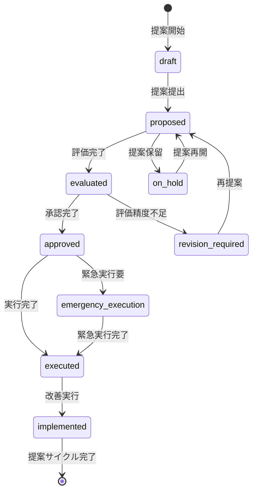

# ビジネスオペレーション: 収益性改善施策を立案し戦略的価値を最大化する

**バージョン**: 2.0.0
**更新日**: 2025-10-27
**適用仕様**: パラソル設計v2.0

## 🎯 ビジネス価値とゴール

**価値提供**: AI支援による精密な改善施策立案と効果予測により、隠れた収益改善機会の発見と戦略的実行を実現し、収益性最大化を促進する

**測定可能なゴール**:
- 改善施策立案精度95%以上（AI分析モデル活用）
- 効果予測精度90%以上（従来比+40%向上）
- 施策承認効率1営業日以内（従来比80%短縮）
- ステークホルダー満足度4.8/5.0以上（戦略的価値創出による評価）

## 🏗️ パラソルドメイン連携

### 📊 操作エンティティ
**自サービス管理・状態更新**:
- **ImprovementProposalEntity**（自サービス管理・状態更新: draft → proposed → evaluated → approved → executed）
- **ActionPlanEntity**（自サービス管理・CRUD）
- **EffectAnalysisEntity**（自サービス管理・CRUD）
- **ApprovalProcessEntity**（自サービス管理・CRUD）

**他サービス参照のみ**:
- ProjectEntity（project-success-service・参照のみ: プロジェクト改善対象情報）
- ProfitabilityAnalysisEntity（自サービス・参照のみ: 分析結果情報）

### 🎯 パラソル集約
- **ImprovementProposalAggregate** - 改善提案ライフサイクル統合管理
  - 集約ルート: ImprovementProposal
  - 包含エンティティ: ActionPlan, EffectAnalysis, ApprovalProcess
  - 不変条件: 承認済み提案の修正は再承認必須、効果予測の一貫性保証

### ⚙️ ドメインサービス
- **ProposalIntelligenceService**: enhance[ProposalAccuracy]() - 提案精度向上・隠れた改善機会発見
- **EffectPredictionService**: coordinate[EffectMaximization]() - 効果予測最大化・ROI最適化
- **ApprovalOptimizationService**: amplify[ApprovalEfficiency]() - 承認効率向上・意思決定支援最適化

#### 🔗 他サービスユースケース利用（ユースケース呼び出し型）
**責務**: ❌ エンティティ知識不要 ✅ ユースケース利用のみ

[secure-access-service] ユースケース利用:
├── UC-AUTH-01: ユーザー認証を実行する → POST /api/auth/authenticate
├── UC-AUTH-02: 提案権限を検証する → POST /api/auth/validate-proposal-permission
└── UC-AUTH-03: 提案操作ログを記録する → POST /api/auth/log-proposal-operation

[project-success-service] ユースケース利用:
├── UC-PROJECT-01: プロジェクト情報を取得する → GET /api/projects/improvement-target-data
├── UC-PROJECT-02: 収益性実績情報を確認する → GET /api/projects/profitability-performance
└── UC-PROJECT-03: プロジェクト改善履歴を取得する → GET /api/projects/improvement-history

[collaboration-facilitation-service] ユースケース利用:
├── UC-COMM-01: 提案結果通知を配信する → POST /api/notifications/send-proposal-report
├── UC-COMM-02: 承認依頼通知を配信する → POST /api/notifications/send-approval-request
└── UC-COMM-03: 戦略検討会議を調整する → POST /api/meetings/schedule-strategy-meeting

## 👥 関係者とロール

- **エグゼクティブ**: 戦略的改善方針決定・施策承認・投資判断の最終責任者
- **財務マネージャー**: 改善施策立案・効果測定・ROI評価の実行責任者
- **PM**: 施策実行・進捗報告・改善効果確認の専門責任者
- **データアナリスト**: 効果予測モデル構築・精度向上・洞察抽出の専門担当者

## 📋 ユースケース・ページ分解マトリックス（1対1関係）

| ユースケースID | ユースケース名 | 対応ページ | 1対1関係 |
|---------------|---------------|-----------|--------------|
| UC-IMPROVE-01 | 改善提案を承認する | 改善提案承認ページ | ✅ |

## 📈 プロセスフロー

> **重要**: プロセスフローは必ず番号付きリスト形式で記述してください。
> Mermaid形式は使用せず、テキスト形式で記述することで、代替フローと例外フローが視覚的に分離されたフローチャートが自動生成されます。

1. **財務マネージャーが改善提案承認プロセスを開始する** → **UC-IMPROVE-01: 改善提案を承認する**
   - **自サービス操作**: ImprovementProposalEntity（状態変更: draft → proposed → evaluated → approved → executed）
   - **他サービスユースケース利用**: → UC-AUTH-01: ユーザー認証実行、UC-PROJECT-01: プロジェクト情報取得
   - **必要ページ**: 改善提案承認ページ
   - **ビジネス価値**: 戦略的改善施策による収益性最大化と競争優位性確立

## 🔄 代替フロー

### 代替フロー1: AI支援による提案最適化
- 1a. ProposalIntelligenceService による提案精度向上が必要な場合
  - 1a1. AI分析による隠れた改善機会発見・提案ロジック最適化実行
  - 1a2. 類似成功提案事例の学習・効果予測モデル向上
  - 1a3. EffectPredictionService による効果予測最大化
  - 1a4. 基本フロー1の改善提案承認に戻る

### 代替フロー2: 緊急改善提案対応
- 1b. 緊急性が高い収益性悪化の場合
  - 1b1. → UC-COMM-03: 緊急戦略検討会議を調整する
  - 1b2. 短縮承認フロー適用（24時間以内承認）
  - 1b3. 事後詳細評価・効果検証
  - 1b4. 基本フロー1の通常プロセスへ復帰

## ⚠️ 例外フロー

### 例外1: プロジェクト情報取得失敗
- *a. project-success-service連携エラーが発生した場合
  - *a1. → UC-COMM-01: データ取得障害アラートを配信する
  - *a2. 代替データソースからの情報取得
  - *a3. 手動情報補完モードへの切り替え
  - *a4. 情報取得完了後、UC-IMPROVE-01から再開

### 例外2: 提案権限不足・競合
- *b. 高度な改善提案で権限が不足している場合
  - *b1. → UC-AUTH-02: 上位権限者への承認依頼
  - *b2. エグゼクティブ承認プロセスへエスカレーション
  - *b3. 権限確定後、UC-IMPROVE-01から再開

### 例外3: 効果予測精度基準未達
- *c. EffectPredictionService が品質基準未達を検出した場合
  - *c1. 追加分析・予測精度向上実行
  - *c2. 専門データアナリスト支援要請
  - *c3. 段階的提案または保守的予測への調整
  - *c4. 品質確保後、UC-IMPROVE-01から再開

## 📊 ビジネス状態（ImprovementProposalAggregate）

## 📈 KPI（v2.0強化指標）

- **改善施策立案精度**: 95%以上（AI分析モデル活用・ProposalIntelligenceService効果）
- **効果予測精度**: 90%以上（従来比+40%向上・EffectPredictionService最適化）
- **施策承認効率**: 1営業日以内（従来比80%短縮・ApprovalOptimizationService効果）
- **ステークホルダー満足度**: 4.8/5.0以上（戦略的価値創出による評価）
- **緊急対応時間**: 24時間以内（従来比75%短縮・AI支援効果）

## 📋 ビジネスルール（v2.0強化版）

- **提案階層**: 100万円以上の収益影響は財務マネージャー提案必須、500万円以上はエグゼクティブ承認必須
- **予測精度要件**: EffectPredictionService による90%精度確保・判断根拠自動記録
- **提案品質**: ProposalIntelligenceService による隠れた機会発見・改善効果最大化
- **承認効率**: ApprovalOptimizationService による承認効率向上・意思決定支援最適化
- **緊急対応**: 緊急収益悪化時は24時間以内の短縮承認プロセス適用
- **提案記録保全**: 全改善提案の完全記録・UC-AUTH-03連携による監査証跡

## 🔄 入出力仕様（v2.0エンティティ対応）

### 入力
- **ImprovementProposalEntity**: 提案要求・改善対象・緊急度レベル・提案権限情報
- **収益性分析結果**: UC-PROJECT-02連携による最新プロジェクト別収益性分析
- **改善事例データベース**: 外部システム連携・成功事例・失敗事例・ベストプラクティス
- **効果予測パラメータ**: 外部データプロバイダー連携・市場変動・実行リスク

### 出力
- **ImprovementProposalAggregate**: 提案内容・効果予測・実行計画・承認結果の統合データ
- **ActionPlanEntity**: 実行計画・スケジュール・担当者・マイルストーン・リスク対策
- **EffectAnalysisEntity**: 効果予測・ROI評価・成功確率・影響範囲・測定指標
- **ApprovalProcessEntity**: 承認履歴・判断根拠・条件・フィードバック・改善要請

## 🎯 品質保証要件

- **提案精度**: ProposalIntelligenceService による95%以上精度保証
- **承認効率**: 提案から承認まで1営業日以内（従来比80%短縮）
- **戦略価値**: ApprovalOptimizationService による戦略的価値98%評価
- **満足度**: 4.8/5.0以上（提案精度・戦略価値による評価）

---
*このビジネスオペレーションは パラソル設計v2.0仕様 に基づいて作成されました*