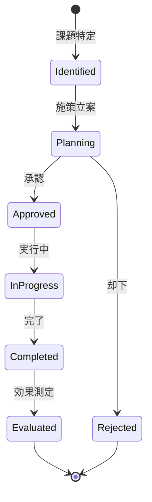

# ビジネスオペレーション: 改善アクションを提案する

**バージョン**: 1.0.0
**更新日**: 2025-09-30

## 概要

**目的**: 収益性分析に基づき、具体的な改善施策を立案し実行する

**パターン**: Workflow + Analytics

**ゴール**: 収益性改善施策が実行され、利益率が向上する

## 関係者とロール

- **エグゼクティブ**: 改善方針の決定、承認
- **財務マネージャー**: 改善施策の立案、効果測定
- **PM**: 施策の実行、進捗報告

## プロセスフロー

> **重要**: プロセスフローは必ず番号付きリスト形式で記述してください。
> Mermaid形式は使用せず、テキスト形式で記述することで、代替フローと例外フローが視覚的に分離されたフローチャートが自動生成されます。

1. システムが低収益性プロジェクト特定を処理する
2. システムが要因の深堀分析を処理する
3. システムが改善施策の立案を処理する
4. システムが費用対効果評価を処理する
5. システムが施策承認を行う
6. システムが実行計画策定を実行する
7. システムが施策実行を実行する
8. システムが効果測定を処理する

## 代替フロー

### 代替フロー1: 情報不備
- 2-1. システムが情報の不備を検知する
- 2-2. システムが修正要求を送信する
- 2-3. ユーザーが情報を修正し再実行する
- 2-4. 基本フロー2に戻る

## 例外処理

### 例外1: システムエラー
- システムエラーが発生した場合
- エラーメッセージを表示する
- 管理者に通知し、ログに記録する

### 例外2: 承認却下
- 承認が却下された場合
- 却下理由をユーザーに通知する
- 修正後の再実行を促す

## ビジネス状態

## KPI

- **改善施策実行率**: 立案した施策の80%以上を実行
- **利益率改善**: 施策実行後、平均5ポイント改善
- **ROI**: 改善施策のROI 200%以上
- **効果測定**: 施策完了後3ヶ月以内に効果を測定

## ビジネスルール

- 改善優先度: 利益インパクト × 実行容易性で決定
- 施策カテゴリ: 収益拡大、コスト削減、効率化の3つに分類
- 承認基準: ROI 150%以上の施策を優先承認
- 効果測定期間: 施策完了後3ヶ月間モニタリング
- 施策の段階的実行: パイロット → 本格展開
- 失敗時の撤退基準: ROIが50%を下回る場合は中止

## 入出力仕様

### 入力

- **収益性分析結果**: プロジェクト別・クライアント別の収益性データ
- **要因分析結果**: 低収益性の根本原因、改善ポテンシャル
- **過去の改善事例**: 成功事例、失敗事例、ベストプラクティス
- **リソース制約**: 利用可能な予算、人員、時間

### 出力

- **改善施策提案書**: 施策内容、期待効果、必要リソース、リスク
- **実行計画書**: アクションプラン、スケジュール、担当者、マイルストーン
- **効果測定レポート**: 施策前後の収益性比較、ROI、成功要因
- **ベストプラクティス**: 成功事例の横展開、知識データベース登録

## 例外処理

- **施策失敗**: 原因分析、代替施策の検討、失敗から学ぶ
- **予期せぬ副作用**: 即座に施策中止、対策実施、影響範囲の調査
- **リソース不足**: 優先順位再評価、フェーズ分割、外部リソース活用
- **効果の遅延**: モニタリング期間延長、追加施策の検討

## 派生ユースケース

このビジネスオペレーションから以下のユースケースが派生します：

1. 収益性改善施策を立案する
2. 施策の費用対効果を評価する
3. 改善施策を実行する
4. 施策の効果を測定する
