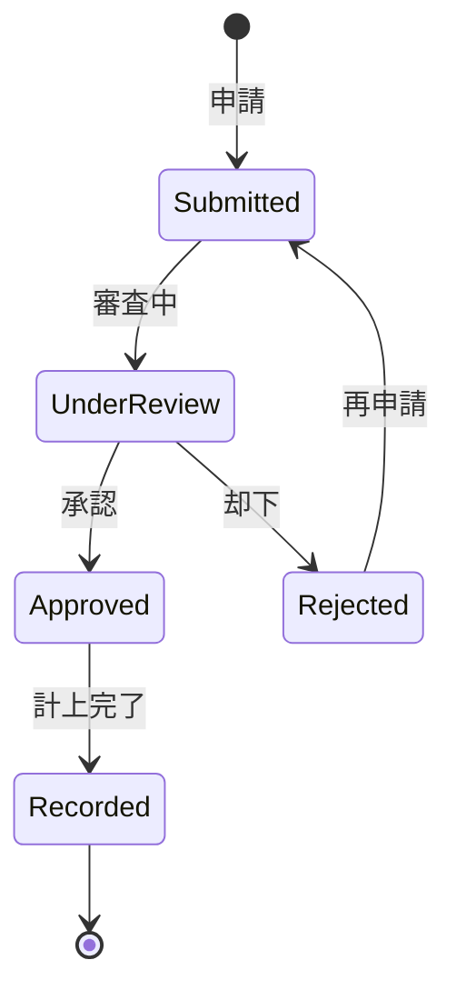

# ビジネスオペレーション: コストを配分し最適化する

**バージョン**: 1.0.0
**更新日**: 2025-09-30

## 概要

**目的**: 一定額以上のコストや例外的なコストに対して適切な承認プロセスを実行する

**パターン**: Workflow

**ゴール**: 承認が必要なコストが適切な権限者によって承認され、不正支出が防止される

## 関係者とロール

- **申請者**: コスト発生の申請
- **承認者**: 権限に応じた承認判断
- **財務マネージャー**: 承認プロセスの監視

## プロセスフロー

> **重要**: プロセスフローは必ず番号付きリスト形式で記述してください。
> Mermaid形式は使用せず、テキスト形式で記述することで、代替フローと例外フローが視覚的に分離されたフローチャートが自動生成されます。

1. ユーザーがコスト申請を行う
2. システムが金額・内容確認を実行する
3. システムが承認ルート判定を行う
4. システムが自動承認を行う
5. システムが承認者へ通知を行う
6. システムが承認判断を行う
7. システムが承認完了を行う
8. システムが却下・差戻しを処理する
9. システムがコスト計上を処理する

## 代替フロー

### 代替フロー1: 情報不備
- 2-1. システムが情報の不備を検知する
- 2-2. システムが修正要求を送信する
- 2-3. ユーザーが情報を修正し再実行する
- 2-4. 基本フロー2に戻る

## 例外処理

### 例外1: システムエラー
- システムエラーが発生した場合
- エラーメッセージを表示する
- 管理者に通知し、ログに記録する

### 例外2: 承認却下
- 承認が却下された場合
- 却下理由をユーザーに通知する
- 修正後の再実行を促す

## ビジネス状態

## KPI

- **承認処理時間**: 平均2営業日以内
- **承認率**: 85%以上（適切な事前チェックの指標）
- **却下後再承認率**: 却下案件の70%が修正後承認
- **承認遅延件数**: 月間5件以下

## ビジネスルール

- 1万円未満: 自動承認
- 1万円以上10万円未満: マネージャー承認
- 10万円以上100万円未満: 部門長承認
- 100万円以上: 役員承認
- 緊急案件: 口頭承認後、事後申請可
- 承認期限: 申請後3営業日以内に判断
- 承認権限の委譲: 不在時の代理承認者設定必須

## 入出力仕様

### 入力

- **コスト申請情報**: 金額、目的、根拠資料、緊急度
- **申請者情報**: 申請者ID、所属部門、役職
- **承認ルール**: 金額別承認権限、承認フロー定義

### 出力

- **承認結果**: 承認/却下、承認日時、承認者コメント
- **承認履歴**: 承認プロセスの記録、エスカレーション履歴
- **承認待ちリスト**: 未承認案件一覧、期限超過案件

## 例外処理

- **承認者不在**: 代理承認者へ自動エスカレーション、上位承認者への通知
- **承認期限超過**: 上位承認者へ通知、自動催促メール送信
- **承認後の取消**: 取消理由記録、再審査、監査証跡保存
- **重複申請**: 重複チェック、既存申請との統合

## 派生ユースケース

このビジネスオペレーションから以下のユースケースが派生します：

1. コストを申請する
2. コストを承認する
3. コストを却下する
4. 承認状況を確認する
