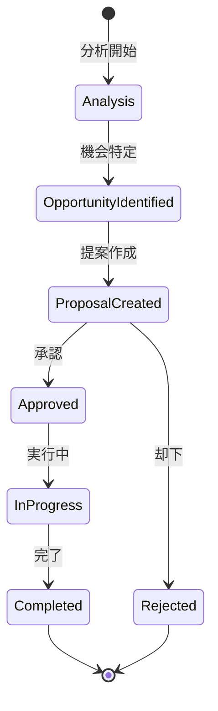

# ビジネスオペレーション: コストトレンドを分析する

**バージョン**: 1.0.0
**更新日**: 2025-09-30

## 概要

**目的**: コスト構造を分析し、無駄なコストを特定して削減案を提案する

**パターン**: Analytics

**ゴール**: コスト削減機会が特定され、実行可能な最適化提案が作成される

## 関係者とロール

- **エグゼクティブ**: コスト削減方針の承認
- **財務マネージャー**: コスト分析、最適化提案
- **PM**: プロジェクトレベルのコスト改善

## プロセスフロー

> **重要**: プロセスフローは必ず番号付きリスト形式で記述してください。
> Mermaid形式は使用せず、テキスト形式で記述することで、代替フローと例外フローが視覚的に分離されたフローチャートが自動生成されます。

1. システムがコストデータ収集を処理する
2. システムがコスト構造分析を処理する
3. システムが予算実績差異分析を処理する
4. システムがコスト要因分析を処理する
5. システムが削減機会特定を処理する
6. システムが最適化案策定を処理する
7. システムが実行計画作成を行う

## 代替フロー

### 代替フロー1: 情報不備
- 2-1. システムが情報の不備を検知する
- 2-2. システムが修正要求を送信する
- 2-3. ユーザーが情報を修正し再実行する
- 2-4. 基本フロー2に戻る

## 例外処理

### 例外1: システムエラー
- システムエラーが発生した場合
- エラーメッセージを表示する
- 管理者に通知し、ログに記録する

### 例外2: 承認却下
- 承認が却下された場合
- 却下理由をユーザーに通知する
- 修正後の再実行を促す

## ビジネス状態

## KPI

- **コスト削減率**: 年間総コストの5%以上削減
- **分析頻度**: 月次で主要プロジェクトを分析
- **提案実行率**: 承認された提案の80%以上を実行
- **ROI**: コスト削減施策のROI 300%以上

## ビジネスルール

- 予算差異20%以上は詳細分析実施
- 削減案は費用対効果を定量評価
- 品質・納期に影響する削減は不可
- ベンチマーク: 業界平均、社内平均と比較
- 分析期間: 過去12ヶ月のトレンド分析
- 削減目標: プロジェクト別に設定

## 入出力仕様

### 入力

- **コスト実績データ**: プロジェクト別、カテゴリ別、月次推移
- **予算データ**: 当初予算、改訂予算、予算執行状況
- **業界ベンチマークデータ**: 業界平均コスト、競合情報
- **プロジェクト成果指標**: 品質、納期、顧客満足度

### 出力

- **コスト分析レポート**: トレンド分析、構造分析、要因分析
- **予算実績差異分析レポート**: 差異の可視化、要因説明
- **コスト削減提案書**: 削減機会、施策内容、期待効果
- **実行計画書**: アクションプラン、担当者、スケジュール

## 例外処理

- **データ不足**: 推定値で補完、信頼度を明示、データ収集計画策定
- **外部要因**: 為替、市場価格変動を考慮、外部要因の影響を分離
- **提案却下**: 却下理由を記録、代替案検討、次回提案に反映
- **複数要因の複合**: 多変量解析、優先順位付け

## 派生ユースケース

このビジネスオペレーションから以下のユースケースが派生します：

1. コスト構造を分析する
2. 予算実績差異を分析する
3. コスト削減機会を特定する
4. 最適化提案を作成する
