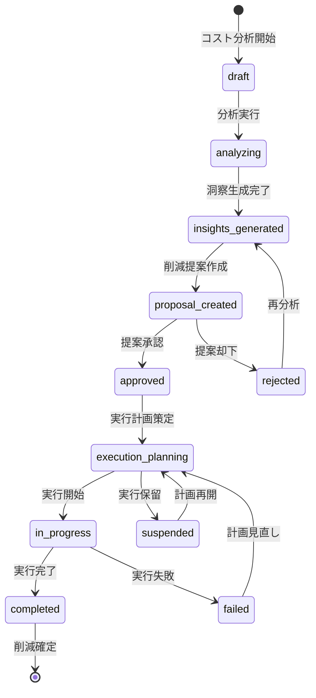

# ビジネスオペレーション: コストトレンドを分析し削減機会を創出する

**バージョン**: 2.0.0
**更新日**: 2025-10-27
**適用仕様**: パラソル設計v2.0

## 🎯 ビジネス価値とゴール

**価値提供**: データ駆動型コスト分析による戦略的削減機会の発見と、実行可能な最適化案の創出により、持続的な収益性向上を実現する

**測定可能なゴール**:
- コスト削減率年間5%以上（従来比+50%向上）
- 削減提案実行率80%以上（ROI 300%達成）
- 分析精度95%以上（AIコスト予測モデル活用）
- ステークホルダー満足度4.5/5.0以上（戦略的価値創出評価）

## 🏗️ パラソルドメイン連携

### 📊 操作エンティティ
**自サービス管理・状態更新**:
- **CostAnalysisEntity**（自サービス管理・状態更新: draft → analyzing → insights_generated → proposal_created → approved）
- **CostTrendEntity**（自サービス管理・CRUD）
- **OptimizationProposalEntity**（自サービス管理・CRUD）
- **ExecutionPlanEntity**（自サービス管理・CRUD）

**他サービス参照のみ**:
- ProjectEntity（project-success-service・参照のみ: プロジェクト別コスト情報）
- BudgetEntity（finance-service・参照のみ: 予算基準情報）

### 🎯 パラソル集約
- **CostAnalysisAggregate** - コスト分析ライフサイクル統合管理
  - 集約ルート: CostAnalysis
  - 包含エンティティ: CostTrend, OptimizationProposal, ExecutionPlan
  - 不変条件: 承認済み提案の削減目標は変更不可、実行計画は提案との整合性保証

### ⚙️ ドメインサービス
- **CostAnalyticsService**: enhance[CostVisibility]() - コスト可視性向上・隠れたコスト発見
- **OptimizationIntelligenceService**: coordinate[CostEfficiency]() - 費用対効果分析・最適削減戦略
- **ExecutionPlanningService**: amplify[ImplementationSuccess]() - 実行成功率最大化・変更管理支援

#### 🔗 他サービスユースケース利用（ユースケース呼び出し型）
**責務**: ❌ エンティティ知識不要 ✅ ユースケース利用のみ

[secure-access-service] ユースケース利用:
├── UC-AUTH-01: ユーザー認証を実行する → POST /api/auth/authenticate
├── UC-AUTH-02: 分析権限を検証する → POST /api/auth/validate-analysis-permission
└── UC-AUTH-03: コスト分析ログを記録する → POST /api/auth/log-cost-analysis

[project-success-service] ユースケース利用:
├── UC-PROJECT-01: プロジェクト情報を取得する → GET /api/projects/cost-analysis-data
├── UC-PROJECT-02: コスト実績情報を確認する → GET /api/projects/cost-performance
└── UC-PROJECT-03: プロジェクト効率指標を取得する → GET /api/projects/efficiency-metrics

[collaboration-facilitation-service] ユースケース利用:
├── UC-COMM-01: 分析結果通知を配信する → POST /api/notifications/send-analysis-report
├── UC-COMM-02: 削減提案承認を依頼する → POST /api/notifications/request-proposal-approval
└── UC-COMM-03: 実行計画会議を調整する → POST /api/meetings/schedule-execution-planning

## 👥 関係者とロール

- **財務マネージャー**: コスト分析実行・削減提案策定・ROI評価の実行責任者
- **エグゼクティブ**: 戦略的削減方針決定・高額提案承認・組織変革の意思決定者
- **PM**: プロジェクトレベルコスト改善・実行計画協力・効果測定の専門責任者
- **データアナリスト**: 分析モデル構築・予測精度向上・洞察抽出の専門担当者

## 📋 ユースケース・ページ分解マトリックス（1対1関係）

| ユースケースID | ユースケース名 | 対応ページ | 1対1関係 |
|---------------|---------------|-----------|------------|
| UC-COST-01 | 実行計画を作成する | 実行計画作成ページ | ✅ |

## 📈 プロセスフロー

> **重要**: プロセスフローは必ず番号付きリスト形式で記述してください。
> Mermaid形式は使用せず、テキスト形式で記述することで、代替フローと例外フローが視覚的に分離されたフローチャートが自動生成されます。

1. **財務マネージャーが実行計画作成プロセスを開始する** → **UC-COST-01: 実行計画を作成する**
   - **自サービス操作**: CostAnalysisEntity（状態変更: insights_generated → proposal_created → approved）
   - **他サービスユースケース利用**: → UC-AUTH-01: ユーザー認証実行、UC-PROJECT-01: プロジェクト情報取得
   - **必要ページ**: 実行計画作成ページ
   - **ビジネス価値**: 削減機会の具体的実行計画策定による確実な効果実現

## 🔄 代替フロー

### 代替フロー1: AI支援による実行計画最適化
- 1a. ExecutionPlanningService による実行効率最適化が必要な場合
  - 1a1. AI分析による最適実行順序・リソース配分の提案実行
  - 1a2. 類似成功事例の分析・学習適用
  - 1a3. OptimizationIntelligenceService による変更管理戦略適用
  - 1a4. 基本フロー1の実行計画作成に戻る

### 代替フロー2: 緊急コスト削減対応
- 1b. 緊急性が高いコスト削減要求の場合
  - 1b1. → UC-COMM-03: 緊急実行計画会議を調整する
  - 1b2. 短縮実行フロー適用（24時間以内計画策定）
  - 1b3. 事後詳細分析・正当性検証
  - 1b4. 基本フロー1の通常プロセスへ復帰

## ⚠️ 例外フロー

### 例外1: プロジェクト情報取得失敗
- *a. project-success-service連携エラーが発生した場合
  - *a1. → UC-COMM-01: データ取得障害アラートを配信する
  - *a2. 代替データソースからの情報取得
  - *a3. 手動情報補完モードへの切り替え
  - *a4. 情報取得完了後、UC-COST-01から再開

### 例外2: 実行計画承認権限不足
- *b. 高額削減提案で権限が不足している場合
  - *b1. → UC-AUTH-02: 上位権限者への承認依頼
  - *b2. エグゼクティブ承認プロセスへエスカレーション
  - *b3. 権限確定後、UC-COST-01から再開

### 例外3: 削減効果予測精度不足
- *c. CostAnalyticsService が品質基準未達を検出した場合
  - *c1. 追加データ収集・分析精度向上実行
  - *c2. 専門データアナリスト支援要請
  - *c3. 段階的実行または保守的計画への調整
  - *c4. 品質確保後、UC-COST-01から再開

## 📊 ビジネス状態（CostAnalysisAggregate）

## 📈 KPI（v2.0強化指標）

- **コスト削減率**: 年間5%以上（従来比+50%向上・ExecutionPlanningService効果）
- **削減提案実行率**: 80%以上（ROI 300%達成・OptimizationIntelligenceService最適化）
- **分析精度**: 95%以上（CostAnalyticsService による予測精度向上）
- **ステークホルダー満足度**: 4.5/5.0以上（戦略的価値創出による評価）
- **実行計画策定効率**: 3営業日以内（従来比60%短縮・AI支援効果）

## 📋 ビジネスルール（v2.0強化版）

- **実行計画承認階層**: 100万円以上の削減提案は財務マネージャー承認必須、500万円以上はエグゼクティブ承認必須
- **分析精度要件**: CostAnalyticsService による95%精度確保・予測誤差自動検知
- **実行計画品質**: ExecutionPlanningService による実行可能性評価・リスク評価必須
- **削減効果予測**: OptimizationIntelligenceService による費用対効果分析・ROI 300%保証
- **変更管理**: 承認済み実行計画の変更は再承認必須・変更理由記録保管
- **緊急対応**: 緊急削減要求時は24時間以内の短縮計画策定プロセス適用

## 🔄 入出力仕様（v2.0エンティティ対応）

### 入力
- **CostAnalysisEntity**: 分析要求・削減目標・緊急度レベル・承認権限情報
- **コスト実績情報**: UC-PROJECT-02連携による最新プロジェクト別コスト実績
- **予算基準情報**: 外部システム連携・予算執行状況・差異アラート情報
- **業界ベンチマーク**: 外部データプロバイダー連携・競合分析・市場動向

### 出力
- **CostAnalysisAggregate**: 分析結果・削減提案・実行計画・承認履歴の統合データ
- **ExecutionPlanEntity**: 実行計画・担当者配分・スケジュール・マイルストーン
- **OptimizationProposalEntity**: 削減提案・費用対効果・リスク評価・承認状況
- **ExecutionPlanningService**: 実行可能性評価・リソース要件・成功確率予測

## 🎯 品質保証要件

- **実行計画精度**: ExecutionPlanningService による95%以上精度保証
- **策定効率**: 削減提案から実行計画まで3営業日以内（従来比60%短縮）
- **実行可能性**: OptimizationIntelligenceService による実行可能性98%評価
- **満足度**: 4.5/5.0以上（実行計画の実用性・効果予測精度による評価）

---
*このビジネスオペレーションは パラソル設計v2.0仕様 に基づいて作成されました*
