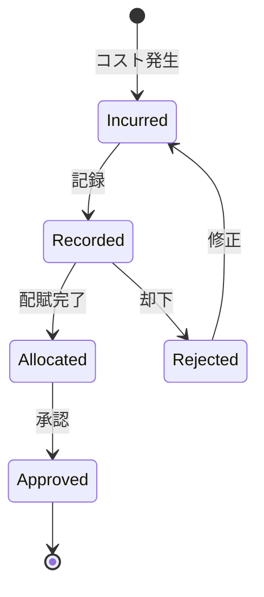

# ビジネスオペレーション: コストを記録し分類する

**バージョン**: 1.0.0
**更新日**: 2025-09-30

## 概要

**目的**: 発生したコストを正確に記録し、プロジェクトや部門に適切に配賦する

**パターン**: Workflow + CRUD

**ゴール**: すべてのコストが正確に記録され、適切な配賦基準でプロジェクトに割り当てられる

## 関係者とロール

- **財務マネージャー**: コスト記録、配賦処理
- **PM**: 直接コストの確認、配賦承認
- **従業員**: 経費申請

## プロセスフロー

> **重要**: プロセスフローは必ず番号付きリスト形式で記述してください。
> Mermaid形式は使用せず、テキスト形式で記述することで、代替フローと例外フローが視覚的に分離されたフローチャートが自動生成されます。

1. システムがコスト発生を処理する
2. システムがコスト記録を処理する
3. システムがコスト分類を処理する
4. システムが配賦基準判定を処理する
5. システムが配賦計算を処理する
6. システムが配賦実行を実行する
7. システムが完了を処理する

## 代替フロー

### 代替フロー1: 情報不備
- 2-1. システムが情報の不備を検知する
- 2-2. システムが修正要求を送信する
- 2-3. ユーザーが情報を修正し再実行する
- 2-4. 基本フロー2に戻る

## 例外処理

### 例外1: システムエラー
- システムエラーが発生した場合
- エラーメッセージを表示する
- 管理者に通知し、ログに記録する

### 例外2: 承認却下
- 承認が却下された場合
- 却下理由をユーザーに通知する
- 修正後の再実行を促す

## ビジネス状態

## KPI

- **記録タイムリネス**: コスト発生後5営業日以内に記録
- **配賦精度**: 誤配賦率1%以下
- **未配賦コスト比率**: 総コストの3%以内
- **承認処理時間**: 記録後3営業日以内に承認

## ビジネスルール

- 直接コスト: プロジェクトに直接配賦
- 間接コスト: 工数比率で按分配賦
- 固定資産: 1年以上使用は資産計上後、減価償却
- 承認権限: 1万円以上はマネージャー承認必須
- コストカテゴリ: Labor, Material, Subcontract, Travel, Other
- 為替レート: コスト発生日のレートを適用

## 入出力仕様

### 入力

- **コスト発生情報**: 金額、発生日、ベンダー、領収書
- **コストタイプ**: Labor（人件費）、Material（材料費）、Subcontract（外注費）、Travel（旅費交通費）、Other（その他）
- **プロジェクト情報**: 配賦先プロジェクト、配賦比率
- **配賦基準**: 工数比率、売上比率、メンバー数比率

### 出力

- **コストレコード**: costId、金額、分類、発生日、ステータス
- **配賦レコード**: プロジェクト別コスト、配賦率、配賦額
- **コスト集計レポート**: カテゴリ別集計、プロジェクト別集計、月次推移

## 例外処理

- **配賦先不明**: 暫定配賦後、後日精算、未配賦としてフラグ設定
- **金額誤り**: 修正仕訳で対応、原因記録と監査証跡保存
- **承認遅延**: エスカレーション処理、上位承認者へ通知
- **重複記録**: 重複チェック、既存レコードとの照合

## 派生ユースケース

このビジネスオペレーションから以下のユースケースが派生します：

1. 人件費コストを記録する
2. 外注費コストを記録する
3. 経費コストを記録する
4. コストを配賦する
5. 配賦を調整する
