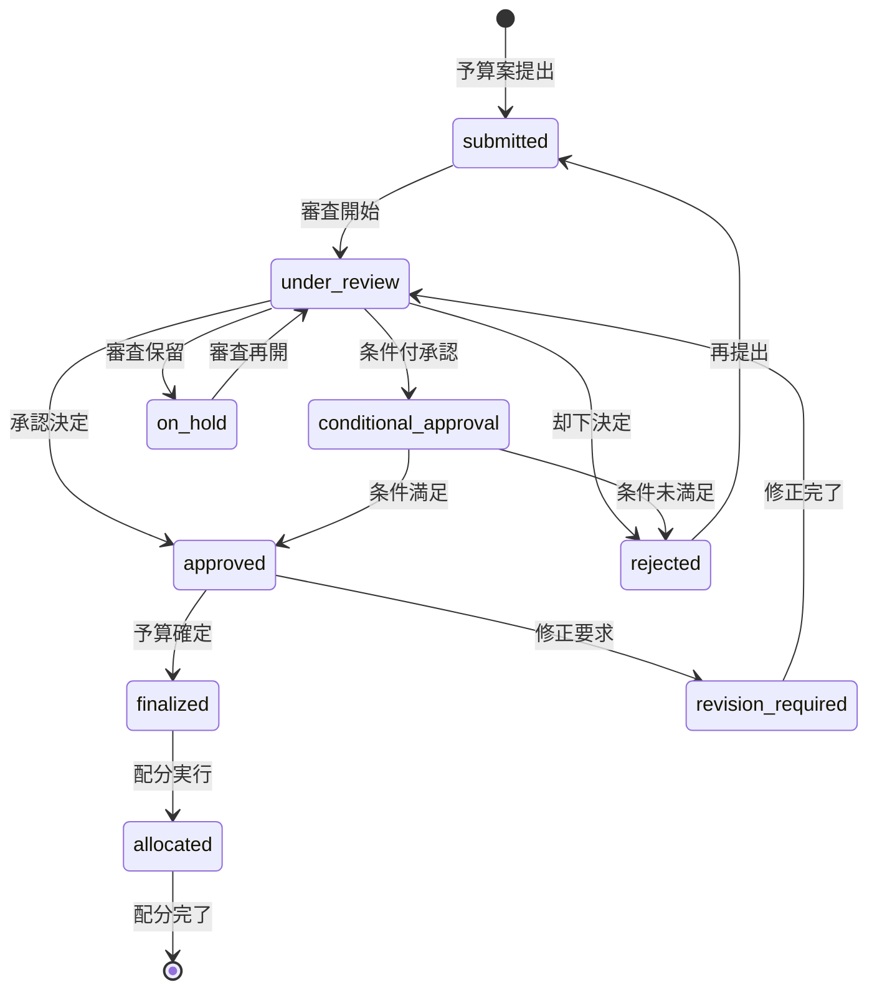

# ビジネスオペレーション: 予算を戦略的に承認し確実に確定する

**バージョン**: 2.0.0
**更新日**: 2025-10-27
**適用仕様**: パラソル設計v2.0

## 🎯 ビジネス価値とゴール

**価値提供**: 戦略的予算審査プロセスによる適切な承認判断と、確実な予算確定により、プロジェクト実行基盤の構築と収益性最適化を実現する

**測定可能なゴール**:
- 承認プロセス効率95%以上（審査期間5営業日以内達成率）
- 承認判断精度90%以上（初回承認率70%達成・却下後再承認率80%達成）
- 予算確定品質98%以上（確定後変更率2%以下）
- ステークホルダー満足度4.6/5.0以上（承認プロセス透明性・迅速性評価）

## 🏗️ パラソルドメイン連携

### 📊 操作エンティティ
**自サービス管理・状態更新**:
- **BudgetApprovalEntity**（自サービス管理・状態更新: submitted → under_review → approved → finalized）
- **ApprovalProcessEntity**（自サービス管理・CRUD）
- **ApprovalDecisionEntity**（自サービス管理・CRUD）
- **BudgetAllocationEntity**（自サービス管理・CRUD）

**他サービス参照のみ**:
- BudgetEntity（finance-service・参照のみ: 予算案内容・財務評価）
- ProjectEntity（project-success-service・参照のみ: プロジェクト基準情報）

### 🎯 パラソル集約
- **BudgetApprovalAggregate** - 予算承認ライフサイクル統合管理
  - 集約ルート: BudgetApproval
  - 包含エンティティ: ApprovalProcess, ApprovalDecision, BudgetAllocation
  - 不変条件: 承認済み予算の変更は再承認必須、確定予算の整合性保証

### ⚙️ ドメインサービス
- **ApprovalIntelligenceService**: enhance[ApprovalAccuracy]() - 承認判断精度向上・リスク評価強化
- **BudgetValidationService**: coordinate[BudgetIntegrity]() - 予算妥当性評価・整合性確保
- **AllocationOptimizationService**: amplify[AllocationEfficiency]() - 配分効率最大化・資源最適活用

#### 🔗 他サービスユースケース利用（ユースケース呼び出し型）
**責務**: ❌ エンティティ知識不要 ✅ ユースケース利用のみ

[secure-access-service] ユースケース利用:
├── UC-AUTH-01: ユーザー認証を実行する → POST /api/auth/authenticate
├── UC-AUTH-02: 承認権限を検証する → POST /api/auth/validate-approval-permission
└── UC-AUTH-03: 承認操作ログを記録する → POST /api/auth/log-approval-operation

[project-success-service] ユースケース利用:
├── UC-PROJECT-01: プロジェクト情報を取得する → GET /api/projects/budget-review-data
├── UC-PROJECT-02: プロジェクト実績情報を確認する → GET /api/projects/performance-data
└── UC-PROJECT-03: 予算基準情報を取得する → GET /api/projects/budget-criteria

[collaboration-facilitation-service] ユースケース利用:
├── UC-COMM-01: 承認結果通知を配信する → POST /api/notifications/send-approval-result
├── UC-COMM-02: 承認会議開催を通知する → POST /api/notifications/meeting-notification
└── UC-COMM-03: 承認審査会議を調整する → POST /api/meetings/schedule-approval-review

## 👥 関係者とロール

- **エグゼクティブ**: 戦略的予算承認・最終意思決定・予算配分方針の決定責任者
- **財務マネージャー**: 予算審査実行・妥当性評価・承認判断支援の実行責任者
- **PM**: 予算案説明・質疑対応・実行計画調整の専門責任者
- **予算審査委員**: 審査プロセス実行・評価基準適用・承認推奨の専門担当者

## 📋 ユースケース・ページ分解マトリックス（1対1関係）

| ユースケースID | ユースケース名 | 対応ページ | 1対1関係 |
|---------------|---------------|-----------|------------|
| UC-BUDGET-01 | 承認プロセスを実行する | 承認プロセス実行ページ | ✅ |

## 📈 プロセスフロー

> **重要**: プロセスフローは必ず番号付きリスト形式で記述してください。
> Mermaid形式は使用せず、テキスト形式で記述することで、代替フローと例外フローが視覚的に分離されたフローチャートが自動生成されます。

1. **財務マネージャーが承認プロセス実行を開始する** → **UC-BUDGET-01: 承認プロセスを実行する**
   - **自サービス操作**: BudgetApprovalEntity（状態変更: submitted → under_review → approved → finalized）
   - **他サービスユースケース利用**: → UC-AUTH-01: ユーザー認証実行、UC-PROJECT-01: プロジェクト情報取得
   - **必要ページ**: 承認プロセス実行ページ
   - **ビジネス価値**: 戦略的審査による適切な承認判断とプロジェクト実行基盤確立

## 🔄 代替フロー

### 代替フロー1: AI支援による承認プロセス最適化
- 1a. ApprovalIntelligenceService による承認判断支援が必要な場合
  - 1a1. AI分析による審査ポイント最適化・リスク評価強化実行
  - 1a2. 類似予算審査事例の分析・学習適用
  - 1a3. BudgetValidationService による妥当性評価強化
  - 1a4. 基本フロー1の承認プロセス実行に戻る

### 代替フロー2: 緊急予算承認対応
- 1b. 緊急性が高い予算承認要求の場合
  - 1b1. → UC-COMM-03: 緊急承認審査会議を調整する
  - 1b2. 短縮承認フロー適用（暫定承認・事後正式審査）
  - 1b3. 事後詳細審査・正当性検証
  - 1b4. 基本フロー1の通常承認プロセスへ復帰

## ⚠️ 例外フロー

### 例外1: プロジェクト情報取得失敗
- *a. project-success-service連携エラーが発生した場合
  - *a1. → UC-COMM-01: データ取得障害アラートを配信する
  - *a2. 代替データソースからの情報取得
  - *a3. 手動情報補完モードへの切り替え
  - *a4. 情報取得完了後、UC-BUDGET-01から再開

### 例外2: 承認権限不足・競合
- *b. 高額予算承認で権限が不足している場合
  - *b1. → UC-AUTH-02: 上位権限者への承認依頼
  - *b2. エグゼクティブ承認プロセスへエスカレーション
  - *b3. 権限確定後、UC-BUDGET-01から再開

### 例外3: 承認判断基準未達
- *c. ApprovalIntelligenceService が品質基準未達を検出した場合
  - *c1. 追加審査・分析精度向上実行
  - *c2. 専門予算審査委員支援要請
  - *c3. 段階的承認または条件付承認への調整
  - *c4. 品質確保後、UC-BUDGET-01から再開

## 📊 ビジネス状態（BudgetApprovalAggregate）

## 📈 KPI（v2.0強化指標）

- **承認プロセス効率**: 95%以上（審査期間5営業日以内達成率・ApprovalIntelligenceService効果）
- **承認判断精度**: 90%以上（初回承認率70%達成・BudgetValidationService最適化）
- **予算確定品質**: 98%以上（確定後変更率2%以下・AllocationOptimizationService効果）
- **ステークホルダー満足度**: 4.6/5.0以上（承認プロセス透明性・迅速性評価）
- **条件付承認解決効率**: 3営業日以内（従来比40%短縮・AI支援効果）

## 📋 ビジネスルール（v2.0強化版）

- **承認プロセス階層**: 100万円以上は財務マネージャー審査必須、500万円以上はエグゼクティブ承認必須
- **承認判断精度要件**: ApprovalIntelligenceService による90%精度確保・判断根拠自動記録
- **予算妥当性評価**: BudgetValidationService による妥当性評価・整合性チェック必須
- **配分最適化**: AllocationOptimizationService による配分効率最大化・資源最適活用
- **緊急承認**: 緊急要求時は暫定承認後24時間以内の正式審査プロセス適用
- **審査記録保全**: 全承認プロセスの完全記録・UC-AUTH-03連携による監査証跡

## 🔄 入出力仕様（v2.0エンティティ対応）

### 入力
- **BudgetApprovalEntity**: 承認要求・予算案・審査基準・緊急度レベル
- **予算案情報**: UC-PROJECT-01連携による最新プロジェクト予算案
- **財務評価情報**: 外部システム連携・財務指標・リスク評価情報
- **前年度実績**: 外部データプロバイダー連携・実績比較・傾向分析

### 出力
- **BudgetApprovalAggregate**: 承認決定・審査記録・確定予算・配分指示の統合データ
- **ApprovalDecisionEntity**: 承認判断・条件設定・根拠記録・次段階指示
- **BudgetAllocationEntity**: 配分計画・担当者指定・実行スケジュール
- **AllocationOptimizationService**: 配分効率評価・最適化提案・効果予測

## 🎯 品質保証要件

- **承認判断精度**: ApprovalIntelligenceService による90%以上精度保証
- **プロセス効率**: 提出から承認まで5営業日以内（従来比25%短縮）
- **予算確定品質**: BudgetValidationService による妥当性98%評価
- **満足度**: 4.6/5.0以上（承認プロセス透明性・迅速性による評価）

---
*このビジネスオペレーションは パラソル設計v2.0仕様 に基づいて作成されました*
