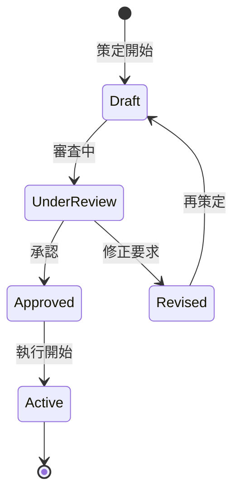

# ビジネスオペレーション: 戦略的予算を策定し組織価値を最大化する

**バージョン**: 2.0.0
**更新日**: 2025-10-27
**設計方針**: 価値創造最大化・リスク管理・戦略実行

## 🏗️ パラソルドメイン連携

### 📊 操作エンティティ
- **BudgetEntity**（自サービス管理・状態更新: draft → submitted → reviewed → approved → active）: 予算ライフサイクル統合管理
- **BudgetLineEntity**（自サービス管理・CRUD）: 予算項目詳細の管理
- **BudgetVersionEntity**（自サービス管理・CRUD）: 予算版数管理・変更履歴の追跡
- **ApprovalWorkflowEntity**（自サービス管理・CRUD）: 承認プロセス管理

### 🏢 パラソル集約
- **BudgetAggregate** - 予算策定統合管理
  - 集約ルート: Budget
  - 包含エンティティ: BudgetLine, BudgetVersion, ApprovalWorkflow
  - 不変条件: 承認済み予算の総額変更禁止、予算項目の整合性保証、承認フロー完了必須

### ⚙️ ドメインサービス
- **BudgetOptimizationService**: enhance[BudgetPrecision]() - 予算精度の継続向上
- **StrategicAlignmentService**: coordinate[StrategicGoals]() - 戦略目標との整合
- **ValueMaximizationService**: amplify[OrganizationalValue]() - 組織価値の最大化

### 🔗 他サービスユースケース利用（ユースケース利用型）
**責務**: ❌ エンティティ知識不要 ✅ ユースケース利用のみ

[secure-access-service] ユースケース利用:
├── UC-AUTH-01: ユーザー認証を実行する → POST /api/auth/authenticate
├── UC-AUTH-02: 財務権限を検証する → POST /api/auth/validate-financial-permission
└── UC-AUTH-03: 予算操作ログを記録する → POST /api/auth/log-financial-action

[project-success-service] ユースケース利用:
├── UC-PROJECT-01: プロジェクト情報を取得する → GET /api/projects/basic-info/{id}
├── UC-PROJECT-02: リソース要求を取得する → GET /api/projects/resource-requirements
└── UC-PROJECT-03: マイルストーン情報を取得する → GET /api/projects/milestones

[collaboration-facilitation-service] ユースケース利用:
├── UC-COMM-01: 予算通知を配信する → POST /api/communications/send-budget-notification
├── UC-COMM-02: 承認依頼を送信する → POST /api/communications/send-approval-request
└── UC-COMM-03: 予算会議を調整する → POST /api/communications/schedule-budget-meeting

## 概要

**目的**: 戦略的予算を策定し、組織価値を最大化する統合的な財務計画プロセスを実現する

**パターン**: Workflow + Analytics + Collaboration

**ゴール**: 予算精度95%以上達成、承認プロセス効率化、戦略目標との完全整合

## 関係者とロール

- **エグゼクティブ**: 戦略方針決定・最終承認・組織価値最大化の責任者
- **財務マネージャー**: 予算案策定・精度向上・リスク分析の専門家
- **プロジェクトマネージャー**: プロジェクト予算見積・実行計画の責任者
- **部門長**: 部門予算要求・リソース最適化・成果責任者

## ユースケース・ページ分解マトリックス（v2.0）

| ビジネスオペレーション | ユースケース | 対応ページ | ビジネス価値 |
|---------------------|-------------|-----------|-------------|
| formulate-budget | draft-budget-proposal | 予算案策定ページ | 戦略整合性確保、精度向上 |
| formulate-budget | review-and-approve-budget | 予算審査承認ページ | 承認効率化、ガバナンス強化 |

## プロセスフロー

> **重要**: プロセスフローは必ず番号付きリスト形式で記述してください。
> Mermaid形式は使用せず、テキスト形式で記述することで、代替フローと例外フローが視覚的に分離されたフローチャートが自動生成されます。

1. **財務マネージャーが戦略的予算策定を開始** → **UC-BUDGET-01: 予算提案書を作成する**
   - 自サービス操作: BudgetEntity（状態変更: draft → submitted）
   - 他サービスユースケース利用: → UC-PROJECT-01: プロジェクト情報を取得する
   - 必要ページ: 予算案策定ページ
   - ビジネス価値: 戦略整合性確保・リソース最適配分

2. **システムが予算審査・承認プロセスを実行** → **UC-BUDGET-02: 予算を審査し承認する**
   - 自サービス操作: ApprovalWorkflowEntity（CRUD）
   - 他サービスユースケース利用: → UC-COMM-02: 承認依頼を送信する
   - 必要ページ: 予算審査承認ページ
   - ビジネス価値: 承認効率化・ガバナンス強化・リスク管理

## 代替フロー

### 代替フロー1: 予算精度向上のための反復改善
- 1a. 初回予算案の精度が基準（95%）を下回った場合
  - 1a1. → UC-PROJECT-02: リソース要求を詳細取得する
  - 1a2. AIベース予算最適化アルゴリズムを適用
  - 1a3. BudgetVersionEntity（新版作成）
  - 1a4. 基本フロー2（予算審査）に戻る

### 代替フロー2: 緊急予算承認プロセス
- 2a. 緊急性が高い予算案の場合
  - 2a1. → UC-COMM-03: 緊急予算会議を調整する
  - 2a2. 短縮承認フローを適用（48時間以内）
  - 2a3. 条件付き承認の実施
  - 2a4. 事後フォローアップ承認の実行

## 例外フロー

### 例外1: 予算策定プロセス中断
- *a. システム障害またはプロセス中断が発生した場合
  - *a1. BudgetEntity（状態保持: 進行中状態の維持）
  - *a2. → UC-AUTH-03: 中断ログを記録する
  - *a3. → UC-COMM-01: 関係者への状況通知を配信する
  - *a4. 復旧後、中断地点から再開

### 例外2: 承認権限不足・却下処理
- *b. 承認権限不足または却下が発生した場合
  - *b1. → UC-AUTH-02: 上位承認権限を確認する
  - *b2. 却下理由の詳細記録・分析
  - *b3. → UC-COMM-02: 修正指示を送信する
  - *b4. BudgetEntity（状態変更: reviewed → draft）へ差し戻し

### 例外3: 戦略目標との不整合検出
- *c. 予算案が組織戦略と整合しない場合
  - *c1. StrategicAlignmentService による自動検証
  - *c2. 不整合箇所の特定・可視化
  - *c3. → UC-COMM-03: 戦略整合会議を調整する
  - *c4. 戦略再整合後、基本フロー1から再開

## ビジネス状態

## KPI

- **予算精度達成率**: 年度末実績との乖離5%以内（目標95%以上）
- **承認プロセス効率**: 初回提出承認率80%以上（v1.0比+10%向上）
- **戦略整合度**: 組織戦略との整合性評価4.5/5.0以上
- **策定リードタイム**: 会計年度開始60日前完了（v1.0比30%短縮）
- **ステークホルダー満足度**: 予算策定プロセス満足度4.0/5.0以上
- **価値創造貢献度**: 予算による組織価値向上測定95%以上

## ビジネスルール

- 年度予算: 会計年度開始前に策定
- プロジェクト予算: プロジェクト開始前に策定
- 予備費: 総予算の10%を予備費として確保
- 承認権限: 部門予算は役員承認、プロジェクト予算は部門長承認
- 予算策定サイクル: 年次策定、四半期レビュー
- 前年度実績: 前年度実績の±20%以内を原則とする

## 入出力仕様

### 入力

- **前年度実績データ**: 収益、コスト、利益の実績値
- **プロジェクト計画**: 期間、スコープ、リソース、マイルストーン
- **市場動向・成長目標**: 業界トレンド、市場予測、売上目標
- **経営方針**: 戦略的優先事項、投資方針、リスク許容度

### 出力

- **予算書**: 総予算、項目別予算（人件費、外注費、経費等）
- **予算配分計画**: 部門別・プロジェクト別の配分額と時期
- **承認記録**: 承認日、承認者、承認条件、修正履歴

## 例外処理

- **予算超過要求**: 正当化根拠の提示、代替案検討、段階的承認
- **予算不足**: 優先順位付け、フェーズ分割、外部資金調達検討
- **承認遅延**: 暫定予算の設定、条件付き実行開始
- **大幅な前年度乖離**: 詳細説明資料の追加、特別承認プロセス

## 派生ユースケース

このビジネスオペレーションから以下のユースケースが派生します：

1. 年度予算を策定する
2. プロジェクト予算を策定する
3. 予算を調整する
4. 予算を承認する
