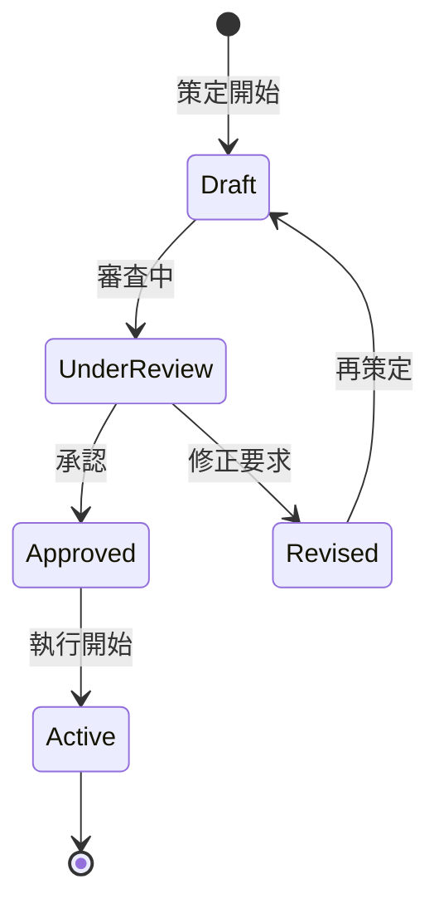

# ビジネスオペレーション: 予算を策定する

**バージョン**: 1.0.0
**更新日**: 2025-09-30

## 概要

**目的**: プロジェクトや部門の予算を策定し、承認を得る

**パターン**: Workflow

**ゴール**: 承認された予算が確定し、プロジェクト実行の基準となる

## 関係者とロール

- **エグゼクティブ**: 予算方針の決定、最終承認
- **財務マネージャー**: 予算案の作成、調整
- **PM**: プロジェクト予算の見積もり

## プロセスフロー

> **重要**: プロセスフローは必ず番号付きリスト形式で記述してください。
> Mermaid形式は使用せず、テキスト形式で記述することで、代替フローと例外フローが視覚的に分離されたフローチャートが自動生成されます。

1. システムが予算方針策定を処理する
2. システムがプロジェクト別見積を処理する
3. システムが予算案作成を行う
4. システムが予算調整を処理する
5. システムが予算承認審査を行う
6. システムが予算確定を処理する
7. システムが予算配分を処理する

## 代替フロー

### 代替フロー1: 情報不備
- 2-1. システムが情報の不備を検知する
- 2-2. システムが修正要求を送信する
- 2-3. ユーザーが情報を修正し再実行する
- 2-4. 基本フロー2に戻る

## 例外処理

### 例外1: システムエラー
- システムエラーが発生した場合
- エラーメッセージを表示する
- 管理者に通知し、ログに記録する

### 例外2: 承認却下
- 承認が却下された場合
- 却下理由をユーザーに通知する
- 修正後の再実行を促す

## ビジネス状態

## KPI

- **策定期間**: 会計年度開始2ヶ月前に承認完了
- **予算承認率**: 初回提出で70%以上が承認
- **予算精度**: 年度末実績との乖離15%以内
- **予算配分完了**: 承認後1週間以内に各部門へ配分

## ビジネスルール

- 年度予算: 会計年度開始前に策定
- プロジェクト予算: プロジェクト開始前に策定
- 予備費: 総予算の10%を予備費として確保
- 承認権限: 部門予算は役員承認、プロジェクト予算は部門長承認
- 予算策定サイクル: 年次策定、四半期レビュー
- 前年度実績: 前年度実績の±20%以内を原則とする

## 入出力仕様

### 入力

- **前年度実績データ**: 収益、コスト、利益の実績値
- **プロジェクト計画**: 期間、スコープ、リソース、マイルストーン
- **市場動向・成長目標**: 業界トレンド、市場予測、売上目標
- **経営方針**: 戦略的優先事項、投資方針、リスク許容度

### 出力

- **予算書**: 総予算、項目別予算（人件費、外注費、経費等）
- **予算配分計画**: 部門別・プロジェクト別の配分額と時期
- **承認記録**: 承認日、承認者、承認条件、修正履歴

## 例外処理

- **予算超過要求**: 正当化根拠の提示、代替案検討、段階的承認
- **予算不足**: 優先順位付け、フェーズ分割、外部資金調達検討
- **承認遅延**: 暫定予算の設定、条件付き実行開始
- **大幅な前年度乖離**: 詳細説明資料の追加、特別承認プロセス

## 派生ユースケース

このビジネスオペレーションから以下のユースケースが派生します：

1. 年度予算を策定する
2. プロジェクト予算を策定する
3. 予算を調整する
4. 予算を承認する
