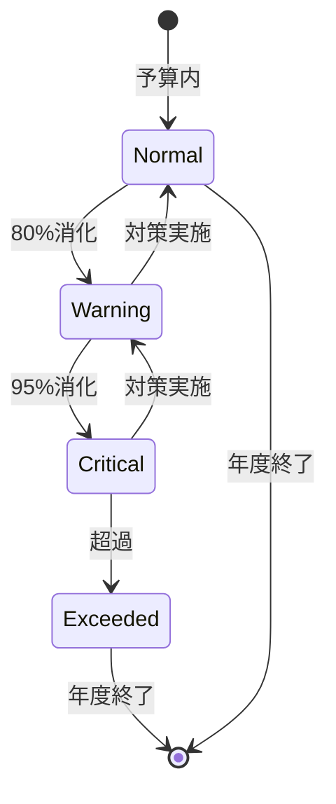

# ビジネスオペレーション: 予算を監視し統制する

**バージョン**: 1.0.0
**更新日**: 2025-09-30

## 概要

**目的**: 予算の執行状況をリアルタイムに監視し、予算超過を防止する

**パターン**: Analytics + Communication

**ゴール**: 予算超過が早期に検知され、適切な対策が実行される

## 関係者とロール

- **エグゼクティブ**: 予算超過アラートの受信、判断
- **財務マネージャー**: 予算執行状況の監視、レポート作成
- **PM**: プロジェクト予算の管理、対策実施

## プロセスフロー

> **重要**: プロセスフローは必ず番号付きリスト形式で記述してください。
> Mermaid形式は使用せず、テキスト形式で記述することで、代替フローと例外フローが視覚的に分離されたフローチャートが自動生成されます。

1. システムが予算執行データ収集を処理する
2. システムが執行率計算を処理する
3. システムが予算残高確認を実行する
4. システムがアラート発行を行う
5. システムが通常モニタリングを処理する
6. システムが原因分析を処理する
7. システムが対策立案を処理する
8. システムが対策実行を実行する

## 代替フロー

### 代替フロー1: 情報不備
- 2-1. システムが情報の不備を検知する
- 2-2. システムが修正要求を送信する
- 2-3. ユーザーが情報を修正し再実行する
- 2-4. 基本フロー2に戻る

## 例外処理

### 例外1: システムエラー
- システムエラーが発生した場合
- エラーメッセージを表示する
- 管理者に通知し、ログに記録する

### 例外2: 承認却下
- 承認が却下された場合
- 却下理由をユーザーに通知する
- 修正後の再実行を促す

## ビジネス状態

## KPI

- **監視頻度**: 週次で執行状況を更新
- **アラート対応時間**: アラート発生後24時間以内に対策立案
- **予算超過防止率**: 95%以上のプロジェクトが予算内で完了
- **レポート配信**: 月次で全ステークホルダーへ配信

## ビジネスルール

- 80%消化: 警告アラート、PM・財務に通知
- 95%消化: 重大アラート、役員へエスカレーション
- 100%超過: 即座に支出停止、承認なしの追加支出禁止
- 監視粒度: プロジェクト単位、部門単位、全社単位
- 更新頻度: 週次更新、月次レポート
- 予測期間: 3ヶ月先までの予算執行予測

## 入出力仕様

### 入力

- **予算データ**: 総予算、配分済み予算、予備費
- **実績コストデータ**: 発生済みコスト、確定コスト、見込みコスト
- **予算消化率**: 実績/予算、期間別消化率

### 出力

- **予算執行レポート**: 執行率、残高、予測、トレンド
- **アラート通知**: 警告レベル、原因、推奨アクション
- **対策提案**: 予算内収束のための施策、優先順位

## 例外処理

- **急激な消化率上昇**: 緊急調査、支出一時停止、詳細分析
- **データ遅延**: 暫定データで監視、後日精算、遅延理由の記録
- **複数プロジェクト超過**: ポートフォリオレベルで再配分検討、優先順位の見直し
- **予測不能な外部要因**: 緊急予算改訂、リスク対策費の活用

## 派生ユースケース

このビジネスオペレーションから以下のユースケースが派生します：

1. 予算執行状況を確認する
2. 予算超過アラートを受信する
3. 予算差異を分析する
4. 予算統制レポートを作成する
