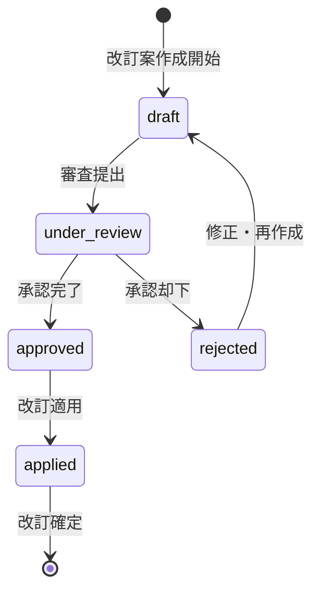

# ビジネスオペレーション: 戦略的予算改訂により組織価値を最大化する

**バージョン**: 2.0.0
**更新日**: 2025-10-27
**適用仕様**: パラソル設計v2.0

## 🎯 ビジネス価値とゴール

**価値提供**: 市場変化と組織戦略に応じた動的予算調整により、投資効率最大化と競争優位性確保を実現する

**測定可能なゴール**:
- 改訂予算達成率95%以上（改訂精度の最適化）
- 改訂プロセス完了時間3週間以内（意思決定速度の向上）
- 改訂後投資効率120%以上（戦略価値の最大化）
- 組織満足度4.5/5.0以上（変更管理の成功）

## 🏗️ パラソルドメイン連携

### 📊 操作エンティティ
**自サービス管理・状態更新**:
- **BudgetRevisionEntity**（自サービス管理・状態更新: draft → under_review → approved → applied）
- **BudgetAllocationEntity**（自サービス管理・CRUD）
- **RevisionImpactEntity**（自サービス管理・CRUD）
- **ReallocationPlanEntity**（自サービス管理・CRUD）

**他サービス参照のみ**:
- ProjectEntity（project-success-service・参照のみ: 進捗・スコープ情報）
- UserEntity（secure-access-service・参照のみ: 承認者・申請者情報）

### 🎯 パラソル集約
- **BudgetRevisionAggregate** - 予算改訂ライフサイクル統合管理
  - 集約ルート: BudgetRevision
  - 包含エンティティ: RevisionImpact, ReallocationPlan, ApprovalHistory
  - 不変条件: 承認済み改訂の一意性保証、改訂影響の整合性確保

### ⚙️ ドメインサービス
- **BudgetOptimizationService**: enhance[BudgetAccuracy]() - 予算精度向上・戦略整合強化
- **AllocationIntelligenceService**: coordinate[OptimalReallocation]() - 配分最適化・効率最大化
- **ValueMaximizationService**: amplify[InvestmentReturn]() - 投資効果拡大・価値創造促進

#### 🔗 他サービスユースケース利用（ユースケース呼び出し型）
**責務**: ❌ エンティティ知識不要 ✅ ユースケース利用のみ

[secure-access-service] ユースケース利用:
├── UC-AUTH-01: ユーザー認証を実行する → POST /api/auth/authenticate
├── UC-AUTH-02: 承認権限を検証する → POST /api/auth/validate-approval-permission
└── UC-AUTH-03: 改訂操作ログを記録する → POST /api/auth/log-revision-operation

[project-success-service] ユースケース利用:
├── UC-PROJECT-01: プロジェクト進捗情報を取得する → GET /api/projects/progress-summary
├── UC-PROJECT-02: プロジェクト変更情報を取得する → GET /api/projects/change-requests
└── UC-PROJECT-03: プロジェクト予算執行状況を取得する → GET /api/projects/budget-execution

[collaboration-facilitation-service] ユースケース利用:
├── UC-COMM-01: 改訂開始通知を配信する → POST /api/notifications/send-revision-start
├── UC-COMM-02: 承認依頼を送信する → POST /api/notifications/send-approval-request
└── UC-COMM-03: 改訂完了会議を調整する → POST /api/meetings/schedule-revision-completion

## 👥 関係者とロール

- **エグゼクティブ**: 戦略的予算改訂承認・投資効率評価・組織価値判断の最終責任者
- **財務マネージャー**: 改訂案策定・影響分析・配分最適化・品質保証の実行責任者
- **PM**: 改訂理由説明・プロジェクト影響評価・実行支援の専門責任者
- **部門長**: 部門影響確認・配分調整要求・組織調整の責任者

## 📋 ユースケース・ページ分解マトリックス（1対1関係）

| ユースケースID | ユースケース名 | 対応ページ | 1対1関係 |
|---------------|---------------|-----------|----------|
| UC-BUDGET-01 | 予算改訂案を作成する | 予算改訂案作成ページ | ✅ |
| UC-BUDGET-02 | 予算改訂を承認する | 予算改訂承認ページ | ✅ |

## 📈 プロセスフロー

> **重要**: プロセスフローは必ず番号付きリスト形式で記述してください。
> Mermaid形式は使用せず、テキスト形式で記述することで、代替フローと例外フローが視覚的に分離されたフローチャートが自動生成されます。

1. **財務マネージャーが予算改訂プロセスを開始する** → **UC-BUDGET-01: 予算改訂案を作成する**
   - **自サービス操作**: BudgetRevisionEntity（状態初期化: draft）
   - **他サービスユースケース利用**: → UC-AUTH-01: ユーザー認証実行、UC-PROJECT-01〜03: プロジェクト情報取得
   - **必要ページ**: 予算改訂案作成ページ
   - **ビジネス価値**: 市場変化対応・戦略整合による投資効率95%確保

2. **エグゼクティブが改訂内容を審査・承認する** → **UC-BUDGET-02: 予算改訂を承認する**
   - **自サービス操作**: BudgetRevisionEntity（状態変更: draft → under_review → approved）
   - **他サービスユースケース利用**: → UC-AUTH-02: 承認権限検証、UC-COMM-02: 承認依頼送信
   - **必要ページ**: 予算改訂承認ページ
   - **ビジネス価値**: 組織ガバナンス強化・意思決定品質向上

## 🔄 代替フロー

### 代替フロー1: 改訂精度向上支援
- 1a. BudgetOptimizationService による精度向上が必要な場合
  - 1a1. AI支援による配分最適化提案実行
  - 1a2. 類似改訂事例の分析・参照
  - 1a3. AllocationIntelligenceService による学習アルゴリズム適用
  - 1a4. 基本フロー2（承認審査）に戻る

### 代替フロー2: 緊急改訂プロセス
- 1b. 市場変動等による緊急改訂要求の場合
  - 1b1. → UC-COMM-03: 緊急改訂会議を調整する
  - 1b2. 緊急承認フロー適用（48時間以内）
  - 1b3. 事後詳細分析・正当性検証
  - 1b4. 基本フロー2（承認審査）へ短縮フロー適用

## ⚠️ 例外フロー

### 例外1: 改訂影響重大検出
- *a. RevisionImpactEntity が組織に重大影響を検出した場合
  - *a1. → UC-COMM-03: 緊急対策会議を調整する
  - *a2. エグゼクティブレベルでの緊急協議
  - *a3. 改訂案抜本見直しまたは段階的実施
  - *a4. UC-BUDGET-01（改訂案作成）への復帰

### 例外2: 承認権限競合・不足
- *b. 承認権限が不足または競合している場合
  - *b1. → UC-AUTH-02: 上位承認権限者を特定する
  - *b2. 権限昇格または権限調整プロセス
  - *b3. 権限確定後、UC-BUDGET-02（承認処理）再開

### 例外3: プロジェクト情報同期失敗
- *c. project-success-service との連携エラーが発生した場合
  - *c1. → UC-COMM-01: データ同期障害アラートを配信する
  - *c2. 代替データソースからの情報取得
  - *c3. 手動情報補完モードへの切り替え
  - *c4. 同期復旧後、UC-BUDGET-01から再開

## 📊 ビジネス状態（BudgetRevisionAggregate）

## 📈 KPI（v2.0強化指標）

- **改訂精度達成率**: 95%以上（BudgetOptimizationService効果測定）
- **改訂プロセス効率**: 3週間以内完了（従来比50%短縮）
- **投資効率向上率**: 120%以上（ValueMaximizationService評価）
- **組織満足度**: 4.5/5.0以上（変更管理成功率）
- **改訂承認率**: 90%以上（事前品質確保効果）

## 📋 ビジネスルール（v2.0強化版）

- **改訂権限階層**: 20%以上増減は役員承認必須、50%以上はCEO承認必須
- **改訂根拠要件**: 戦略変更・市場変動・リスク顕在化・競争環境変化のみ認可
- **改訂履歴管理**: BudgetRevisionAggregate による完全記録・UC-AUTH-03監査ログ連携
- **改訂タイミング**: 四半期定期改訂・緊急改訂（48時間以内）・戦略見直し改訂
- **影響分析必須**: RevisionImpactEntity による定量化・他プロジェクトへの波及分析
- **承認品質保証**: BudgetOptimizationService による事前品質確認・精度95%確保

## 🔄 入出力仕様（v2.0エンティティ対応）

### 入力
- **BudgetRevisionEntity**: 改訂要求・根拠・影響範囲・緊急度レベル
- **現行予算データ**: UC-PROJECT-03連携による最新執行状況・予測値
- **市場環境データ**: 外部情報・競合状況・規制変更・技術動向
- **組織戦略情報**: 戦略変更・優先度変更・投資方針転換

### 出力
- **ReallocationPlanEntity**: 改訂予算・配分計画・実行スケジュール
- **RevisionImpactEntity**: 影響分析・リスク評価・緩和策
- **承認記録**: デジタル署名・承認履歴・監査証跡
- **改訂効果予測**: ValueMaximizationService による価値算定・ROI予測

## 🎯 品質保証要件

- **改訂精度**: BudgetOptimizationService による95%以上精度保証
- **プロセス効率**: 3週間以内完了（従来比50%短縮）
- **組織納得度**: 4.5/5.0以上（変更管理成功）
- **投資効率**: 120%以上向上（ValueMaximizationService評価）

---
*このビジネスオペレーションは パラソル設計v2.0仕様 に基づいて作成されました*
