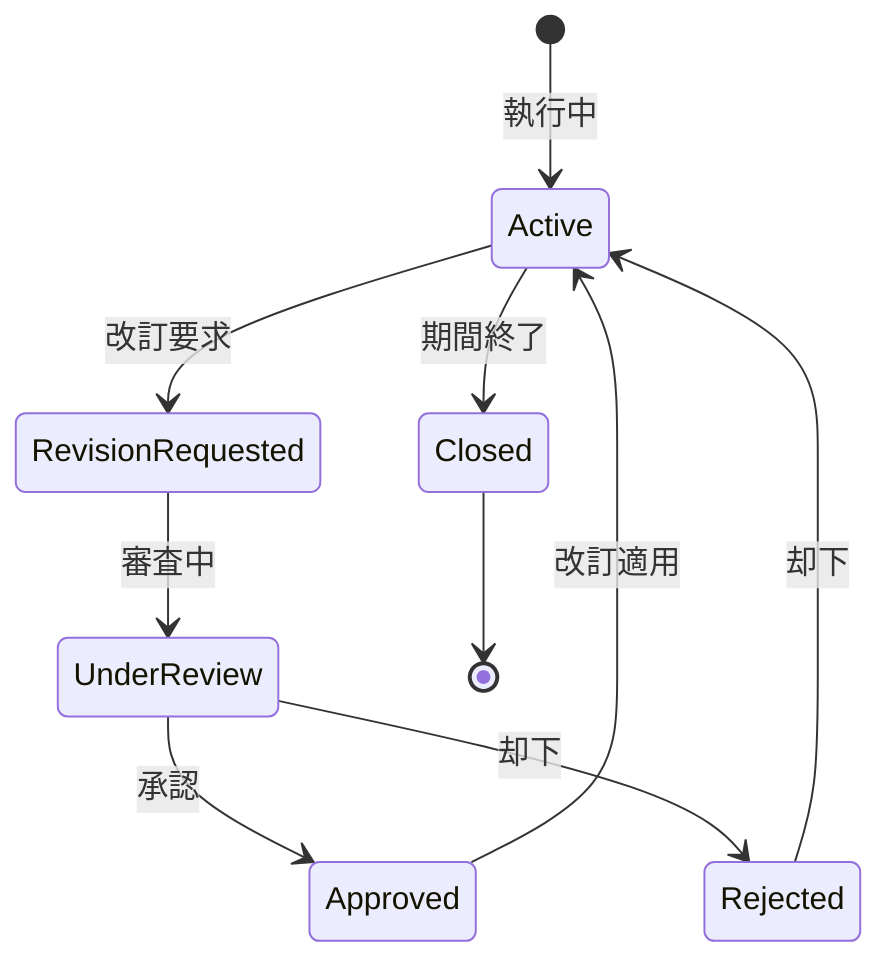

# ビジネスオペレーション: 予算を改訂し再配分する

**バージョン**: 1.0.0
**更新日**: 2025-09-30

## 概要

**目的**: 状況変化に応じて予算を改訂し、最適な予算配分を実現する

**パターン**: Workflow

**ゴール**: 改訂された予算が承認され、プロジェクトに再配分される

## 関係者とロール

- **エグゼクティブ**: 予算改訂の承認
- **財務マネージャー**: 改訂案の作成、調整
- **PM**: 改訂理由の説明、影響評価

## プロセスフロー

> **重要**: プロセスフローは必ず番号付きリスト形式で記述してください。
> Mermaid形式は使用せず、テキスト形式で記述することで、代替フローと例外フローが視覚的に分離されたフローチャートが自動生成されます。

1. システムが改訂要求を処理する
2. システムが改訂理由の評価を処理する
3. システムが影響分析を処理する
4. システムが改訂案作成を行う
5. システムが承認審査を行う
6. システムが予算改訂実行を実行する
7. システムが代替案検討を処理する
8. システムが再配分処理を実行する

## 代替フロー

### 代替フロー1: 情報不備
- 2-1. システムが情報の不備を検知する
- 2-2. システムが修正要求を送信する
- 2-3. ユーザーが情報を修正し再実行する
- 2-4. 基本フロー2に戻る

## 例外処理

### 例外1: システムエラー
- システムエラーが発生した場合
- エラーメッセージを表示する
- 管理者に通知し、ログに記録する

### 例外2: 承認却下
- 承認が却下された場合
- 却下理由をユーザーに通知する
- 修正後の再実行を促す

## ビジネス状態

## KPI

- **改訂処理時間**: 改訂要求から承認まで2週間以内
- **改訂承認率**: 80%以上（適切な事前評価の指標）
- **改訂回数**: 年度内の改訂は3回以内に抑制
- **改訂後の予算達成率**: 改訂予算の90%以上を達成

## ビジネスルール

- 20%以上の増減: 役員承認必須
- 改訂理由: スコープ変更、市場変動、リスク顕在化のみ認める
- 改訂履歴: すべての改訂を記録、監査可能にする
- 改訂タイミング: 四半期ごとの定期改訂、緊急時の臨時改訂
- 影響範囲の明示: 他プロジェクトへの影響を定量化
- 承認権限: 金額により段階的な承認ルート

## 入出力仕様

### 入力

- **改訂要求**: 理由、金額、影響範囲、緊急度
- **現行予算データ**: 当初予算、前回改訂予算、執行状況
- **予算執行実績**: 実績コスト、執行率、予測値
- **プロジェクト変更情報**: スコープ変更、リスク情報、外部要因

### 出力

- **改訂予算書**: 改訂後予算、変更箇所、変更額
- **改訂理由書**: 改訂の背景、必要性、正当性
- **再配分計画**: プロジェクト別配分額、配分理由、優先順位
- **改訂履歴**: 改訂日、改訂者、承認者、変更内容

## 例外処理

- **緊急改訂**: 口頭承認後、事後申請可、24時間以内の正式申請
- **承認却下**: 代替案（スコープ削減、フェーズ分割）検討、却下理由の記録
- **頻繁な改訂**: プロジェクト計画の見直し要求、根本原因分析
- **大幅な増額要求**: 特別承認プロセス、追加資金調達の検討

## 派生ユースケース

このビジネスオペレーションから以下のユースケースが派生します：

1. 予算改訂を要求する
2. 改訂理由を評価する
3. 予算を改訂する
4. 予算を再配分する
