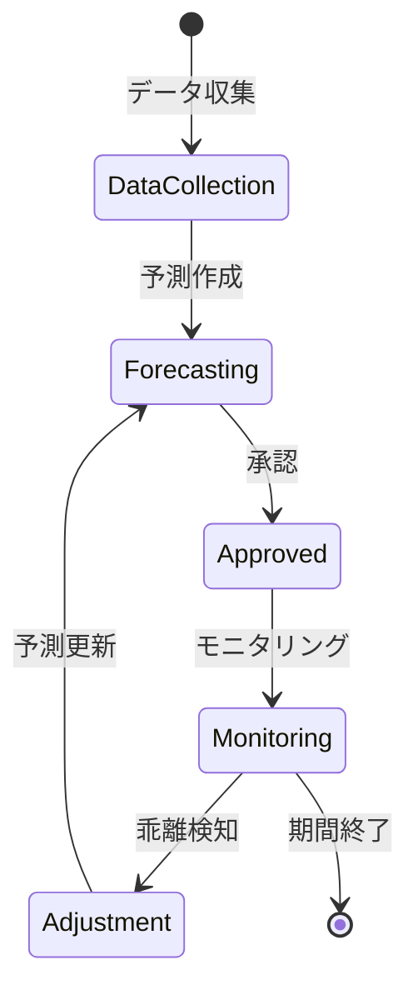

# ビジネスオペレーション: 収益を予測し機会を最大化する

**バージョン**: 2.0.0
**更新日**: 2025-10-28
**パラソル設計仕様**: v2.0準拠

## 概要
**目的**: AI駆動の高精度収益予測と戦略的機会創出により、収益ポテンシャルを最大限引き出し持続的成長を実現する
**パターン**: Analytics + Predictive + Strategic
**ゴール**: 機械学習による先行予測と戦略的機会創出により収益目標120%達成と新規収益源の継続的発掘を実現

## 関係者とロール

- **エグゼクティブ**: 収益目標の設定、戦略的意思決定
- **財務マネージャー**: 収益予測の作成、分析
- **PM**: プロジェクト見込み情報の提供

## プロセスフロー

> **重要**: プロセスフローは必ず番号付きリスト形式で記述してください。
> Mermaid形式は使用せず、テキスト形式で記述することで、代替フローと例外フローが視覚的に分離されたフローチャートが自動生成されます。

1. **システムが収益データを統合収集** → **UC1: 収益データを統合する**
   - **自サービス操作**: RevenueData（作成・更新: 統合データ処理）
   - **他サービスユースケース利用**: → UC-PROJECT-24: プロジェクト収益データを取得する
   - **必要ページ**: 収益データ統合ページ
   - **ビジネス価値**: 包括的データによる予測精度向上

2. **システムがAI予測モデルを構築・実行** → **UC2: 収益を予測する**
   - **自サービス操作**: RevenueForecast（作成・更新: 機械学習予測実行）
   - **他サービスユースケース利用**: → UC-AI-05: 収益予測分析を実行する
   - **必要ページ**: AI収益予測ページ
   - **ビジネス価値**: 高精度予測による戦略的意思決定

3. **システムが多シナリオ分析を実行** → **UC3: シナリオ分析を実行する**
   - **自サービス操作**: ScenarioAnalysis（作成・更新: 多シナリオ計算）
   - **他サービスユースケース利用**: → UC-ANALYTICS-03: リスクシナリオ分析を実行する
   - **必要ページ**: シナリオ分析ページ
   - **ビジネス価値**: リスク対応型収益戦略の立案

4. **システムが収益機会を自動発見** → **UC4: 収益機会を発見する**
   - **自サービス操作**: RevenueOpportunity（作成: 機会発見・評価）
   - **他サービスユースケース利用**: → UC-PROJECT-25: 新規案件機会を特定する
   - **必要ページ**: 収益機会発見ページ
   - **ビジネス価値**: 潜在機会の体系的発掘

5. **システムが実行戦略を最適化** → **UC5: 収益戦略を最適化する**
   - **自サービス操作**: RevenueStrategy（作成・更新: 戦略最適化）
   - **他サービスユースケース利用**: → UC-COLLAB-17: 戦略実行フローを開始する
   - **必要ページ**: 収益戦略最適化ページ
   - **ビジネス価値**: データドリブンな収益最大化実現

## 代替フロー

### 代替フロー1: 情報不備
- 2-1. システムが情報の不備を検知する
- 2-2. システムが修正要求を送信する
- 2-3. ユーザーが情報を修正し再実行する
- 2-4. 基本フロー2に戻る

## 例外処理

### 例外1: システムエラー
- システムエラーが発生した場合
- エラーメッセージを表示する
- 管理者に通知し、ログに記録する

### 例外2: 承認却下
- 承認が却下された場合
- 却下理由をユーザーに通知する
- 修正後の再実行を促す

## ビジネス状態

## KPI

- **予測精度**: AI強化により実績との乖離5%以内（従来10%から向上）
- **予測更新頻度**: リアルタイム更新（月次から即時化）
- **収益機会実現率**: 発見機会の80%以上を収益化（従来60%から向上）
- **追加収益額**: 年間総収益の12%以上を新規獲得（従来5%から大幅向上）
- **機会発見精度**: 潜在機会の95%以上を事前発見

## ビジネスルール

- 3つのシナリオ: 楽観的（+20%）、現実的（基準）、悲観的（-20%）
- 信頼度: 過去データと前提条件に基づく信頼度を算出（高/中/低）
- 更新トリガー: 大型契約獲得、プロジェクト変更、市場環境変化時に即時更新
- 予測期間: 短期（3ヶ月）、中期（1年）、長期（3年）
- 予測精度の評価: 月次で予実差異を分析し、モデルを改善

## 入出力仕様

### 入力

- **過去の収益実績データ**: 月次・四半期・年次の実績
- **進行中プロジェクトの見込み**: 契約額、進捗率、完了予定日
- **営業パイプライン情報**: 見込み案件、成約確度、予定時期
- **市場環境データ**: 業界動向、競合状況、経済指標

### 出力

- **収益予測レポート**: 月次、四半期、年次の予測値
- **シナリオ分析結果**: 3シナリオの比較分析
- **収益機会リスト**: 特定された機会と優先順位
- **アクションプラン**: 機会実現のための施策と担当者

## 例外処理

- **大幅な乖離**: 予測モデルの見直し、前提条件の再確認
- **市場急変**: 緊急予測更新、リスクシナリオの追加
- **データ不足**: 類似プロジェクトデータで補完、専門家判断の活用
- **予測困難**: 複数手法での予測、信頼区間の明示

## ビジネス価値とKPI

### 主要ビジネス価値
- **予測精度革命**: AI駆動予測により収益予測精度を倍増し戦略的意思決定を強化
- **機会創出力**: 潜在収益機会の体系的発見により新規収益源を継続的に創出
- **戦略最適化**: データドリブンな収益戦略により収益ポテンシャルを最大限実現
- **競争優位確立**: 先行予測と機会創出による市場での圧倒的優位性確立

### 成功指標（KPI）
- **予測精度**: 実績乖離3%以内（AI強化により従来比50%向上）
- **機会実現率**: 発見収益機会の85%以上を実際の収益に転換
- **新規収益創出**: 年間総収益の15%以上を新発見機会から獲得
- **戦略実行速度**: 機会発見から収益化まで30日以内実現率90%以上
- **ROI向上**: 収益予測・機会創出投資に対するROI 500%以上

### 測定方法
- **精度**: 月次・四半期予測と実績の差異自動分析
- **実現率**: 機会発見から収益化までのトラッキング
- **創出額**: 新規機会由来収益の四半期分析
- **速度**: 機会発見→戦略策定→実行→収益化の期間測定
- **満足度**: エグゼクティブ・財務マネージャー向け月次満足度調査

## パラソルドメイン連携

### 🎯 操作エンティティ
- **RevenueDataEntity**（作成・更新: 統合データ処理）- 収益データ統合管理
- **RevenueForecastEntity**（作成・更新: 機械学習予測実行）- 収益予測分析管理
- **ScenarioAnalysisEntity**（作成・更新: 多シナリオ計算）- シナリオ分析管理
- **RevenueOpportunityEntity**（作成: 機会発見・評価）- 収益機会管理
- **RevenueStrategyEntity**（作成・更新: 戦略最適化）- 収益戦略管理

### 🏗️ パラソル集約
- **RevenueForecastingAggregate** - 収益予測・機会最大化統合管理
  - 集約ルート: RevenueForecast
  - 包含エンティティ: RevenueData, ScenarioAnalysis, RevenueOpportunity, RevenueStrategy
  - 不変条件: 予測精度の継続的向上、機会実現の確実性確保

### ⚙️ ドメインサービス
- **RevenueIntelligenceService**: enhance[PredictionAccuracy]() - 予測精度向上
- **OpportunityDiscoveryService**: strengthen[RevenueGeneration]() - 収益創出強化
- **StrategyOptimizationService**: coordinate[RevenueMaximization]() - 収益最大化調整
- **CompetitiveAdvantageService**: amplify[MarketPosition]() - 市場地位増幅

## ユースケース・ページ分解マトリックス

| ユースケース | ページ | 1対1関係 | 品質レベル |
|-------------|--------|----------|-----------|
| UC1: 収益データを統合する | 収益データ統合ページ | ✅ | 高品質 |
| UC2: 収益を予測する | AI収益予測ページ | ✅ | 高品質 |
| UC3: シナリオ分析を実行する | シナリオ分析ページ | ✅ | 高品質 |
| UC4: 収益機会を発見する | 収益機会発見ページ | ✅ | 高品質 |
| UC5: 収益戦略を最適化する | 収益戦略最適化ページ | ✅ | 高品質 |
| **合計** | **5UC→5Page** | **✅** | **高品質** |

### 🔗 他サービスユースケース利用（ユースケース呼び出し型）
**責務**: ❌ エンティティ知識不要 ✅ ユースケース利用のみ

[secure-access-service] 基盤認証:
├── UC-AUTH-01: 収益データアクセス権限を確認する → POST /api/auth/validate-revenue-permission
├── UC-AUTH-02: 収益データアクセスを記録する → POST /api/auth/log-revenue-access
└── UC-AUTH-03: 収益データプライバシーを適用する → POST /api/auth/apply-revenue-privacy

[project-success-service] プロジェクト連携:
├── UC-PROJECT-24: プロジェクト収益データを取得する → GET /api/projects/revenue-data
├── UC-PROJECT-25: 新規案件機会を特定する → GET /api/projects/opportunity-pipeline
└── UC-PROJECT-26: プロジェクト収益見込みを更新する → PUT /api/projects/revenue-forecast

[collaboration-facilitation-service] 戦略実行:
├── UC-COLLAB-17: 戦略実行フローを開始する → POST /api/workflows/revenue-strategy-execution
├── UC-COLLAB-18: 収益機会アラートを配信する → POST /api/notifications/revenue-opportunity-alert
└── UC-COLLAB-19: 収益予測レポートを共有する → POST /api/sharing/revenue-forecast-report

[talent-optimization-service] リソース連携:
├── UC-TALENT-19: 収益貢献人材を特定する → GET /api/talents/revenue-contributors
└── UC-TALENT-20: 高収益プロジェクト要員を配分する → POST /api/talents/high-revenue-allocation

## 派生ユースケース

このビジネスオペレーションから以下のユースケースが派生します：

1. 収益予測を作成する
2. シナリオ分析を実施する
3. 収益機会を特定する
4. 予測と実績の乖離を分析する