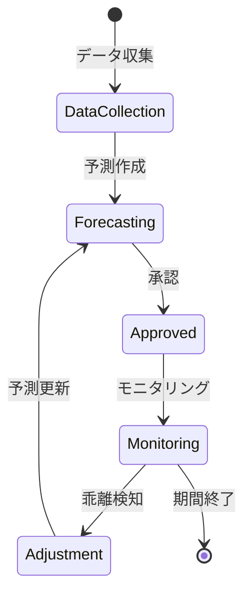

# ビジネスオペレーション: 収益を予測し機会を最大化する

**バージョン**: 1.0.0
**更新日**: 2025-09-30

## 概要

**目的**: 将来の収益を予測し、収益機会を特定して最大化する

**パターン**: Analytics

**ゴール**: 精度の高い収益予測が作成され、収益機会が特定・実行される

## 関係者とロール

- **エグゼクティブ**: 収益目標の設定、戦略的意思決定
- **財務マネージャー**: 収益予測の作成、分析
- **PM**: プロジェクト見込み情報の提供

## プロセスフロー

> **重要**: プロセスフローは必ず番号付きリスト形式で記述してください。
> Mermaid形式は使用せず、テキスト形式で記述することで、代替フローと例外フローが視覚的に分離されたフローチャートが自動生成されます。

1. システムが過去データ収集を処理する
2. システムが予測モデル構築を処理する
3. システムが将来収益の予測を処理する
4. システムがシナリオ分析を処理する
5. システムが収益機会の特定を処理する
6. システムがアクションプラン策定を処理する
7. システムが実行・モニタリングを実行する

## 代替フロー

### 代替フロー1: 情報不備
- 2-1. システムが情報の不備を検知する
- 2-2. システムが修正要求を送信する
- 2-3. ユーザーが情報を修正し再実行する
- 2-4. 基本フロー2に戻る

## 例外処理

### 例外1: システムエラー
- システムエラーが発生した場合
- エラーメッセージを表示する
- 管理者に通知し、ログに記録する

### 例外2: 承認却下
- 承認が却下された場合
- 却下理由をユーザーに通知する
- 修正後の再実行を促す

## ビジネス状態

## KPI

- **予測精度**: 実績との乖離10%以内
- **予測更新頻度**: 月次更新
- **収益機会実現率**: 特定した機会の60%以上を実現
- **追加収益額**: 年間総収益の5%以上を追加獲得

## ビジネスルール

- 3つのシナリオ: 楽観的（+20%）、現実的（基準）、悲観的（-20%）
- 信頼度: 過去データと前提条件に基づく信頼度を算出（高/中/低）
- 更新トリガー: 大型契約獲得、プロジェクト変更、市場環境変化時に即時更新
- 予測期間: 短期（3ヶ月）、中期（1年）、長期（3年）
- 予測精度の評価: 月次で予実差異を分析し、モデルを改善

## 入出力仕様

### 入力

- **過去の収益実績データ**: 月次・四半期・年次の実績
- **進行中プロジェクトの見込み**: 契約額、進捗率、完了予定日
- **営業パイプライン情報**: 見込み案件、成約確度、予定時期
- **市場環境データ**: 業界動向、競合状況、経済指標

### 出力

- **収益予測レポート**: 月次、四半期、年次の予測値
- **シナリオ分析結果**: 3シナリオの比較分析
- **収益機会リスト**: 特定された機会と優先順位
- **アクションプラン**: 機会実現のための施策と担当者

## 例外処理

- **大幅な乖離**: 予測モデルの見直し、前提条件の再確認
- **市場急変**: 緊急予測更新、リスクシナリオの追加
- **データ不足**: 類似プロジェクトデータで補完、専門家判断の活用
- **予測困難**: 複数手法での予測、信頼区間の明示

## 派生ユースケース

このビジネスオペレーションから以下のユースケースが派生します：

1. 収益予測を作成する
2. シナリオ分析を実施する
3. 収益機会を特定する
4. 予測と実績の乖離を分析する