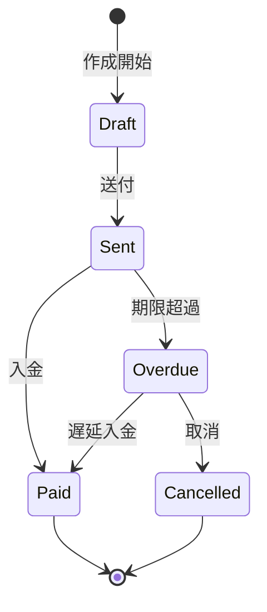

# ビジネスオペレーション: 請求書を発行し入金を管理する

**バージョン**: 1.0.0
**更新日**: 2025-09-30

## 概要

**目的**: タイムリーに請求書を発行し、入金状況を管理して売掛金回収を確実にする

**パターン**: Workflow

**ゴール**: 請求書が期限内に発行され、入金が計画通りに回収される

## 関係者とロール

- **財務マネージャー**: 請求書発行、入金確認
- **PM**: 請求根拠資料の提供
- **クライアント**: 請求書受領、支払い実行

## プロセスフロー

> **重要**: プロセスフローは必ず番号付きリスト形式で記述してください。
> Mermaid形式は使用せず、テキスト形式で記述することで、代替フローと例外フローが視覚的に分離されたフローチャートが自動生成されます。

1. システムが請求書作成を行う
2. システムが内容確認・承認を実行する
3. システムが請求書送付を処理する
4. システムが入金待ちを処理する
5. システムが入金確認を実行する
6. システムが消込処理を実行する
7. システムが完了を処理する
8. システムが督促処理を実行する

## 代替フロー

### 代替フロー1: 情報不備
- 2-1. システムが情報の不備を検知する
- 2-2. システムが修正要求を送信する
- 2-3. ユーザーが情報を修正し再実行する
- 2-4. 基本フロー2に戻る

## 例外処理

### 例外1: システムエラー
- システムエラーが発生した場合
- エラーメッセージを表示する
- 管理者に通知し、ログに記録する

### 例外2: 承認却下
- 承認が却下された場合
- 却下理由をユーザーに通知する
- 修正後の再実行を促す

## ビジネス状態

## KPI

- **請求書発行リードタイム**: 納品後5営業日以内に発行
- **入金回収率**: 期限内回収率95%以上
- **DSO（売掛金回収期間）**: 平均45日以内
- **督促対応率**: 期限超過後3日以内に督促開始

## ビジネスルール

- 請求サイクル: 月末締め翌月末払い
- 督促: 期限超過3日後に第1督促、7日後に第2督促、14日後に第3督促
- 早期支払い割引: 期限前10日以内の支払いで2%割引
- 分割払い: 100万円以上は分割払い可能（3回まで）
- 請求書発行は財務マネージャーの承認が必須
- 請求額の10%以上の差異がある場合は再確認必須

## 入出力仕様

### 入力

- **収益データ**: 請求対象の収益情報、金額、課税区分
- **請求先情報**: クライアント情報、請求先住所、担当者
- **支払条件**: 支払期限、支払方法、銀行口座情報

### 出力

- **請求書（PDF）**: 請求書番号、明細、金額、支払期限
- **請求データ**: invoiceId、金額、期限、ステータス
- **入金予定表**: 予定入金日、金額、クライアント
- **督促リスト**: 未入金請求書一覧、督促履歴

## 例外処理

- **請求書誤り**: 訂正請求書の発行、原請求書のキャンセル
- **入金額相違**: 差額の原因調査と調整、不足分の追加請求
- **未入金**: 督促エスカレーションフロー、法的措置の検討
- **重複入金**: 超過分の返金処理

## 派生ユースケース

このビジネスオペレーションから以下のユースケースが派生します：

1. 請求書を作成する
2. 請求書を送付する
3. 入金状況を確認する
4. 督促を実施する
5. 消込処理を行う