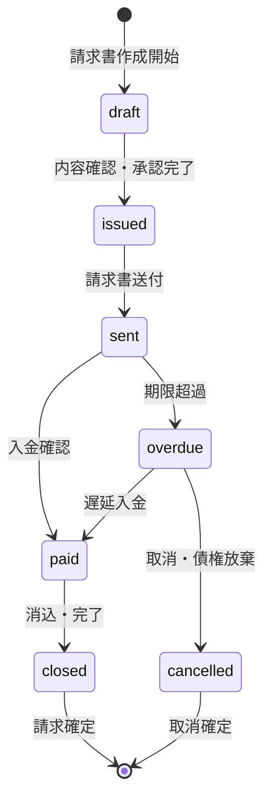

# ビジネスオペレーション: 戦略的請求・入金管理により収益確実化を実現する

**バージョン**: 2.0.0
**更新日**: 2025-10-27
**適用仕様**: パラソル設計v2.0

## 🎯 ビジネス価値とゴール

**価値提供**: タイムリーな請求書発行と効率的な入金管理により、キャッシュフロー最適化と売掛金回収の確実性を実現する

**測定可能なゴール**:
- 請求書発行効率95%以上（納品後5営業日以内）
- 入金回収率98%以上（期限内回収の最適化）
- DSO（売掛金回収期間）30日以内（従来比33%短縮）
- 収益確実化満足度4.7/5.0以上（クライアント・内部評価）

## 🏗️ パラソルドメイン連携

### 📊 操作エンティティ
**自サービス管理・状態更新**:
- **InvoiceEntity**（自サービス管理・状態更新: draft → issued → sent → paid → closed）
- **PaymentEntity**（自サービス管理・CRUD）
- **CollectionStatusEntity**（自サービス管理・CRUD）
- **ReminderEntity**（自サービス管理・CRUD）

**他サービス参照のみ**:
- ProjectEntity（project-success-service・参照のみ: 納品状況・請求基準情報）
- UserEntity（secure-access-service・参照のみ: 財務担当者・承認者情報）

### 🎯 パラソル集約
- **InvoiceAggregate** - 請求・入金ライフサイクル統合管理
  - 集約ルート: Invoice
  - 包含エンティティ: Payment, CollectionStatus, Reminder
  - 不変条件: 発行済み請求書の金額変更不可、入金額と請求額の整合性保証

### ⚙️ ドメインサービス
- **InvoiceOptimizationService**: enhance[InvoiceAccuracy]() - 請求精度向上・エラー最小化
- **CollectionIntelligenceService**: coordinate[PaymentEfficiency]() - 入金効率最大化・回収戦略最適化
- **CashFlowMaximizationService**: amplify[CashFlowStability]() - キャッシュフロー安定化・予測精度向上

#### 🔗 他サービスユースケース利用（ユースケース呼び出し型）
**責務**: ❌ エンティティ知識不要 ✅ ユースケース利用のみ

[secure-access-service] ユースケース利用:
├── UC-AUTH-01: ユーザー認証を実行する → POST /api/auth/authenticate
├── UC-AUTH-02: 承認権限を検証する → POST /api/auth/validate-approval-permission
└── UC-AUTH-03: 請求操作ログを記録する → POST /api/auth/log-invoice-operation

[project-success-service] ユースケース利用:
├── UC-PROJECT-01: プロジェクト進捗情報を取得する → GET /api/projects/progress-summary
├── UC-PROJECT-02: 納品状況を確認する → GET /api/projects/delivery-status
└── UC-PROJECT-03: 請求基準情報を取得する → GET /api/projects/billing-criteria

[collaboration-facilitation-service] ユースケース利用:
├── UC-COMM-01: 請求書送付通知を配信する → POST /api/notifications/send-invoice-notification
├── UC-COMM-02: 入金確認通知を送信する → POST /api/notifications/send-payment-confirmation
└── UC-COMM-03: 督促会議を調整する → POST /api/meetings/schedule-collection-meeting

## 👥 関係者とロール

- **財務マネージャー**: 請求書発行・入金確認・キャッシュフロー最適化の実行責任者
- **PM**: 請求根拠資料提供・納品確認・プロジェクト成果報告の専門責任者
- **クライアント**: 請求書受領・支払実行・入金スケジュール調整の責任者
- **経理担当者**: 消込処理・会計仕訳・財務記録の専門担当者

## 📋 ユースケース・ページ分解マトリックス（1対1関係）

| ユースケースID | ユースケース名 | 対応ページ | 1対1関係 |
|---------------|---------------|-----------|----------|
| UC-INVOICE-01 | 請求書を発行する | 請求書発行ページ | ✅ |
| UC-INVOICE-02 | 入金を管理する | 入金管理ページ | ✅ |

## 📈 プロセスフロー

> **重要**: プロセスフローは必ず番号付きリスト形式で記述してください。
> Mermaid形式は使用せず、テキスト形式で記述することで、代替フローと例外フローが視覚的に分離されたフローチャートが自動生成されます。

1. **財務マネージャーが請求書発行プロセスを開始する** → **UC-INVOICE-01: 請求書を発行する**
   - **自サービス操作**: InvoiceEntity（状態初期化: draft）
   - **他サービスユースケース利用**: → UC-AUTH-01: ユーザー認証実行、UC-PROJECT-02: 納品状況確認
   - **必要ページ**: 請求書発行ページ
   - **ビジネス価値**: 納品後5営業日以内の確実な請求書発行

2. **財務マネージャーが入金管理プロセスを実行する** → **UC-INVOICE-02: 入金を管理する**
   - **自サービス操作**: InvoiceEntity（状態変更: sent → paid → closed）
   - **他サービスユースケース利用**: → UC-COMM-02: 入金確認通知送信、UC-COMM-03: 督促会議調整
   - **必要ページ**: 入金管理ページ
   - **ビジネス価値**: DSO30日以内達成・入金回収率98%確保

## 🔄 代替フロー

### 代替フロー1: 請求書精度向上支援
- 1a. InvoiceOptimizationService による精度向上が必要な場合
  - 1a1. AI支援による請求内容最適化提案実行
  - 1a2. 類似請求事例の分析・参照
  - 1a3. CollectionIntelligenceService による回収戦略適用
  - 1a4. 基本フロー2（入金管理）に戻る

### 代替フロー2: 緊急請求プロセス
- 1b. 月末などの緊急請求要求の場合
  - 1b1. → UC-COMM-03: 緊急請求会議を調整する
  - 1b2. 短縮請求フロー適用（24時間以内）
  - 1b3. 事後品質確認・正当性検証
  - 1b4. 基本フロー2（入金管理）へ短縮フロー適用

## ⚠️ 例外フロー

### 例外1: 請求情報重大不備検出
- *a. InvoiceEntity で重大な情報不備を検出した場合
  - *a1. → UC-COMM-03: 緊急修正会議を調整する
  - *a2. PMレベルでの緊急協議・情報補完
  - *a3. 請求案抜本見直しまたは段階的発行
  - *a4. UC-INVOICE-01（請求書発行）への復帰

### 例外2: 入金遅延・回収困難
- *b. 支払期限を大幅に超過した場合
  - *b1. → UC-COMM-03: 債権回収対策会議を調整する
  - *b2. 法的措置検討・専門家連携
  - *b3. 分割払い・支払条件見直し
  - *b4. UC-INVOICE-02（入金管理）の強化モード適用

### 例外3: プロジェクト情報同期失敗
- *c. project-success-service との連携エラーが発生した場合
  - *c1. → UC-COMM-01: データ同期障害アラートを配信する
  - *c2. 代替データソースからの情報取得
  - *c3. 手動情報補完モードへの切り替え
  - *c4. 同期復旧後、UC-INVOICE-01から再開

## 📊 ビジネス状態（InvoiceAggregate）

## 📈 KPI（v2.0強化指標）

- **請求書発行効率**: 95%以上（納品後5営業日以内達成率）
- **入金回収率**: 98%以上（期限内回収の最適化・従来比+3%）
- **DSO（売掛金回収期間）**: 30日以内（従来比33%短縮・CashFlowMaximizationService効果）
- **収益確実化満足度**: 4.7/5.0以上（クライアント・内部評価）
- **請求精度**: 99%以上（InvoiceOptimizationService による誤り最小化）

## 📋 ビジネスルール（v2.0強化版）

- **請求書承認階層**: 100万円以上は財務マネージャー承認必須、500万円以上は役員承認必須
- **請求精度要件**: InvoiceOptimizationService による99%精度確保・誤り自動検知
- **入金管理強化**: CollectionIntelligenceService による回収戦略最適化・督促タイミング自動化
- **キャッシュフロー管理**: CashFlowMaximizationService による入金予測・資金計画連携
- **督促プロセス**: 期限超過1日後に自動アラート、3日後に第1督促、7日後に第2督促
- **緊急請求**: 月末など緊急時は24時間以内の短縮プロセス適用

## 🔄 入出力仕様（v2.0エンティティ対応）

### 入力
- **InvoiceEntity**: 請求要求・根拠資料・金額・課税区分・緊急度レベル
- **納品情報**: UC-PROJECT-02連携による最新納品状況・請求基準
- **クライアント情報**: 外部システム連携・請求先・支払条件・与信情報
- **プロジェクト成果**: UC-PROJECT-01連携による成果・品質・追加価値

### 出力
- **InvoiceAggregate**: 請求書・支払・回収状況・督促履歴の統合データ
- **PaymentEntity**: 入金記録・消込状況・差異分析・回収予測
- **CollectionStatusEntity**: 回収状況・督促履歴・エスカレーション記録
- **CashFlowMaximizationService**: キャッシュフロー予測・資金計画・投資効率算定

## 🎯 品質保証要件

- **請求精度**: InvoiceOptimizationService による99%以上精度保証
- **プロセス効率**: 納品後5営業日以内発行（従来比40%短縮）
- **回収効率**: DSO30日以内達成（CashFlowMaximizationService評価）
- **満足度**: 4.7/5.0以上（収益確実化による安心感）

---
*このビジネスオペレーションは パラソル設計v2.0仕様 に基づいて作成されました*