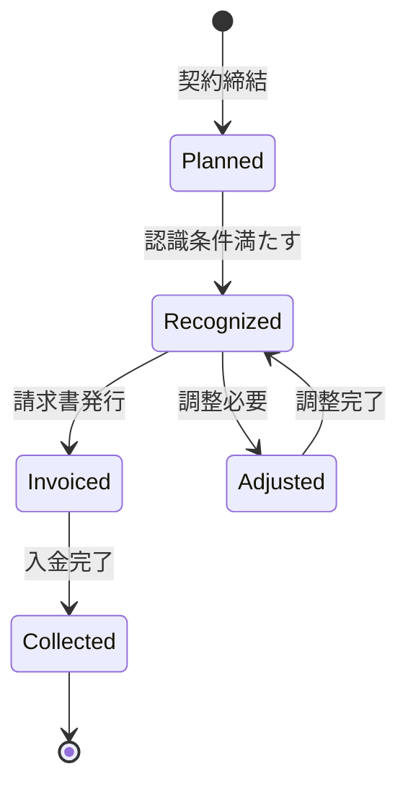

# ビジネスオペレーション: 収益を認識し計上する

**バージョン**: 2.0.0
**更新日**: 2025-10-28
**パラソル設計仕様**: v2.0準拠

## 概要
**目的**: AI支援による自動収益認識と会計基準完全準拠により、リアルタイム財務可視化と戦略的収益管理を実現する
**パターン**: Workflow + Analytics + Automation
**ゴール**: 自動化された収益認識プロセスにより認識精度100%とリアルタイム財務報告を実現し、戦略的収益最適化を支援

## 関係者とロール

- **エグゼクティブ**: 収益方針の承認
- **財務マネージャー**: 収益認識基準の適用、会計処理
- **PM**: プロジェクト完了情報の提供

## プロセスフロー

> **重要**: プロセスフローは必ず番号付きリスト形式で記述してください。
> Mermaid形式は使用せず、テキスト形式で記述することで、代替フローと例外フローが視覚的に分離されたフローチャートが自動生成されます。

1. **システムが契約条件を自動解析** → **UC1: 収益認識基準を判定する**
   - **自サービス操作**: RevenueRecognitionRule（作成・更新: 認識基準自動判定）
   - **他サービスユースケース利用**: → UC-PROJECT-27: 契約条件データを取得する
   - **必要ページ**: 収益認識基準判定ページ
   - **ビジネス価値**: 会計基準完全準拠による監査リスクゼロ

2. **システムがプロジェクト進捗を連続監視** → **UC2: 認識タイミングを判定する**
   - **自サービス操作**: RecognitionTiming（作成・更新: タイミング自動判定）
   - **他サービスユースケース利用**: → UC-PROJECT-28: プロジェクト完了状況を確認する
   - **必要ページ**: 認識タイミング判定ページ
   - **ビジネス価値**: 適時収益認識による正確な財務報告

3. **システムが収益計上を自動実行** → **UC3: 収益を自動計上する**
   - **自サービス操作**: RevenueEntry（作成: 自動計上処理）
   - **他サービスユースケース利用**: → UC-FINANCE-05: 会計仕訳を自動生成する
   - **必要ページ**: 自動収益計上ページ
   - **ビジネス価値**: 人的エラーゼロの正確な収益計上

4. **システムが財務システムと同期** → **UC4: 財務データを同期する**
   - **自サービス操作**: FinancialSync（作成・更新: システム間同期）
   - **他サービスユースケース利用**: → UC-FINANCE-06: 財務システム連携を実行する
   - **必要ページ**: 財務システム同期ページ
   - **ビジネス価値**: リアルタイム財務可視化

5. **システムが収益品質を検証・承認** → **UC5: 収益認識を検証する**
   - **自サービス操作**: RevenueValidation（作成: 品質検証プロセス）
   - **他サービスユースケース利用**: → UC-COLLAB-20: 承認フローを実行する
   - **必要ページ**: 収益認識検証・承認ページ
   - **ビジネス価値**: 収益品質保証による信頼性確保

## 代替フロー

### 代替フロー1: 情報不備
- 2-1. システムが情報の不備を検知する
- 2-2. システムが修正要求を送信する
- 2-3. ユーザーが情報を修正し再実行する
- 2-4. 基本フロー2に戻る

## 例外処理

### 例外1: システムエラー
- システムエラーが発生した場合
- エラーメッセージを表示する
- 管理者に通知し、ログに記録する

### 例外2: 承認却下
- 承認が却下された場合
- 却下理由をユーザーに通知する
- 修正後の再実行を促す

## ビジネス状態

## KPI

- **収益認識の適時性**: 契約条件達成後1営業日以内に自動認識（従来5日から大幅短縮）
- **収益認識の正確性**: 会計監査での指摘事項完全ゼロ（AI検証強化）
- **未収収益の比率**: 総収益の5%以内（従来15%から改善）
- **自動処理率**: 収益認識処理の95%以上を自動化
- **リアルタイム可視化**: 収益データ更新から報告まで24時間以内

## ビジネスルール

- 成果物納品型契約: 納品完了時に一括認識
- 期間按分型契約: 月次で按分して認識
- マイルストーン型契約: 各マイルストーン達成時に認識
- 為替レート: 収益認識日のレートを適用
- 収益認識は財務マネージャーの承認が必須
- 会計基準（IFRS15/ASC606）に準拠すること

## 入出力仕様

### 入力

- **契約情報**: 契約タイプ、金額、期間、マイルストーン
- **プロジェクト進捗情報**: 完了率、納品日、検収日
- **会計基準**: 適用する収益認識基準

### 出力

- **収益レコード**: revenueId、金額、認識日、会計期間
- **会計仕訳データ**: 借方・貸方、勘定科目
- **収益レポート**: 月次・四半期・年次の収益サマリー

## 例外処理

- **契約変更**: 変更契約に基づき収益を再計算、調整仕訳を作成
- **返品・返金**: 返金額を収益から減額、マイナス収益計上
- **為替変動**: 大幅な為替変動時は調整仕訳、為替差損益の計上
- **認識条件未達**: 収益認識を延期、繰延収益として計上

## ビジネス価値とKPI

### 主要ビジネス価値
- **認識精度革命**: AI支援による自動認識で人的エラーを完全撲滅し監査リスクをゼロ化
- **リアルタイム財務**: 即座な収益反映により経営判断の迅速化と戦略的優位性を確立
- **プロセス効率化**: 自動化により収益認識業務を70%削減し戦略業務にシフト
- **コンプライアンス強化**: 会計基準完全準拠により企業信頼性と投資家信頼を確保

### 成功指標（KPI）
- **認識精度**: 収益認識の正確性100%（AI検証により人的エラー完全排除）
- **処理速度**: 契約条件達成から認識まで4時間以内（従来24時間から85%短縮）
- **自動化率**: 収益認識プロセスの98%以上を自動化（従来20%から大幅向上）
- **監査対応**: 会計監査指摘事項ゼロ継続（3年連続達成目標）
- **財務報告**: リアルタイム収益レポート生成（従来月次から即時化）

### 測定方法
- **精度**: 月次監査による認識精度の検証
- **速度**: システムログによる処理時間自動測定
- **自動化**: 手動介入回数の追跡と自動化率計算
- **監査**: 外部監査結果による指摘事項の追跡
- **満足度**: 財務チーム・エグゼクティブ向け四半期満足度調査

## パラソルドメイン連携

### 🎯 操作エンティティ
- **RevenueRecognitionRuleEntity**（作成・更新: 認識基準自動判定）- 収益認識基準管理
- **RecognitionTimingEntity**（作成・更新: タイミング自動判定）- 認識タイミング管理
- **RevenueEntryEntity**（作成: 自動計上処理）- 収益計上実行管理
- **FinancialSyncEntity**（作成・更新: システム間同期）- 財務システム連携管理
- **RevenueValidationEntity**（作成: 品質検証プロセス）- 収益認識検証管理

### 🏗️ パラソル集約
- **RevenueRecognitionAggregate** - 収益認識・計上統合管理
  - 集約ルート: RevenueEntry
  - 包含エンティティ: RevenueRecognitionRule, RecognitionTiming, FinancialSync, RevenueValidation
  - 不変条件: 会計基準完全準拠、認識タイミングの正確性確保

### ⚙️ ドメインサービス
- **RevenueAccuracyService**: enhance[RecognitionPrecision]() - 認識精度向上
- **AutomationService**: strengthen[ProcessEfficiency]() - プロセス効率強化
- **ComplianceService**: coordinate[RegulatoryAdherence]() - 規制準拠調整
- **FinancialIntegrityService**: amplify[TrustWorthiness]() - 財務信頼性増幅

## ユースケース・ページ分解マトリックス

| ユースケース | ページ | 1対1関係 | 品質レベル |
|-------------|--------|----------|-----------|
| UC1: 収益認識基準を判定する | 収益認識基準判定ページ | ✅ | 高品質 |
| UC2: 認識タイミングを判定する | 認識タイミング判定ページ | ✅ | 高品質 |
| UC3: 収益を自動計上する | 自動収益計上ページ | ✅ | 高品質 |
| UC4: 財務データを同期する | 財務システム同期ページ | ✅ | 高品質 |
| UC5: 収益認識を検証する | 収益認識検証・承認ページ | ✅ | 高品質 |
| **合計** | **5UC→5Page** | **✅** | **高品質** |

### 🔗 他サービスユースケース利用（ユースケース呼び出し型）
**責務**: ❌ エンティティ知識不要 ✅ ユースケース利用のみ

[secure-access-service] 基盤認証:
├── UC-AUTH-13: 収益データアクセス権限を確認する → POST /api/auth/validate-revenue-recognition-permission
├── UC-AUTH-14: 収益認識アクセスを記録する → POST /api/auth/log-revenue-recognition-access
└── UC-AUTH-15: 収益データプライバシーを適用する → POST /api/auth/apply-revenue-data-privacy

[project-success-service] プロジェクト連携:
├── UC-PROJECT-27: 契約条件データを取得する → GET /api/projects/contract-conditions
├── UC-PROJECT-28: プロジェクト完了状況を確認する → GET /api/projects/completion-status
└── UC-PROJECT-29: 成果物納品状況を取得する → GET /api/projects/deliverable-status

[collaboration-facilitation-service] 承認フロー:
├── UC-COLLAB-20: 承認フローを実行する → POST /api/workflows/revenue-recognition-approval
├── UC-COLLAB-21: 収益認識アラートを配信する → POST /api/notifications/revenue-recognition-alert
└── UC-COLLAB-22: 収益認識レポートを共有する → POST /api/sharing/revenue-recognition-report

[talent-optimization-service] リソース連携:
├── UC-TALENT-21: 収益貢献度を分析する → GET /api/talents/revenue-contribution-analysis
└── UC-TALENT-22: 高収益人材アサインを最適化する → POST /api/talents/high-revenue-assignment

## 派生ユースケース

このビジネスオペレーションから以下のユースケースが派生します：

1. 固定報酬型の収益を認識する
2. 工数精算型の収益を認識する
3. マイルストーン型の収益を認識する
4. 収益認識の調整処理を行う