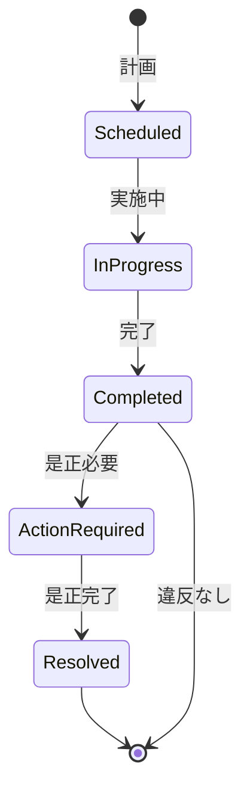

# ビジネスオペレーション: コンプライアンスを監査し報告する

**バージョン**: 1.0.0
**更新日**: 2025-10-01

## 概要

**目的**: セキュリティポリシーとコンプライアンス要件の遵守状況を監査し報告する

**パターン**: Analytics + Communication

**ゴール**: コンプライアンス監査レポートが作成され、違反が是正される

## 関係者とロール

- **監査担当**: コンプライアンス監査の実施
- **セキュリティ管理者**: 違反の是正
- **経営層**: 監査結果の確認、方針決定

## プロセスフロー

> **重要**: プロセスフローは必ず番号付きリスト形式で記述してください。
> Mermaid形式は使用せず、テキスト形式で記述することで、代替フローと例外フローが視覚的に分離されたフローチャートが自動生成されます。

1. システムが監査計画策定を処理する
2. システムが監査実施を処理する
3. システムが証跡確認を実行する
4. システムが違反検出を処理する
5. システムが是正提案を処理する
6. システムがレポート作成を行う
7. システムが経営層報告を処理する

## 代替フロー

### 代替フロー1: 情報不備
- 2-1. システムが情報の不備を検知する
- 2-2. システムが修正要求を送信する
- 2-3. ユーザーが情報を修正し再実行する
- 2-4. 基本フロー2に戻る

## 例外処理

### 例外1: システムエラー
- システムエラーが発生した場合
- エラーメッセージを表示する
- 管理者に通知し、ログに記録する

### 例外2: 承認却下
- 承認が却下された場合
- 却下理由をユーザーに通知する
- 修正後の再実行を促す

## ビジネス状態

## KPI

- **監査頻度**: 年2回以上実施
- **カバー率**: 全セキュリティポリシーの100%を監査
- **違反是正率**: 指摘事項の95%以上を60日以内に是正
- **レポート提出**: 監査完了後2週間以内に提出

## ビジネスルール

- 監査スコープ: ユーザー管理、アクセス制御、ログ管理、パスワードポリシー
- 監査基準: ISO27001、SOC2、GDPR、業界標準
- 是正期限: 重大な違反は30日以内、軽微な違反は60日以内
- フォローアップ: 是正完了を確認

## 入出力仕様

### 入力
- セキュリティポリシー
- コンプライアンス要件
- 監査ログデータ
- 権限データ
- インシデントレポート

### 出力
- コンプライアンス監査レポート
- 違反リスト
- 是正計画
- トレンド分析

## 例外処理

- **重大な違反**: 即座に経営層へ報告、緊急是正
- **是正遅延**: エスカレーション、リソース追加
- **監査困難**: 外部監査の検討

## 派生ユースケース

1. コンプライアンス監査を計画する
2. 監査を実施する
3. 違反を検出する
4. 是正計画を策定する
