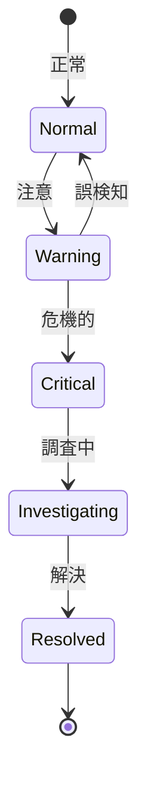

# ビジネスオペレーション: セキュリティイベントを検知し分析する

**バージョン**: 1.0.0
**更新日**: 2025-10-01

## 概要

**目的**: セキュリティログを分析し、異常なイベントを検知する

**パターン**: Analytics

**ゴール**: 不正アクセスやセキュリティ違反が早期に検知され、対応される

## 関係者とロール

- **セキュリティ管理者**: イベント分析、対応
- **監査担当**: 定期的なログレビュー
- **インシデント対応チーム**: インシデント対応

## プロセスフロー

> **重要**: プロセスフローは必ず番号付きリスト形式で記述してください。
> Mermaid形式は使用せず、テキスト形式で記述することで、代替フローと例外フローが視覚的に分離されたフローチャートが自動生成されます。

1. システムがログ収集を処理する
2. システムがパターン分析を処理する
3. システムが異常検知を処理する
4. システムが即座にアラートを処理する
5. システムが要注意マークを処理する
6. システムが記録のみを処理する
7. システムがインシデント対応を処理する

## 代替フロー

### 代替フロー1: 情報不備
- 2-1. システムが情報の不備を検知する
- 2-2. システムが修正要求を送信する
- 2-3. ユーザーが情報を修正し再実行する
- 2-4. 基本フロー2に戻る

## 例外処理

### 例外1: システムエラー
- システムエラーが発生した場合
- エラーメッセージを表示する
- 管理者に通知し、ログに記録する

### 例外2: 承認却下
- 承認が却下された場合
- 却下理由をユーザーに通知する
- 修正後の再実行を促す

## ビジネス状態

## KPI

- **検知率**: 既知の攻撃パターンの100%を検知
- **誤検知率**: 5%以下
- **対応時間**: 高脅威イベントを15分以内に通知
- **分析頻度**: リアルタイムで分析

## ビジネスルール

- 高脅威イベント: 不正ログイン、管理者権限の不正使用、大量データアクセス
- 検知パターン: 失敗ログイン連続、異常な時間帯アクセス、異常な地理位置
- アラート: 高脅威はメール・SMS、中脅威はメール、低脅威は記録のみ

## 入出力仕様

### 入力
- 監査ログデータ
- 脅威インテリジェンス
- 攻撃パターンデータベース
- ユーザー通常行動パターン

### 出力
- セキュリティアラート
- 異常イベントレポート
- 脅威分析レポート
- 推奨対応アクション

## 例外処理

- **誤検知**: パターンの調整、ホワイトリスト追加
- **検知漏れ**: 検知ルールの追加、改善
- **大量アラート**: トリアージ、優先度付け

## 派生ユースケース

1. 異常イベントを検知する
2. セキュリティアラートを発行する
3. インシデントを調査する
4. 検知ルールを更新する
