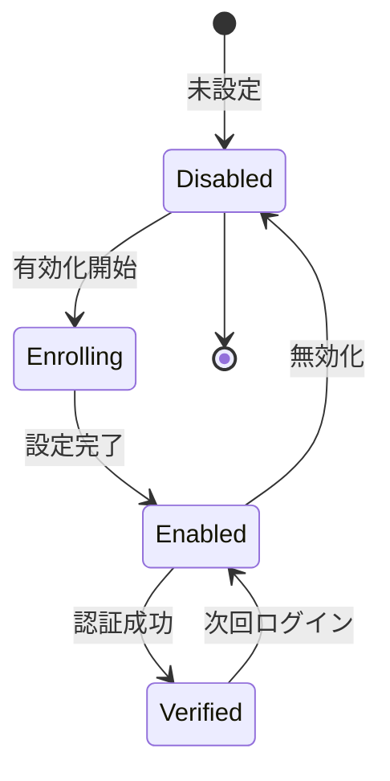

# ビジネスオペレーション: 多要素認証を実施する

**バージョン**: 1.0.0
**更新日**: 2025-10-01

## 概要

**目的**: パスワードに加えて追加の認証要素を要求し、セキュリティを強化する

**パターン**: Workflow

**ゴール**: ユーザーが2つ以上の認証要素で本人確認され、安全にログインする

## 関係者とロール

- **ユーザー**: MFA設定、認証コード入力
- **管理者**: MFAポリシーの設定
- **セキュリティ管理者**: MFAの監視、強制

## プロセスフロー

> **重要**: プロセスフローは必ず番号付きリスト形式で記述してください。
> Mermaid形式は使用せず、テキスト形式で記述することで、代替フローと例外フローが視覚的に分離されたフローチャートが自動生成されます。

1. システムがMFA有効化を処理する
2. ユーザーが認証アプリ登録を行う
3. システムがQRコードスキャンを処理する
4. システムが確認コード入力を実行する
5. システムがMFA設定完了を処理する
6. システムがログイン時にコード要求を処理する
7. システムがコード入力を処理する
8. システムがログイン成功を処理する
9. システムが再入力要求を処理する

## 代替フロー

### 代替フロー1: 情報不備
- 2-1. システムが情報の不備を検知する
- 2-2. システムが修正要求を送信する
- 2-3. ユーザーが情報を修正し再実行する
- 2-4. 基本フロー2に戻る

## 例外処理

### 例外1: システムエラー
- システムエラーが発生した場合
- エラーメッセージを表示する
- 管理者に通知し、ログに記録する

### 例外2: 承認却下
- 承認が却下された場合
- 却下理由をユーザーに通知する
- 修正後の再実行を促す

## ビジネス状態

## KPI

- **MFA有効化率**: 全ユーザーの90%以上がMFA有効化
- **認証成功率**: MFA認証の95%以上が初回で成功
- **バックアップコード利用率**: 5%以下（紛失対応）
- **強制適用**: 管理者・財務担当は100%強制

## ビジネスルール

- 管理者ロールはMFA必須
- 財務・人事データアクセスはMFA必須
- バックアップコード10個を発行、使い切ったら再発行
- 認証コード有効期限30秒

## 入出力仕様

### 入力
- 認証アプリ（Google Authenticator、Authydなど）
- 秘密鍵（QRコードまたは文字列）
- 6桁認証コード

### 出力
- MFA設定完了通知
- バックアップコードリスト
- 認証成功トークン

## 例外処理

- **デバイス紛失**: バックアップコードで認証、管理者による再設定
- **コード期限切れ**: 新しいコードの入力要求
- **連続失敗**: 一時的にアカウントロック、管理者へ通知

## 派生ユースケース

1. MFAを有効化する
2. 認証コードを入力する
3. バックアップコードを使用する
4. MFAをリセットする
