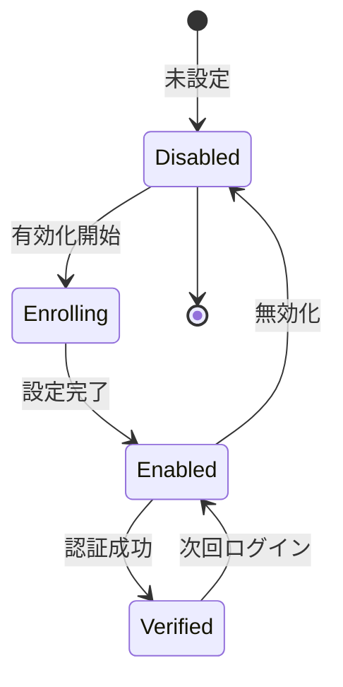

# ビジネスオペレーション: 多要素認証を実施する

**バージョン**: 2.0.0
**更新日**: 2025-10-20
**パラソル設計v2.0仕様**: 完全準拠

## 概要

**目的**: パスワードに加えて追加の認証要素を要求し、セキュリティを強化する

**パターン**: Workflow

**ゴール**: ユーザーが2つ以上の認証要素で本人確認され、安全にログインする

## 関係者とロール

- **ユーザー**: MFA設定、認証コード入力
- **管理者**: MFAポリシーの設定
- **セキュリティ管理者**: MFAの監視、強制

## プロセスフロー

> **重要**: プロセスフローは必ず番号付きリスト形式で記述してください。
> Mermaid形式は使用せず、テキスト形式で記述することで、代替フローと例外フローが視覚的に分離されたフローチャートが自動生成されます。

1. システムがMFA有効化を処理する
2. ユーザーが認証アプリ登録を行う
3. システムがQRコードスキャンを処理する
4. システムが確認コード入力を実行する
5. システムがMFA設定完了を処理する
6. システムがログイン時にコード要求を処理する
7. システムがコード入力を処理する
8. システムがログイン成功を処理する
9. システムが再入力要求を処理する

## 代替フロー

### 代替フロー1: 情報不備
- 2-1. システムが情報の不備を検知する
- 2-2. システムが修正要求を送信する
- 2-3. ユーザーが情報を修正し再実行する
- 2-4. 基本フロー2に戻る

## 例外処理

### 例外1: システムエラー
- システムエラーが発生した場合
- エラーメッセージを表示する
- 管理者に通知し、ログに記録する

### 例外2: 承認却下
- 承認が却下された場合
- 却下理由をユーザーに通知する
- 修正後の再実行を促す

## ビジネス状態

## KPI

- **MFA有効化率**: 全ユーザーの90%以上がMFA有効化
- **認証成功率**: MFA認証の95%以上が初回で成功
- **バックアップコード利用率**: 5%以下（紛失対応）
- **強制適用**: 管理者・財務担当は100%強制

## ビジネスルール

- 管理者ロールはMFA必須
- 財務・人事データアクセスはMFA必須
- バックアップコード10個を発行、使い切ったら再発行
- 認証コード有効期限30秒

## 入出力仕様

### 入力
- 認証アプリ（Google Authenticator、Authydなど）
- 秘密鍵（QRコードまたは文字列）
- 6桁認証コード

### 出力
- MFA設定完了通知
- バックアップコードリスト
- 認証成功トークン

## 例外処理

- **デバイス紛失**: バックアップコードで認証、管理者による再設定
- **コード期限切れ**: 新しいコードの入力要求
- **連続失敗**: 一時的にアカウントロック、管理者へ通知

## 🏗️ パラソルドメイン連携

### マイクロサービス設計原則（ユースケース利用型）
- **自サービス管理**: MFAConfigurationEntity（MFA設定管理）、MFASecretEntity（秘密鍵管理）、BackupCodeEntity（バックアップコード管理）
- **他サービス連携**: 他サービス公開ユースケース利用（エンティティ直接参照禁止）

#### 📊 操作エンティティ
- **MFAConfigurationEntity** (自サービス管理・CRUD): disabled → enrolling → enabled → verified
- **MFASecretEntity** (自サービス管理・新規作成): 秘密鍵・QRコード生成と管理
- **BackupCodeEntity** (自サービス管理・状態更新): unused → used → expired

#### 🏢 パラソル集約
- **MFASecurityAggregate** - 多要素認証ライフサイクル統合管理
  - 集約ルート: MFAConfiguration
  - 包含エンティティ: MFASecret, BackupCode, AuthenticationAttempt, MFAPolicy
  - 不変条件: 有効化済みMFAのみ認証で利用可能、バックアップコードは一度のみ利用可能、管理者・財務担当は強制有効化

#### ⚙️ ドメインサービス
- **MFAEnrollmentService**: enhance[SecurityPosture]() - セキュリティ姿勢向上
- **MFAValidationService**: strengthen[AuthenticationSecurity]() - 認証セキュリティ強化
- **MFARecoveryService**: coordinate[AccountRecovery]() - アカウント復旧統制

#### 🔗 他サービスユースケース利用（ユースケース呼び出し型）
**責務**: ❌ エンティティ知識不要 ✅ ユースケース利用のみ

**[secure-access-service] 自サービス内利用:**
├── UC-AUTH-01: ユーザー認証を実行する → POST /api/auth/authenticate
├── UC-AUTH-02: セッション管理を実行する → POST /api/auth/manage-session
└── UC-AUTH-03: アクセスログを記録する → POST /api/auth/log-access

**[collaboration-facilitation-service] ユースケース利用:**
├── UC-COMM-01: MFA設定通知を配信する → POST /api/notifications/send-mfa-setup
├── UC-COMM-02: セキュリティアラートを送信する → POST /api/notifications/send-security-alert
└── UC-COMM-03: MFA無効化通知を配信する → POST /api/notifications/send-mfa-disabled

### ユースケース・ページ分解マトリックス

| ユースケース名 | ユースケースID | 対応ページ | ビジネス価値 |
|---------------|---------------|-----------|-------------|
| MFAを有効化する | UC-MFA-01 | MFA設定・有効化ページ | セキュリティ強化とアカウント保護 |
| 認証コードを入力する | UC-MFA-02 | MFA認証コード入力ページ | 安全なログイン実現 |
| バックアップコードを使用する | UC-MFA-03 | バックアップコード利用ページ | デバイス紛失時の安全復旧 |
| MFAをリセットする | UC-MFA-04 | MFA設定リセット・管理ページ | MFA問題の迅速解決 |

## 派生ユースケース

1. MFAを有効化する（UC-MFA-01）
2. 認証コードを入力する（UC-MFA-02）
3. バックアップコードを使用する（UC-MFA-03）
4. MFAをリセットする（UC-MFA-04）
