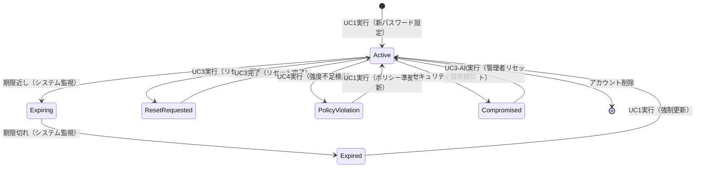

# ビジネスオペレーション: パスワードセキュリティを強化し認証基盤を保護する

**バージョン**: 2.0.0
**更新日**: 2025-10-21
**設計方針**: ユースケース・ページ分解指向 + パラソルドメイン言語連携

## 📋 概要
**目的**: パスワードセキュリティを強化し、組織全体の認証基盤を脅威から保護する
**パターン**: Workflow + Security + Policy
**ゴール**: ゼロトラストセキュリティによる堅牢なパスワード管理環境の実現

## 🎭 関係者とロール
- **ユーザー**: パスワード変更・強度確認・自己管理
- **セキュリティ管理者**: パスワードポリシー策定・強制適用・監視
- **管理者**: パスワードリセット・アカウント復旧・例外対応
- **システム**: 自動検証・期限監視・脅威検知・監査ログ記録

## 🏗️ パラソルドメイン連携

### サービス境界とユースケース連携

> **⚡ マイクロサービス設計の基本原則（ユースケース利用型）**
> - **自サービス管理**: 自エンティティの全CRUD + 自ユースケースの実装
> - **他サービス連携**: **他サービスの公開ユースケースを利用**（エンティティは意識しない）

#### 📦 自サービス管理（secure-access-service）
**責務**: ✅ エンティティ管理 ✅ ユースケース実装 ✅ ビジネスロジック

```
Entity: User - 拡張管理
├── passwordHash: STRING_255 - パスワードハッシュ（bcrypt）
├── passwordChangedAt: TIMESTAMP - 最終変更日時
├── passwordExpiresAt: TIMESTAMP - 有効期限
├── failedLoginAttempts: INTEGER - 失敗回数
└── passwordResetToken: STRING_255 - リセットトークン

ValueObject: Password - 値オブジェクト
├── value: STRING_255 - ハッシュ化された値
├── strength: ENUM - 強度レベル（weak/medium/strong/excellent）
├── createdAt: TIMESTAMP - 作成日時
└── algorithm: STRING_50 - ハッシュアルゴリズム

Entity: PasswordPolicy - 集約ルート
├── id: UUID - ポリシーID
├── organizationId: UUID - 組織ID
├── minLength: INTEGER - 最小文字数
├── requireUpperCase: BOOLEAN - 大文字必須
├── requireNumbers: BOOLEAN - 数字必須
├── requireSymbols: BOOLEAN - 記号必須
├── maxAge: INTEGER - 最大有効期間（日）
├── historyCount: INTEGER - 履歴保持数
└── complexityScore: INTEGER - 最小複雑性スコア

Aggregate: PasswordSecurityAggregate
├── ルート: PasswordPolicy
├── 包含: PasswordHistory（1対多）
├── 不変条件: ポリシー準拠必須、履歴重複禁止
└── セキュリティ制約: 管理者権限必須、監査ログ記録
```

#### 🔗 他サービスユースケース利用（ユースケース呼び出し型）
**責務**: ❌ エンティティ知識不要 ✅ ユースケース利用のみ

```
[collaboration-facilitation-service] ユースケース利用:
├── UC-NOTIFY-01: パスワード期限通知を配信する → POST /api/notifications/password-expiry
├── UC-NOTIFY-02: セキュリティアラートを送信する → POST /api/security/alerts
└── UC-NOTIFY-03: ポリシー変更通知を配信する → POST /api/notifications/policy-updates

[project-success-service] ユースケース利用:
├── UC-AUDIT-01: パスワード変更を監査記録する → POST /api/audit/password-changes
├── UC-AUDIT-02: ポリシー違反を監査記録する → POST /api/audit/policy-violations
└── UC-AUDIT-03: セキュリティイベントを監査記録する → POST /api/audit/security-events

[knowledge-co-creation-service] ユースケース利用:
├── UC-KNOWLEDGE-01: セキュリティ知識を記録する → POST /api/knowledge/security-practices
└── UC-KNOWLEDGE-02: パスワード教育資料を蓄積する → POST /api/knowledge/education-content
```

### マイクロサービス連携型ドメインサービス

#### 🎯 ビジネス価値重視のドメインサービス
```
DomainService: PasswordSecurityService（パスワードセキュリティサービス）
├── strengthen[PasswordResilience]() - パスワード耐性の強化
├── prevent[SecurityBreaches]() - セキュリティ侵害の予防（→ 監視連携）
├── enforce[PolicyCompliance]() - ポリシー準拠の強制
└── enhance[UserExperience]() - ユーザー体験の向上（→ 通知連携）

DomainService: PasswordComplianceService（パスワード準拠サービス）
├── validate[PasswordComplexity]() - パスワード複雑性の検証
├── monitor[PolicyAdherence]() - ポリシー遵守の監視（→ 監査連携）
├── detect[WeakPasswords]() - 脆弱パスワードの検知
└── coordinate[PolicyUpdates]() - ポリシー更新の調整（→ 知識連携）
```

## 🔄 プロセスフロー（ユースケース分解指向）

> **重要**: 各ステップは「誰が何をするか」を明記し、ユースケース分解の根拠とする

### 基本フロー
1. **ユーザーがパスワード変更を実行** → **UC1: パスワードを変更する**
   - **操作エンティティ**: User（passwordHash, passwordChangedAt 更新）
   - **必要ページ**: パスワード変更フォーム - 現在と新パスワード入力

2. **システムがパスワード強度を検証** → **内部処理（ページなし）**
   - **ドメインサービス**: PasswordSecurityService.strengthen[PasswordResilience]()

3. **セキュリティ管理者がポリシー設定を実行** → **UC2: パスワードポリシーを設定する**
   - **操作エンティティ**: PasswordPolicy（新規作成・更新）
   - **必要ページ**: ポリシー設定ページ - 複雑性・期限・履歴設定

4. **ユーザーがパスワードリセットを実行** → **UC3: パスワードをリセットする**
   - **操作エンティティ**: User（passwordResetToken, passwordHash 更新）
   - **必要ページ**: パスワードリセットページ - メール入力・新パスワード設定

5. **システムが強度検証を実行** → **UC4: パスワード強度を検証する**
   - **操作エンティティ**: Password（値オブジェクト作成・検証）
   - **必要ページ**: 強度確認ページ - リアルタイム強度表示・改善提案

### ユースケース分解原則
- **ユーザー操作ステップ** → ユースケース + ページ
- **システム内部処理** → ドメインサービス（ページなし）
- **1ユースケース = 1つの明確な目的 = 1つのページ**

## 📄 ユースケース・ページ設計マトリックス

| UC# | ユースケース名 | 対応ページ | エンティティ | アクター | 設計方針 |
|-----|---------------|-----------|-------------|----------|----------|
| UC1 | パスワードを変更する | パスワード変更フォーム | User（パスワード更新） | ユーザー | 入力重視・強度リアルタイム確認 |
| UC2 | パスワードポリシーを設定する | ポリシー設定ページ | PasswordPolicy（作成・更新） | セキュリティ管理者 | 設定重視・影響範囲表示 |
| UC3 | パスワードをリセットする | パスワードリセットページ | User（リセット処理） | ユーザー・管理者 | ワークフロー重視・セキュリティ強化 |
| UC4 | パスワード強度を検証する | 強度確認ページ | Password（値オブジェクト） | ユーザー | 可視化重視・教育・改善提案 |

## 🔀 代替フロー（ユースケース分岐指向）

### 代替フロー1: 期限切れパスワードの強制変更
- **分岐元**: 基本フロー ステップ1
- **条件**: パスワード期限切れを検知
- **代替ユースケース**: UC1-Alt: 期限切れパスワードを緊急変更する
  - **必要ページ**: 緊急変更フォーム - 期限切れ警告・緊急変更ガイド
  - **操作エンティティ**: User（強制変更フラグ、passwordExpiresAt 更新）

### 代替フロー2: 管理者によるリセット実行
- **分岐元**: 基本フロー ステップ4
- **条件**: ユーザー自身でリセットができない場合
- **代替ユースケース**: UC3-Alt: 管理者がパスワードリセットを代行する
  - **必要ページ**: 管理者リセットページ - ユーザー選択・リセット実行・通知設定
  - **操作エンティティ**: User（管理者による強制リセット）

## ⚠️ 例外フロー（エラーページ設計指向）

### 例外1: ポリシー違反と教育案内
- **発生ステップ**: ステップ2（強度検証）
- **エラーユースケース**: UC1-Error: ポリシー違反を検出し教育を提供する
  - **必要ページ**: ポリシー違反エラーページ - 違反詳細・改善ガイド・教育リンク
  - **表示情報**: 具体的違反事項、推奨パスワード例、セキュリティ教育リンク

### 例外2: 頻繁なリセット要求とセキュリティ対応
- **発生ステップ**: ステップ4（リセット実行）
- **エラーユースケース**: UC3-Error: 異常なリセット要求を検知し保護を強化する
  - **必要ページ**: セキュリティ保護ページ - 異常検知通知・追加認証・管理者連絡
  - **表示情報**: セキュリティ警告、追加認証手順、管理者への連絡方法

## 📊 ビジネス状態（エンティティライフサイクル）



**状態とエンティティの対応**:
- **Active**: User.passwordChangedAt = recent, Password.strength ≥ medium
- **Expiring**: User.passwordExpiresAt - now() ≤ 7days
- **Expired**: User.passwordExpiresAt < now()
- **ResetRequested**: User.passwordResetToken ≠ null
- **PolicyViolation**: Password.strength = weak, Policy compliance = false
- **Compromised**: PasswordSecurityAggregate.securityEvent = detected

## 📏 KPI（ユースケース別成功指標）

| ユースケース | KPI | 目標値 | 測定方法 |
|-------------|-----|--------|----------|
| UC1 | パスワード変更成功率 | 95% | 変更要求→完了の成功率 |
| UC2 | ポリシー準拠率 | 98% | 新規パスワードのポリシー準拠率 |
| UC3 | リセット完了時間 | 15分以内 | 要求→完了の平均時間 |
| UC4 | 強度向上率 | 80% | 弱いパスワード→強いパスワード変更率 |

**全体KPI**:
- **セキュリティ脅威予防率**: 99.5%（パスワード起因の侵害ゼロ）
- **ユーザー満足度**: 90%（パスワード変更プロセスの使いやすさ）
- **ポリシー違反検知率**: 100%（弱いパスワードの即座検知）

## 📜 ビジネスルール（ドメイン制約）

### エンティティ制約
- **PasswordPolicy**: 最小長8文字、複雑性スコア ≥ 60 → PasswordComplianceService.enforce[PolicyCompliance]()
- **Password**: 過去5世代の再利用禁止 → PasswordSecurityService.prevent[PasswordReuse]()
- **User**: 最大失敗回数5回でロック → PasswordSecurityService.prevent[BruteForceAttacks]()

### ユースケース制約
- **UC1**: 現在のパスワード確認必須 → ページバリデーションで実装
- **UC3**: リセット要求は24時間に3回まで → ページバリデーションで実装
- **UC4**: 強度チェックはリアルタイム → ページバリデーションで実装

### セキュリティ制約
- **すべてのUC**: HTTPS通信必須、TLS 1.3以上
- **パスワードハッシュ**: bcrypt、コスト係数12以上
- **リセットトークン**: 暗号化強度256bit、有効期限1時間

## 🔗 入出力仕様（API・ページ連携）

### ユースケース別入出力

#### UC1: パスワードを変更する
**入力（ページ → API）**:
```json
{
  "passwordChangeRequest": {
    "userId": "UUID - ユーザーID",
    "currentPassword": "string - 現在のパスワード",
    "newPassword": "string - 新しいパスワード",
    "confirmPassword": "string - 確認用パスワード"
  }
}
```

**出力（API → ページ）**:
```json
{
  "result": "success/error",
  "passwordStrength": {
    "score": "integer - 強度スコア（0-100）",
    "level": "weak/medium/strong/excellent",
    "recommendations": ["string - 改善提案"]
  },
  "nextAction": "UC4実行可能（強度確認） | セキュリティ設定推奨"
}
```

#### UC2: パスワードポリシーを設定する
**入力（ページ → API）**:
```json
{
  "policyConfiguration": {
    "organizationId": "UUID - 組織ID",
    "minLength": "integer - 最小文字数",
    "complexityRequirements": {
      "requireUpperCase": "boolean",
      "requireLowerCase": "boolean",
      "requireNumbers": "boolean",
      "requireSymbols": "boolean"
    },
    "maxAge": "integer - 最大有効期間（日）",
    "historyCount": "integer - 履歴保持数"
  }
}
```

**出力（API → ページ）**:
```json
{
  "result": "success/error",
  "affectedUsers": "integer - 影響ユーザー数",
  "complianceStatus": {
    "currentCompliance": "percentage - 現在の準拠率",
    "estimatedCompliance": "percentage - 新ポリシー適用後の準拠率"
  },
  "nextAction": "UC1実行推奨（ユーザー向け変更案内） | 通知配信実行"
}
```

## 🚀 実装指針

### 推奨実装順序
1. **パラソルドメイン言語定義** - PasswordPolicy、Password値オブジェクト、PasswordSecurityAggregate
2. **ドメインサービス実装** - PasswordSecurityService、PasswordComplianceService
3. **ユースケース・ページのペア実装** - UC1→UC4→UC3→UC2の順序で段階的に
4. **統合テスト** - セキュリティポリシー全体の検証・脆弱性テスト

### 品質チェックポイント
- [ ] 各ユースケースに対応するページが1対1で存在する
- [ ] パラソルドメイン言語エンティティが正しく操作される
- [ ] ビジネス状態遷移がエンティティ状態と一致する
- [ ] 代替・例外フローにも適切なページが用意される
- [ ] セキュリティポリシーがすべてのユースケースで適用される
- [ ] 他サービスユースケース利用が正しく実装される

### セキュリティ要件
- **パスワードハッシュ**: bcrypt（コスト12以上）
- **通信暗号化**: TLS 1.3必須
- **トークン管理**: JWT、有効期限1時間
- **監査ログ**: 全操作の記録、改ざん防止

---
*このテンプレートは、ユースケース・ページ分解とパラソルドメイン言語連携を強化したビジネスオペレーション設計指針v2.0に基づいています*