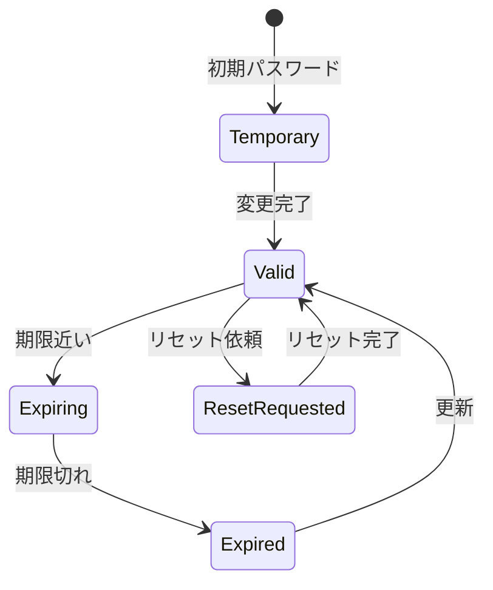

# ビジネスオペレーション: パスワードを管理する

**バージョン**: 1.0.1
**更新日**: 2025-10-02

## 概要

**目的**: パスワードの変更、リセット、ポリシー適用を管理する

**パターン**: Workflow + CRUD

**ゴール**: すべてのパスワードが強固なポリシーに準拠し、定期的に更新される

## 関係者とロール

- **ユーザー**: パスワード変更、リセット依頼
- **管理者**: パスワードリセット、ポリシー設定
- **セキュリティ管理者**: パスワードポリシーの策定

## プロセスフロー

1. ユーザーがパスワード変更を要求する
2. システムが現在のパスワード確認を求める
3. ユーザーが新しいパスワードを入力する
4. システムがパスワードポリシーチェックを実行する
5. ポリシーに適合する場合、パスワードを更新する
6. システムが更新完了通知をユーザーに送信する

## 代替フロー

### 代替フロー1: パスワードリセット
- 3-1. ユーザーが「パスワードを忘れた」を選択する
- 3-2. システムがメールアドレスの入力を求める
- 3-3. システムがリセットリンク付きメールを送信する
- 3-4. ユーザーがリセットリンクをクリックする
- 3-5. システムが新しいパスワードの設定画面を表示する
- 3-6. 基本フロー4に戻る

## 例外処理

### 例外1: ポリシー違反
- システムがポリシー違反を検出した場合
- 具体的な違反理由を表示する
- ユーザーに再入力を促す

### 例外2: リセットメール未達
- メール送信に失敗した場合
- 別の連絡方法（SMS、管理者経由）で対応する
- エラーログを記録する

### 例外3: 頻繁なリセット要求
- 短期間に複数回のリセット要求を検知した場合
- 不正アクセスの可能性を調査する
- アカウントを一時的にロックする

## ビジネス状態

## KPI

- **パスワード強度**: 100%が強度基準を満たす
- **定期変更率**: 90日毎の変更率95%以上
- **リセット処理時間**: リセット依頼から1時間以内に対応
- **漏洩検知**: 既知の漏洩パスワード使用率0%

## ビジネスルール

- パスワード長: 最低8文字、推奨12文字以上
- 複雑性: 英大文字、英小文字、数字、記号を各1文字以上
- 有効期限: 90日（管理者は60日）
- 過去5世代のパスワード再利用禁止
- 既知の漏洩パスワードリストとの照合

## 入出力仕様

### 入力
- 現在のパスワード（変更時）
- 新しいパスワード
- 確認用パスワード
- メールアドレス（リセット時）

### 出力
- パスワード更新完了通知
- パスワード強度スコア
- リセットメール（一時リンク）

## 派生ユースケース

1. パスワードを変更する
2. パスワードをリセットする
3. パスワードポリシーを設定する