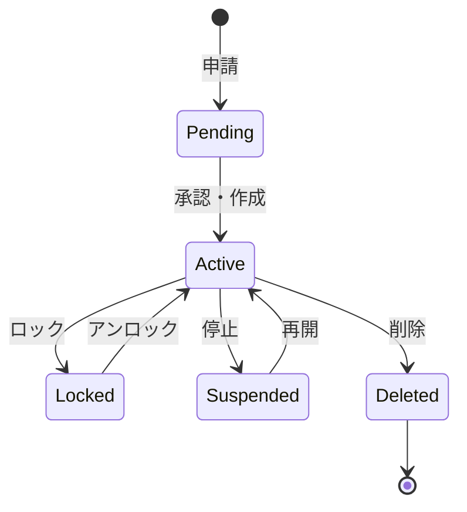

# ビジネスオペレーション: ユーザーを登録し認証する

**バージョン**: 1.0.0
**更新日**: 2025-10-01

## 概要

**目的**: ユーザーを安全に登録し、ログイン時に身元を確認する

**パターン**: Workflow

**ゴール**: ユーザーが正しく認証され、システムへのアクセスが許可される

## 関係者とロール

- **管理者**: ユーザー登録、アカウント管理
- **ユーザー**: アカウント申請、ログイン
- **セキュリティ管理者**: 認証ポリシーの設定

## プロセスフロー

> **重要**: プロセスフローは必ず番号付きリスト形式で記述してください。
> Mermaid形式は使用せず、テキスト形式で記述することで、代替フローと例外フローが視覚的に分離されたフローチャートが自動生成されます。

1. ユーザーがアカウント申請を行う
2. 管理者が申請情報を確認する
3. システムがアカウントを作成する
4. システムが初期パスワードを発行する
5. システムがアカウント通知をユーザーに送信する
6. ユーザーがログイン試行を行う
7. システムが認証処理を実行する
8. 認証に成功した場合、システムがアクセスを許可する

## 代替フロー

### 代替フロー1: 情報不備による修正
- 2-1. 管理者が申請情報の不備を検知する
- 2-2. システムが修正要求をユーザーに送信する
- 2-3. ユーザーが情報を修正し再申請する
- 2-4. 基本フロー2に戻る

### 代替フロー2: 承認却下
- 2-1. 管理者が申請を却下する
- 2-2. システムが却下理由をユーザーに通知する
- 2-3. ユーザーが修正後に再申請する場合、基本フロー1に戻る

## 例外処理

### 例外1: 認証失敗
- 7-1. システムが認証の失敗を検知する
- 7-2. システムが「認証に失敗しました」を表示する
- 7-3. システムが失敗回数をカウントし、ロックまでの残回数を通知する
- 7-4. 5回失敗の場合、アカウントをロックする

### 例外2: メールアドレス重複
- 1-1. システムが既存のメールアドレスを検知する
- 1-2. システムが「既に登録されています」を表示する
- 1-3. 既存アカウントの確認または統合を提案する

### 例外3: システムエラー
- システムエラーが発生した場合
- エラーメッセージを表示する
- 管理者に通知し、ログに記録する

## ビジネス状態

## KPI

- **登録処理時間**: 申請から24時間以内にアカウント作成
- **認証成功率**: 98%以上（誤入力除く）
- **初回ログイン率**: アカウント通知後48時間以内に90%がログイン
- **アカウント正確性**: 誤登録率0.5%以下

## ビジネスルール

- メールアドレスは組織ドメインのみ許可
- パスワードは8文字以上、英数字記号を含む
- 初回ログイン時にパスワード変更を強制
- 連続5回ログイン失敗でアカウントロック

## 入出力仕様

### 入力
- ユーザー情報（氏名、メールアドレス、所属）
- 申請理由
- 希望ロール

### 出力
- アカウント情報（ユーザーID、初期パスワード）
- 認証トークン（JWT）
- 認証ログ

## 例外処理

- **メールアドレス重複**: 既存アカウントの確認、統合
- **承認却下**: 申請者へ理由通知
- **認証失敗**: エラーメッセージ表示、ロックまでの残回数通知

## 派生ユースケース

1. ユーザーアカウントを申請する
2. アカウントを承認・作成する
3. ログインする
4. ログアウトする
