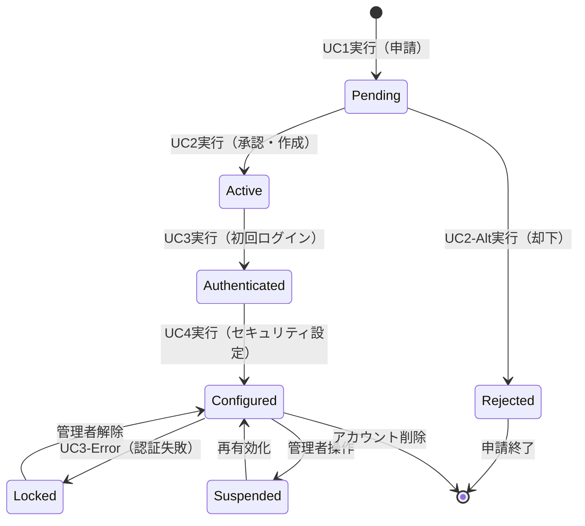

# ビジネスオペレーション: 安全なアクセスを確立し組織セキュリティを実現する

**バージョン**: 2.0.0
**更新日**: 2025-10-09
**設計方針**: ユースケース・ページ分解指向 + パラソルドメイン言語連携

## 📋 概要
**目的**: ユーザーを安全に組織に登録し、継続的な認証によりセキュアなアクセス環境を実現する
**パターン**: Workflow + Authentication
**ゴール**: ゼロトラストセキュリティによる安全な組織アクセス環境の構築

## 🎭 関係者とロール
- **管理者**: ユーザー登録承認・アカウント管理・権限設定
- **申請者**: アカウント申請・認証情報設定・システムアクセス
- **セキュリティ管理者**: 認証ポリシー設定・セキュリティ監視・監査ログ管理
- **システム**: 自動承認・認証処理・セキュリティイベント検知

## 🏗️ パラソルドメイン連携

### サービス境界とユースケース連携

> **⚡ マイクロサービス設計の基本原則（ユースケース利用型）**
> - **自サービス管理**: 自エンティティの全CRUD + 自ユースケースの実装
> - **他サービス連携**: **他サービスの公開ユースケースを利用**（エンティティは意識しない）

#### 📦 自サービス管理（secure-access-service）
**責務**: ✅ エンティティ管理 ✅ ユースケース実装 ✅ ビジネスロジック

```
Entity: User - Aggregate Root
├── id: UUID - 一意識別子
├── organizationId: UUID - 組織ID参照
├── email: EMAIL - メールアドレス（ユニーク）
├── passwordHash: STRING_255 - パスワードハッシュ
├── status: ENUM - ステータス（active/inactive/locked/suspended）
├── mfaEnabled: BOOLEAN - MFA有効フラグ
└── lastLoginAt: TIMESTAMP - 最終ログイン日時

Entity: Session - Aggregate Root
├── id: UUID - セッションID
├── userId: UUID - ユーザーID参照
├── token: STRING_255 - セッショントークン
├── expiresAt: TIMESTAMP - 有効期限
└── deviceInfo: JSON - デバイス情報

ValueObject: AuthenticationContext
├── method: ENUM - 認証方法
├── strength: ENUM - 認証強度
└── timestamp: TIMESTAMP - 認証時刻

Aggregate: UserAggregate
├── ルート: User
├── 包含: Session（1対多）
└── 不変条件: パスワードポリシー準拠、組織所属必須
```

#### 🔗 他サービスユースケース利用（ユースケース呼び出し型）
**責務**: ❌ エンティティ知識不要 ✅ ユースケース利用のみ

```
[collaboration-facilitation-service] ユースケース利用:
├── UC-NOTIFY-01: アカウント通知を配信する → POST /api/notifications/send
├── UC-NOTIFY-02: セキュリティアラートを送信する → POST /api/security/alerts
└── UC-NOTIFY-03: パスワード期限通知を配信する → POST /api/notifications/schedule

[knowledge-co-creation-service] ユースケース利用:
├── UC-KNOWLEDGE-01: セキュリティ知識を記録する → POST /api/knowledge/security-events
└── UC-KNOWLEDGE-02: ベストプラクティスを蓄積する → POST /api/knowledge/practices

[project-success-service] ユースケース利用:
├── UC-AUDIT-01: プロジェクト監査ログを記録する → POST /api/audit/project-access
└── UC-AUDIT-02: セキュリティイベントを監査する → POST /api/audit/security-events
```

**ユースケース連携パターン**:
- **機能利用**: `POST /api/{service}/usecases/{usecase-id}` - 他サービス機能実行
- **状況照会**: `GET /api/{service}/usecases/{usecase-id}/status` - 実行状況確認
- **結果取得**: `GET /api/{service}/usecases/{usecase-id}/result` - 処理結果取得

### マイクロサービス連携型ドメインサービス

#### 🎯 ビジネス価値重視のドメインサービス
```
DomainService: SecureAccessCoordinator（セキュアアクセス調整サービス）
├── establishSecureAccess() - セキュアアクセス環境の確立
├── strengthenAuthentication() - 認証強度の向上（→ MFA設定・監視連携）
├── preventSecurityBreaches() - セキュリティ侵害の予防
└── ensureCompliance() - コンプライアンス確保（→ 監査サービス連携）

DomainService: AuthenticationCoordinator（認証調整サービス）
├── coordinateMultiFactorAuth() - 多要素認証の調整（→ 外部認証連携）
├── managePasswordPolicy() - パスワードポリシー管理
├── detectAnomalousAccess() - 異常アクセス検知（→ 監視サービス連携）
└── maintainSessionSecurity() - セッションセキュリティ維持
```

## 🔄 プロセスフロー（ユースケース分解指向）

> **重要**: 各ステップは「誰が何をするか」を明記し、ユースケース分解の根拠とする

### 基本フロー
1. **申請者がアカウント申請を実行** → **UC1: ユーザーアカウントを申請する**
   - **操作エンティティ**: User（新規作成）
   - **必要ページ**: アカウント申請フォーム - 申請情報入力とポリシー確認

2. **システムが申請情報を検証** → **内部処理（ページなし）**
   - **ドメインサービス**: SecureAccessCoordinator.validateApplicationData()

3. **管理者が申請承認を実行** → **UC2: アカウント申請を承認する**
   - **操作エンティティ**: User（ステータス更新）
   - **必要ページ**: 申請承認ページ - 申請内容確認と承認判定

4. **システムがアカウント作成を実行** → **内部処理（ページなし）**
   - **ドメインサービス**: AuthenticationCoordinator.createUserAccount()

5. **申請者が初回ログインを実行** → **UC3: セキュアログインを実行する**
   - **操作エンティティ**: User, Session（新規作成）
   - **必要ページ**: ログインページ - 認証情報入力と多要素認証

6. **システムが認証処理を実行** → **内部処理（ページなし）**
   - **ドメインサービス**: AuthenticationCoordinator.authenticateUser()

7. **申請者がパスワード変更を実行** → **UC4: セキュリティ設定を完了する**
   - **操作エンティティ**: User（認証情報更新）
   - **必要ページ**: セキュリティ設定ページ - パスワード変更とMFA設定

8. **システムがセキュリティ環境を確立** → **内部処理（ページなし）**
   - **ドメインサービス**: SecureAccessCoordinator.establishSecureEnvironment()

### ユースケース分解原則
- **ユーザー操作ステップ** → ユースケース + ページ
- **システム内部処理** → ドメインサービス（ページなし）
- **1ユースケース = 1つの明確な目的 = 1つのページ**

## 📄 ユースケース・ページ設計マトリックス

| UC# | ユースケース名 | 対応ページ | エンティティ | アクター | 設計方針 |
|-----|---------------|-----------|-------------|----------|----------|
| UC1 | ユーザーアカウントを申請する | アカウント申請フォーム | User（新規） | 申請者 | 入力重視・ポリシー確認 |
| UC2 | アカウント申請を承認する | 申請承認ページ | User（更新） | 管理者 | 操作重視・承認ワークフロー |
| UC3 | セキュアログインを実行する | ログインページ | User, Session | 申請者 | 入力重視・セキュリティ強化 |
| UC4 | セキュリティ設定を完了する | セキュリティ設定ページ | User（認証更新） | 申請者 | 入力重視・設定ガイド |

## 🔀 代替フロー（ユースケース分岐指向）

### 代替フロー1: 申請情報不備による修正
- **分岐元**: 基本フロー ステップ2
- **条件**: 申請情報に不備や不正確な情報を検知
- **代替ユースケース**: UC1-Alt: 申請情報を修正し再申請する
  - **必要ページ**: 申請修正フォーム - エラー詳細表示と修正ガイド
  - **操作エンティティ**: User（申請データ更新）

### 代替フロー2: 承認却下
- **分岐元**: 基本フロー ステップ3
- **条件**: 管理者が申請を却下
- **代替ユースケース**: UC2-Alt: 申請却下と理由通知を実行する
  - **必要ページ**: 却下理由通知ページ - 却下理由詳細と再申請ガイド
  - **操作エンティティ**: User（ステータス却下更新）

## ⚠️ 例外フロー（エラーページ設計指向）

### 例外1: 認証失敗とアカウントロック
- **発生ステップ**: ステップ6（認証処理）
- **エラーユースケース**: UC3-Error: 認証失敗を処理しセキュリティを強化する
  - **必要ページ**: 認証失敗エラーページ - 失敗原因・残回数・回復手順
  - **表示情報**: エラーメッセージ、ロックまでの残回数、パスワードリセット案内

### 例外2: メールアドレス重複
- **発生ステップ**: ステップ1（申請実行）
- **エラーユースケース**: UC1-Error: 重複アカウントを検出し統合案内する
  - **必要ページ**: 重複アカウントエラーページ - 既存アカウント確認・統合手順
  - **表示情報**: 重複検出通知、既存アカウント確認方法、統合オプション

## 📊 ビジネス状態（エンティティライフサイクル）



**状態とエンティティの対応**:
- **Pending**: User.status = "pending", User.emailVerified = false
- **Active**: User.status = "active", User.passwordChangedAt = null
- **Authenticated**: User.lastLoginAt = now(), Session.isActive = true
- **Configured**: User.passwordChangedAt = now(), User.mfaEnabled = true

## 📏 KPI（ユースケース別成功指標）

| ユースケース | KPI | 目標値 | 測定方法 |
|-------------|-----|--------|----------|
| UC1 | 申請完了率 | 95% | 申請開始→完了の成功率 |
| UC2 | 承認処理時間 | 24時間以内 | 申請→承認完了の平均時間 |
| UC3 | 認証成功率 | 98% | ログイン試行の成功率（誤入力除く） |
| UC4 | セキュリティ設定完了率 | 90% | 初回ログイン→設定完了率 |

## 📜 ビジネスルール（ドメイン制約）

### エンティティ制約
- **User**: メールアドレス組織ドメイン制限 → AuthenticationCoordinator.validateEmailDomain()
- **PasswordPolicy**: パスワード8文字以上、複雑性要件 → AuthenticationCoordinator.enforcePasswordPolicy()

### ユースケース制約
- **UC1**: 申請者は組織メンバーである必要 → ページバリデーションで実装
- **UC3**: 5回失敗でアカウントロック → ページバリデーションで実装

## 🔗 入出力仕様（API・ページ連携）

### ユースケース別入出力

#### UC1: ユーザーアカウントを申請する
**入力（ページ → API）**:
```json
{
  "applicationData": {
    "firstName": "string - 名",
    "lastName": "string - 姓",
    "email": "string - 組織メールアドレス",
    "organizationId": "UUID - 所属組織ID",
    "requestedRole": "string - 希望ロール",
    "businessJustification": "string - 申請理由"
  }
}
```

**出力（API → ページ）**:
```json
{
  "result": "success/error",
  "applicationId": "UUID - 申請ID",
  "nextAction": "UC2実行可能（承認待ち） | エラー修正要求"
}
```

#### UC3: セキュアログインを実行する
**入力（ページ → API）**:
```json
{
  "credentials": {
    "email": "string - メールアドレス",
    "password": "string - パスワード",
    "mfaCode": "string - MFAコード（オプション）",
    "deviceFingerprint": "string - デバイス識別"
  }
}
```

**出力（API → ページ）**:
```json
{
  "result": "success/mfa_required/error",
  "sessionToken": "string - JWTトークン",
  "expiresAt": "timestamp - 有効期限",
  "nextAction": "UC4実行可能（設定要求） | MFA入力要求 | エラー対応要求"
}
```

## 🚀 実装指針

### 推奨実装順序
1. **パラソルドメイン言語定義** - User、Session、AuthenticationContext集約
2. **ドメインサービス実装** - SecureAccessCoordinator、AuthenticationCoordinator
3. **ユースケース・ページのペア実装** - UC1→UC2→UC3→UC4の順序で段階的に
4. **統合テスト** - セキュリティポリシー全体の検証

### 品質チェックポイント
- [ ] 各ユースケースに対応するページが1対1で存在する
- [ ] パラソルドメイン言語エンティティが正しく操作される
- [ ] ビジネス状態遷移がエンティティ状態と一致する
- [ ] 代替・例外フローにも適切なページが用意される
- [ ] セキュリティポリシーがすべてのユースケースで適用される

---
*このテンプレートは、ユースケース・ページ分解とパラソルドメイン言語連携を強化したビジネスオペレーション設計指針v2.0に基づいています*
