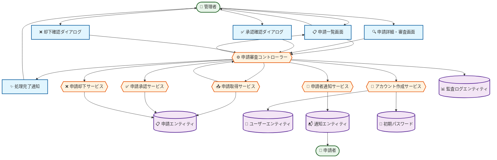

# ロバストネス図: アカウントを承認・作成する

## 図の概要

### 対象ユースケース
- **ユースケース**: アカウントを承認・作成する
- **目的**: 管理者がアカウント申請を審査し、承認してアカウントを作成する
- **主アクター**: 管理者（Admin）

### 主要な流れ
管理者が申請一覧から未承認の申請を確認し、申請内容を審査して承認または却下を判断し、承認時にはユーザーアカウントを作成して申請者に通知する。

### 図の範囲
- **含む範囲**: 申請一覧表示から承認・却下処理、アカウント作成、通知送信まで
- **含まない範囲**: アカウント申請の作成（別のユースケース）、アカウント削除・停止
- **前提**: 申請が既に登録されている（status: pending）

## アクター

### 管理者
- **役割**: アカウント申請の審査と承認権限を持つ組織メンバー
- **目的**: 適切な申請者にのみアカウントを発行し、組織のセキュリティを維持する
- **権限**: 申請の承認・却下、ロールの変更、アカウント作成
- **関与**:
  - 申請一覧の確認
  - 申請内容の審査
  - 承認・却下の判断
  - ロールの調整
  - 却下理由の入力

### 申請者（新規メンバー・クライアント）
- **役割**: アカウント発行を申請したユーザー
- **目的**: 承認・却下の結果を受け取る
- **権限**: なし（受動的）
- **関与**: 承認・却下通知の受信

## 境界要素

### 申請一覧画面
- **目的**: 未承認の申請を管理者に提示する
- **提供機能**:
  - 申請一覧テーブル（申請者名、メールアドレス、希望ロール、申請日時）
  - フィルター（ステータス、ロール、日付範囲）
  - ソート機能（申請日時、メールアドレス）
  - 申請詳細表示ボタン
  - 一括操作（複数選択、一括承認・却下）
- **表示情報**:
  - 申請件数（未承認、期限切れ、処理済み）
  - 申請者の基本情報
  - 申請理由の要約
  - 経過日数
- **受付操作**:
  - 申請の選択
  - 詳細表示のクリック
  - フィルター・ソート操作

### 申請詳細・審査画面
- **目的**: 申請の詳細情報を表示し、承認・却下を受け付ける
- **提供機能**:
  - 申請者情報の詳細表示（氏名、メールアドレス）
  - 申請理由の全文表示
  - 希望ロールの表示
  - ロール変更セレクター（承認時のロール調整）
  - 承認ボタン
  - 却下ボタン
  - 却下理由入力フィールド（却下時必須）
  - キャンセルボタン
- **表示情報**:
  - 申請の全詳細情報
  - 申請日時
  - 有効期限
  - メールドメインの検証結果
- **受付操作**:
  - ロールの変更
  - 却下理由の入力
  - 承認ボタンのクリック
  - 却下ボタンのクリック

### 承認確認ダイアログ
- **目的**: 承認操作の最終確認
- **提供機能**: 承認内容の確認と実行
- **表示情報**:
  - 作成されるアカウント情報
  - 付与されるロール
  - 初期パスワード送信の案内
- **受付操作**:
  - 承認実行ボタン
  - キャンセルボタン

### 却下確認ダイアログ
- **目的**: 却下操作の最終確認
- **提供機能**: 却下理由の確認と実行
- **表示情報**:
  - 却下理由
  - 却下後の処理説明
- **受付操作**:
  - 却下実行ボタン
  - キャンセルボタン

### 処理完了通知
- **目的**: 承認・却下処理の完了を管理者に通知
- **提供機能**: 処理結果の表示
- **表示情報**:
  - 処理結果（承認/却下）
  - 作成されたアカウントID（承認時）
  - 通知送信の確認
- **受付操作**: 申請一覧への戻り

## 制御要素

### 申請審査コントローラー
- **責務**: 申請の審査と承認・却下処理全体のフロー制御
- **処理内容**:
  1. 申請一覧画面からの表示要求を受け取る
  2. 申請取得サービスに未承認申請の取得を依頼する
  3. 申請詳細画面への遷移制御
  4. 承認・却下の判断を受け取る
  5. アカウント作成サービス（承認時）または申請却下サービス（却下時）に処理を依頼する
  6. 通知サービスに申請者への通知を依頼する
  7. 処理完了通知を表示する
- **ビジネスルール**:
  - 却下時は却下理由が必須（10文字以上）
  - 承認時はロールの妥当性を再確認
  - 有効期限切れの申請は承認不可
- **判断基準**: 承認または却下に応じた処理分岐

### 申請取得サービス
- **責務**: 申請データの取得とフィルタリング
- **処理内容**:
  1. 申請エンティティから条件に合う申請を取得
  2. ステータスによるフィルタリング（pending, approved, rejected, expired）
  3. 有効期限の確認と期限切れのマーク
  4. ソート処理（申請日時の降順）
- **ビジネスルール**:
  - 有効期限切れ（作成後30日超過）は自動的にexpiredステータス
  - pendingステータスのみ承認・却下可能
- **連携**:
  - 入力元: 申請審査コントローラー
  - 出力先: 申請審査コントローラー（申請リスト）
  - データ参照: 申請エンティティ

### アカウント作成サービス
- **責務**: 承認された申請からユーザーアカウントを作成
- **処理内容**:
  1. ユーザーIDを生成（UUID）
  2. 初期パスワードを生成（ランダム16文字）
  3. パスワードをbcryptでハッシュ化（ラウンド数10）
  4. ユーザーエンティティを作成（申請情報をコピー）
  5. アカウントステータスをActiveに設定
  6. データベースに保存
  7. 初期パスワード情報を返却
- **ビジネスルール**:
  - パスワードは必ず安全な方法で生成（英数字記号混在）
  - パスワードは必ずハッシュ化して保存
  - アカウントステータスは初期状態でActive
  - 初回ログイン時にパスワード変更を強制
- **連携**:
  - 入力元: 申請審査コントローラー
  - 出力先: 申請審査コントローラー（アカウント情報、初期パスワード）
  - データ保存: ユーザーエンティティ

### 申請承認サービス
- **責務**: 申請のステータス更新と承認記録
- **処理内容**:
  1. 申請エンティティのステータスをapprovedに変更
  2. processedAt（処理日時）を現在時刻に設定
  3. processedBy（処理者ID）を管理者IDに設定
  4. approvedRole（承認ロール）を設定
  5. データベースを更新
- **ビジネスルール**:
  - 承認後は再編集不可
  - 承認ロールは希望ロールと異なってもよい
- **連携**:
  - 入力元: 申請審査コントローラー
  - 出力先: 申請審査コントローラー（更新結果）
  - データ更新: 申請エンティティ

### 申請却下サービス
- **責務**: 申請の却下処理と却下理由の記録
- **処理内容**:
  1. 申請エンティティのステータスをrejectedに変更
  2. processedAt（処理日時）を現在時刻に設定
  3. processedBy（処理者ID）を管理者IDに設定
  4. rejectionReason（却下理由）を設定
  5. データベースを更新
- **ビジネスルール**:
  - 却下理由は必須（10文字以上）
  - 却下後は再申請可能（新規申請として）
- **連携**:
  - 入力元: 申請審査コントローラー
  - 出力先: 申請審査コントローラー（更新結果）
  - データ更新: 申請エンティティ

### 申請者通知サービス
- **責務**: 申請者への承認・却下通知
- **処理内容**:
  1. 通知内容を作成（承認/却下、初期パスワード、却下理由）
  2. メール通知を作成
  3. メールに初期パスワード（承認時）または却下理由（却下時）を含める
  4. メールを送信
  5. システム内通知を作成（オプション）
- **ビジネスルール**:
  - 承認時は必ず初期パスワードをメール送信
  - 却下時は必ず却下理由を通知
  - メールは暗号化された通信経路で送信
- **連携**:
  - 入力元: 申請審査コントローラー
  - 出力先: メール送信、通知エンティティ
  - データ参照: 申請エンティティ

## エンティティ要素

### 申請エンティティ
- **情報内容**:
  - id: UUID（主キー）
  - email: メールアドレス
  - firstName: 名
  - lastName: 姓
  - requestedRole: 希望ロール（Consultant, Client）
  - reason: 申請理由（テキスト）
  - status: ステータス（pending, approved, rejected, expired）
  - createdAt: 申請日時
  - expiresAt: 有効期限（作成日時+30日）
  - processedAt: 処理日時（NULL: 未処理）
  - processedBy: 処理者ID（管理者のユーザーID）
  - approvedRole: 承認ロール（承認時に設定）
  - rejectionReason: 却下理由（却下時に設定）
- **責務**: アカウント申請情報と処理状況の管理
- **永続性**: データベースに永続化（auth-service/data/auth.db）
- **整合性**: ステータス遷移は pending → approved/rejected/expired のみ

### ユーザーエンティティ
- **情報内容**:
  - id: UUID（主キー）
  - email: メールアドレス
  - passwordHash: ハッシュ化パスワード
  - firstName: 名
  - lastName: 姓
  - role: ロール（Executive, PM, Consultant, Client, Admin）
  - status: アカウント状態（Active, Locked, Suspended）
  - isPasswordChangeRequired: 初回ログイン時パスワード変更フラグ
  - createdAt: 作成日時
  - createdBy: 作成者ID（承認した管理者のID）
  - lastLoginAt: 最終ログイン日時
- **責務**: ユーザーアカウント情報の管理
- **永続性**: データベースに永続化（auth-service/data/auth.db）
- **整合性**: メールアドレスはユニーク、パスワードは必須

### 通知エンティティ
- **情報内容**:
  - id: UUID
  - recipientEmail: 通知先メールアドレス
  - type: 通知タイプ（ACCOUNT_APPROVED, ACCOUNT_REJECTED）
  - subject: 件名
  - body: 本文
  - sentAt: 送信日時
  - status: 送信ステータス（pending, sent, failed）
- **責務**: メール通知情報の保持
- **永続性**: データベースに永続化（notification-service/data/notification.db）
- **整合性**: 送信ステータスは pending → sent/failed のみ

### 初期パスワード値オブジェクト
- **情報内容**:
  - plainPassword: 平文パスワード（一時的にメモリに保持）
  - hashedPassword: ハッシュ化パスワード
  - generatedAt: 生成日時
- **責務**: 初期パスワードの安全な生成と保持
- **永続性**: メモリのみ（DBには保存しない）
- **整合性**: 平文パスワードは通知送信後すぐに破棄

### 監査ログエンティティ
- **情報内容**:
  - id: UUID
  - eventType: イベント種別（ACCOUNT_APPROVED, ACCOUNT_REJECTED）
  - performedBy: 実行者ID（管理者）
  - targetEmail: 対象メールアドレス
  - details: 詳細情報（承認ロール、却下理由等）
  - timestamp: タイムスタンプ
- **責務**: 承認・却下操作の監査記録
- **永続性**: データベースに永続化（90日間保持）
- **整合性**: タイムスタンプ必須、performedByは外部キー

## 処理の流れ

### 基本フロー: 承認処理
1. **開始**: アクター「管理者」が「申請一覧画面」にアクセス
2. **一覧取得**: 「申請審査コントローラー」が「申請取得サービス」に未承認申請の取得を依頼
3. **一覧表示**: 「申請一覧画面」が未承認申請を表示
4. **詳細表示**: 「管理者」が申請を選択し「申請詳細・審査画面」を開く
5. **内容確認**: 「管理者」が申請理由とメールアドレスを確認
6. **ロール調整**: 「管理者」が必要に応じてロールを変更
7. **承認実行**: 「管理者」が承認ボタンをクリック
8. **確認表示**: 「承認確認ダイアログ」が承認内容を確認
9. **アカウント作成**: 「アカウント作成サービス」が「ユーザーエンティティ」を作成
10. **申請更新**: 「申請承認サービス」が「申請エンティティ」のステータスを更新
11. **通知送信**: 「申請者通知サービス」が初期パスワード付きメールを送信
12. **監査記録**: 「監査ログエンティティ」に承認操作を記録
13. **完了通知**: 「処理完了通知」が管理者に完了を通知

### 代替フロー: 却下処理
- **分岐点**: 基本フロー ステップ7
- **条件**: 管理者が却下ボタンをクリック
1. 「申請詳細・審査画面」が却下理由入力フィールドを表示
2. 「管理者」が却下理由を入力（10文字以上）
3. 「却下確認ダイアログ」が却下内容を確認
4. 「申請却下サービス」が「申請エンティティ」のステータスをrejectedに更新
5. 「申請者通知サービス」が却下理由付きメールを送信
6. 「監査ログエンティティ」に却下操作を記録
7. 「処理完了通知」が管理者に完了を通知

### 代替フロー: ロール変更での承認
- **分岐点**: 基本フロー ステップ6
- **条件**: 希望ロールと異なるロールでの承認
1. 「管理者」がロールセレクターで別のロールを選択
2. 「申請詳細・審査画面」が変更後のロールを強調表示
3. 基本フロー ステップ7に進む
4. 「申請承認サービス」が希望ロールではなく管理者が選択したロールを記録

### エラーフロー: 有効期限切れ
- **発生点**: 基本フロー ステップ2
- **条件**: 申請の有効期限（作成後30日）が経過
1. 「申請取得サービス」が有効期限切れを検出
2. 「申請エンティティ」のステータスをexpiredに自動更新
3. 「申請一覧画面」で期限切れとして表示（グレーアウト）
4. 「申請詳細・審査画面」で承認・却下ボタンを無効化
5. 管理者は該当申請を処理不可（再申請を促す）

### エラーフロー: 重複アカウントの検出
- **発生点**: 基本フロー ステップ9
- **条件**: 承認処理中に同一メールアドレスのアカウントが既に存在
1. 「アカウント作成サービス」がユニーク制約違反を検出
2. 「申請審査コントローラー」にエラーを返却
3. 「処理完了通知」にエラーメッセージを表示
4. 申請は承認されず、pendingステータスのまま
5. 管理者は既存アカウントを確認し、必要に応じて却下

## ロバストネス図

### Mermaidダイアグラム（BCE Pattern）



### 要素の凡例

**📋 Boundary（境界オブジェクト）**: ユーザーインターフェース要素
- 申請一覧画面、申請詳細・審査画面、承認確認ダイアログ、却下確認ダイアログ、処理完了通知

**⚙️ Control（制御オブジェクト）**: ビジネスロジック・処理制御
- 申請審査コントローラー、申請取得サービス、アカウント作成サービス、申請承認サービス、申請却下サービス、申請者通知サービス

**📋 Entity（実体オブジェクト）**: データ・ドメインオブジェクト
- 申請エンティティ、ユーザーエンティティ、通知エンティティ、監査ログエンティティ、初期パスワード

### テキスト表現
```
[管理者] → [申請一覧画面] : 一覧表示要求
          [申請一覧画面] → [申請審査コントローラー] : 取得要求
                          [申請審査コントローラー] → [申請取得サービス] : 申請取得依頼
                                                     [申請取得サービス] → [申請エンティティ] : 未承認申請検索
                                                     [申請取得サービス] → [申請審査コントローラー] : 申請リスト
                          [申請審査コントローラー] → [申請一覧画面] : 表示データ
          [申請一覧画面] → [管理者] : 一覧表示

[管理者] → [申請詳細・審査画面] : 申請選択
          [申請詳細・審査画面] → [申請審査コントローラー] : 承認要求
                                [申請審査コントローラー] → [アカウント作成サービス] : アカウント作成依頼
                                                           [アカウント作成サービス] → [初期パスワード] : パスワード生成
                                                           [アカウント作成サービス] → [ユーザーエンティティ] : アカウント保存
                                [申請審査コントローラー] → [申請承認サービス] : 申請更新依頼
                                                           [申請承認サービス] → [申請エンティティ] : ステータス更新
                                [申請審査コントローラー] → [申請者通知サービス] : 通知依頼
                                                           [申請者通知サービス] → [通知エンティティ] : メール送信
                                [申請審査コントローラー] → [監査ログエンティティ] : 監査記録
                                [申請審査コントローラー] → [処理完了通知] : 完了通知
          [処理完了通知] → [管理者] : 処理結果表示
```

### レイヤー別要素配置
```
プレゼンテーション層:
  [申請一覧画面] -- [申請詳細・審査画面] -- [承認確認ダイアログ] -- [却下確認ダイアログ] -- [処理完了通知]

ビジネスロジック層:
  [申請審査コントローラー] -- [申請取得サービス] -- [アカウント作成サービス] -- [申請承認サービス] -- [申請却下サービス] -- [申請者通知サービス]

データ層:
  [申請エンティティ] -- [ユーザーエンティティ] -- [通知エンティティ] -- [監査ログエンティティ] -- [初期パスワード]
```

### 主要な相互作用
1. **一覧取得フェーズ**: 管理者 → 申請一覧画面 → 申請審査コントローラー → 申請取得サービス ↔ 申請エンティティ
2. **審査フェーズ**: 管理者 ↔ 申請詳細・審査画面
3. **承認フェーズ**: アカウント作成サービス → ユーザーエンティティ、申請承認サービス → 申請エンティティ
4. **却下フェーズ**: 申請却下サービス → 申請エンティティ
5. **通知フェーズ**: 申請者通知サービス → 通知エンティティ
6. **監査フェーズ**: 申請審査コントローラー → 監査ログエンティティ

## 設計上の注意点

### 責務の分離
- **境界要素**: 申請情報の表示と承認・却下の受付のみ（アカウント作成ロジックを含まない）
- **制御要素**: 承認・却下処理とアカウント作成（UI要素を含まない）
- **エンティティ**: データの保持のみ（ビジネスロジックを含まない）

### 結合度
- 申請審査コントローラーは各サービスと疎結合（インターフェース経由で連携）
- 申請一覧画面・詳細画面は申請審査コントローラーとのみ通信
- アカウント作成サービスと申請承認サービスは独立（どちらかが失敗しても他方に影響しない）

### 凝集度
- 申請取得サービスは取得・フィルタリングのみに責務を限定
- アカウント作成サービスはアカウント作成のみに特化
- 申請承認/却下サービスは申請のステータス更新のみを扱う

### 拡張性
- 新しい承認フロー（多段階承認、自動承認等）の追加が容易
- 通知方式の追加（Slack、Teams等）が独立して可能
- ロール種別の追加に柔軟に対応

### エラー処理
- すべての境界要素でエラー表示が可能
- 制御要素でトランザクションエラーを適切にハンドリング
- 部分的な成功（アカウント作成成功、通知送信失敗）への対応

## 実装への考慮事項

### パフォーマンス
- 申請一覧は件数が多い場合はページネーション
- 有効期限チェックは定期バッチで事前実行
- 承認・却下処理は非同期で実行（通知送信を待たない）

### セキュリティ
- 初期パスワードは安全な乱数生成器を使用
- 初期パスワードはメール送信後すぐにメモリから削除
- 承認・却下操作は必ず監査ログに記録
- 管理者権限の厳格なチェック（RBACで制御）
- メール送信はTLS暗号化

### 保守性
- 却下理由のテンプレート化（よくある却下理由を選択可能に）
- 初期パスワード生成ポリシーは設定値として外部化
- 承認・却下通知のメールテンプレートは変更容易な設計
- 有効期限（30日）は設定値として外部化
