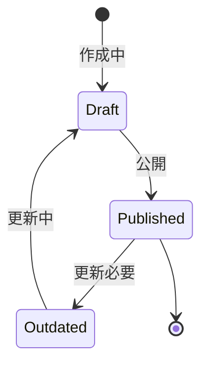

# ビジネスオペレーション: 組織階層を可視化する

**バージョン**: 1.0.0
**更新日**: 2025-10-01

## 概要

**目的**: 組織の階層構造を可視化し、理解を促進する

**パターン**: Analytics

**ゴール**: 組織図が作成され、全メンバーが組織構造を理解できる

## 関係者とロール

- **人事管理者**: 組織図の作成、更新
- **マネージャー**: 部門組織図の確認
- **メンバー**: 組織図の参照

## プロセスフロー

> **重要**: プロセスフローは必ず番号付きリスト形式で記述してください。
> Mermaid形式は使用せず、テキスト形式で記述することで、代替フローと例外フローが視覚的に分離されたフローチャートが自動生成されます。

1. システムが組織データ収集を処理する
2. システムが階層構造構築を処理する
3. システムが組織図生成を処理する
4. システムが部門別ビュー作成を行う
5. システムが公開を処理する
6. システムが定期更新を処理する

## 代替フロー

### 代替フロー1: 情報不備
- 2-1. システムが情報の不備を検知する
- 2-2. システムが修正要求を送信する
- 2-3. ユーザーが情報を修正し再実行する
- 2-4. 基本フロー2に戻る

## 例外処理

### 例外1: システムエラー
- システムエラーが発生した場合
- エラーメッセージを表示する
- 管理者に通知し、ログに記録する

### 例外2: 承認却下
- 承認が却下された場合
- 却下理由をユーザーに通知する
- 修正後の再実行を促す

## ビジネス状態

## KPI

- **可視化完全性**: 全組織の100%を可視化
- **更新頻度**: 組織変更後3営業日以内に更新
- **利用率**: 全メンバーの60%以上が月1回以上参照
- **正確性**: 組織図の誤り0件

## ビジネスルール

- 組織図の種類: 全社組織図、部門組織図、プロジェクト組織図
- 表示形式: ツリー形式、マトリクス形式
- アクセス制御: 一般メンバーは自部門のみ、管理者は全社
- 更新責任: 人事管理者が管理

## 入出力仕様

### 入力
- 組織構造データ
- メンバー情報（役職、写真）
- 部門情報（ミッション、連絡先）

### 出力
- 組織図（画像、PDF、インタラクティブ）
- 部門別組織図
- 連絡先一覧

## 例外処理

- **データ不完全**: 暫定図を作成、後日補完
- **大規模組織**: 階層ごとに分割表示
- **頻繁な変更**: リアルタイム更新の検討

## 派生ユースケース

1. 全社組織図を作成する
2. 部門組織図を作成する
3. 組織図を検索する
4. 組織図を更新する
