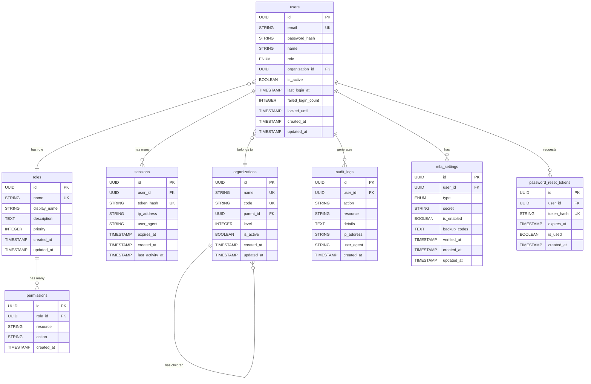

# データベース設計: セキュアアクセスサービス

## 設計概要
**データベース**: PostgreSQL 15 / SQLite 3（開発環境）
**文字エンコーディング**: UTF-8
**タイムゾーン**: UTC
**命名規則**: snake_case

## 論理設計

### ER図


### エンティティ定義

#### usersテーブル
**目的**: システムユーザーの基本情報を管理

| カラム名 | データ型 | NULL | 制約 | 説明 |
|---------|---------|------|------|------|
| id | UUID | NOT NULL | PK | 主キー |
| email | VARCHAR(255) | NOT NULL | UNIQUE | メールアドレス（ログインID） |
| password_hash | VARCHAR(255) | NOT NULL | - | bcryptハッシュ化パスワード |
| name | VARCHAR(100) | NOT NULL | - | ユーザー名 |
| role | VARCHAR(50) | NOT NULL | CHECK | Executive/PM/Consultant/Client/Admin |
| organization_id | UUID | NULL | FK | 所属組織ID |
| is_active | BOOLEAN | NOT NULL | DEFAULT true | アカウント有効フラグ |
| last_login_at | TIMESTAMP | NULL | - | 最終ログイン日時 |
| failed_login_count | INTEGER | NOT NULL | DEFAULT 0 | ログイン失敗回数 |
| locked_until | TIMESTAMP | NULL | - | アカウントロック解除日時 |
| created_at | TIMESTAMP | NOT NULL | DEFAULT NOW() | 作成日時 |
| updated_at | TIMESTAMP | NOT NULL | DEFAULT NOW() | 更新日時 |

**インデックス**:
- `PRIMARY KEY (id)`
- `UNIQUE INDEX idx_users_email (email)`
- `INDEX idx_users_organization_id (organization_id)`
- `INDEX idx_users_role (role)`
- `INDEX idx_users_is_active (is_active)`

**制約**:
- `CHECK (email ~* '^[A-Za-z0-9._%+-]+@[A-Za-z0-9.-]+\.[A-Z|a-z]{2,}$')`: メール形式
- `CHECK (role IN ('Executive', 'PM', 'Consultant', 'Client', 'Admin'))`: ロール制限
- `CHECK (failed_login_count >= 0)`: 失敗回数は0以上

#### organizationsテーブル
**目的**: 組織構造を階層的に管理

| カラム名 | データ型 | NULL | 制約 | 説明 |
|---------|---------|------|------|------|
| id | UUID | NOT NULL | PK | 主キー |
| name | VARCHAR(100) | NOT NULL | - | 組織名 |
| code | VARCHAR(50) | NOT NULL | UNIQUE | 組織コード |
| parent_id | UUID | NULL | FK(self) | 親組織ID |
| level | INTEGER | NOT NULL | DEFAULT 1 | 階層レベル |
| is_active | BOOLEAN | NOT NULL | DEFAULT true | 有効フラグ |
| created_at | TIMESTAMP | NOT NULL | DEFAULT NOW() | 作成日時 |
| updated_at | TIMESTAMP | NOT NULL | DEFAULT NOW() | 更新日時 |

**インデックス**:
- `PRIMARY KEY (id)`
- `UNIQUE INDEX idx_organizations_code (code)`
- `INDEX idx_organizations_parent_id (parent_id)`
- `INDEX idx_organizations_level (level)`

#### sessionsテーブル
**目的**: ユーザーセッションを管理

| カラム名 | データ型 | NULL | 制約 | 説明 |
|---------|---------|------|------|------|
| id | UUID | NOT NULL | PK | 主キー |
| user_id | UUID | NOT NULL | FK | ユーザーID |
| token_hash | VARCHAR(255) | NOT NULL | UNIQUE | トークンのハッシュ値 |
| ip_address | VARCHAR(45) | NOT NULL | - | IPアドレス |
| user_agent | TEXT | NULL | - | ユーザーエージェント |
| expires_at | TIMESTAMP | NOT NULL | - | 有効期限 |
| created_at | TIMESTAMP | NOT NULL | DEFAULT NOW() | 作成日時 |
| last_activity_at | TIMESTAMP | NOT NULL | DEFAULT NOW() | 最終アクティビティ |

**インデックス**:
- `PRIMARY KEY (id)`
- `UNIQUE INDEX idx_sessions_token_hash (token_hash)`
- `INDEX idx_sessions_user_id (user_id)`
- `INDEX idx_sessions_expires_at (expires_at)`

#### audit_logsテーブル
**目的**: セキュリティ監査ログを記録

| カラム名 | データ型 | NULL | 制約 | 説明 |
|---------|---------|------|------|------|
| id | UUID | NOT NULL | PK | 主キー |
| user_id | UUID | NULL | FK | ユーザーID |
| action | VARCHAR(100) | NOT NULL | - | 実行アクション |
| resource | VARCHAR(100) | NULL | - | 対象リソース |
| details | JSONB | NULL | - | 詳細情報 |
| ip_address | VARCHAR(45) | NOT NULL | - | IPアドレス |
| user_agent | TEXT | NULL | - | ユーザーエージェント |
| created_at | TIMESTAMP | NOT NULL | DEFAULT NOW() | 記録日時 |

**インデックス**:
- `PRIMARY KEY (id)`
- `INDEX idx_audit_logs_user_id (user_id)`
- `INDEX idx_audit_logs_action (action)`
- `INDEX idx_audit_logs_created_at (created_at)`
- `INDEX idx_audit_logs_details_gin (details)` (GINインデックス for JSONB)

## 物理設計

### テーブル作成SQL
```sql
-- UUIDエクステンション有効化
CREATE EXTENSION IF NOT EXISTS "uuid-ossp";

-- usersテーブル
CREATE TABLE users (
    id UUID PRIMARY KEY DEFAULT uuid_generate_v4(),
    email VARCHAR(255) NOT NULL UNIQUE,
    password_hash VARCHAR(255) NOT NULL,
    name VARCHAR(100) NOT NULL,
    role VARCHAR(50) NOT NULL CHECK (role IN ('Executive', 'PM', 'Consultant', 'Client', 'Admin')),
    organization_id UUID REFERENCES organizations(id) ON DELETE SET NULL,
    is_active BOOLEAN NOT NULL DEFAULT true,
    last_login_at TIMESTAMP,
    failed_login_count INTEGER NOT NULL DEFAULT 0 CHECK (failed_login_count >= 0),
    locked_until TIMESTAMP,
    created_at TIMESTAMP NOT NULL DEFAULT NOW(),
    updated_at TIMESTAMP NOT NULL DEFAULT NOW(),
    CONSTRAINT check_email_format CHECK (email ~* '^[A-Za-z0-9._%+-]+@[A-Za-z0-9.-]+\.[A-Z|a-z]{2,}$')
);

-- インデックス作成
CREATE INDEX idx_users_email ON users(email);
CREATE INDEX idx_users_organization_id ON users(organization_id);
CREATE INDEX idx_users_role ON users(role);
CREATE INDEX idx_users_is_active ON users(is_active);

-- 更新日時自動更新トリガー
CREATE OR REPLACE FUNCTION update_updated_at_column()
RETURNS TRIGGER AS $$
BEGIN
    NEW.updated_at = NOW();
    RETURN NEW;
END;
$$ language 'plpgsql';

CREATE TRIGGER update_users_updated_at BEFORE UPDATE ON users
    FOR EACH ROW EXECUTE FUNCTION update_updated_at_column();

-- organizationsテーブル
CREATE TABLE organizations (
    id UUID PRIMARY KEY DEFAULT uuid_generate_v4(),
    name VARCHAR(100) NOT NULL,
    code VARCHAR(50) NOT NULL UNIQUE,
    parent_id UUID REFERENCES organizations(id) ON DELETE CASCADE,
    level INTEGER NOT NULL DEFAULT 1 CHECK (level >= 1 AND level <= 5),
    is_active BOOLEAN NOT NULL DEFAULT true,
    created_at TIMESTAMP NOT NULL DEFAULT NOW(),
    updated_at TIMESTAMP NOT NULL DEFAULT NOW()
);

-- sessionsテーブル
CREATE TABLE sessions (
    id UUID PRIMARY KEY DEFAULT uuid_generate_v4(),
    user_id UUID NOT NULL REFERENCES users(id) ON DELETE CASCADE,
    token_hash VARCHAR(255) NOT NULL UNIQUE,
    ip_address VARCHAR(45) NOT NULL,
    user_agent TEXT,
    expires_at TIMESTAMP NOT NULL,
    created_at TIMESTAMP NOT NULL DEFAULT NOW(),
    last_activity_at TIMESTAMP NOT NULL DEFAULT NOW()
);

-- audit_logsテーブル
CREATE TABLE audit_logs (
    id UUID PRIMARY KEY DEFAULT uuid_generate_v4(),
    user_id UUID REFERENCES users(id) ON DELETE SET NULL,
    action VARCHAR(100) NOT NULL,
    resource VARCHAR(100),
    details JSONB,
    ip_address VARCHAR(45) NOT NULL,
    user_agent TEXT,
    created_at TIMESTAMP NOT NULL DEFAULT NOW()
);

CREATE INDEX idx_audit_logs_details_gin ON audit_logs USING GIN (details);

-- パーティション設計（大規模運用時）
CREATE TABLE audit_logs_2024_01 PARTITION OF audit_logs
    FOR VALUES FROM ('2024-01-01') TO ('2024-02-01');
```

## パフォーマンス設計

### インデックス戦略
- **主要検索パターン**:
  - メールアドレスによるユーザー検索 → `idx_users_email`
  - トークンによるセッション検索 → `idx_sessions_token_hash`
  - 期間指定による監査ログ検索 → `idx_audit_logs_created_at`
  - JSONフィールド内検索 → GINインデックス

### クエリ最適化
```sql
-- よく使用されるクエリの例と実行計画
EXPLAIN ANALYZE
SELECT u.*, o.name as organization_name
FROM users u
LEFT JOIN organizations o ON u.organization_id = o.id
WHERE u.email = 'user@example.com'
AND u.is_active = true;

-- セッション有効性チェック（頻繁に実行）
EXPLAIN ANALYZE
SELECT s.*, u.role, u.name
FROM sessions s
JOIN users u ON s.user_id = u.id
WHERE s.token_hash = $1
AND s.expires_at > NOW()
AND u.is_active = true;
```

### パーティション戦略
- **audit_logs**: 月次パーティション（データ量が多い）
- **sessions**: 期限切れセッションの定期削除

## セキュリティ設計

### 暗号化
- **保存時暗号化**: パスワード、トークン、MFA秘密鍵
- **通信時暗号化**: SSL/TLS必須
- **ハッシュアルゴリズム**: bcrypt（コスト係数12）

### アクセス制御
```sql
-- ロール定義
CREATE ROLE app_read;
CREATE ROLE app_write;
CREATE ROLE app_admin;

-- 権限付与
GRANT SELECT ON ALL TABLES IN SCHEMA public TO app_read;
GRANT SELECT, INSERT, UPDATE ON users, sessions, audit_logs TO app_write;
GRANT ALL PRIVILEGES ON ALL TABLES IN SCHEMA public TO app_admin;

-- Row Level Security (RLS)
ALTER TABLE users ENABLE ROW LEVEL SECURITY;

CREATE POLICY users_policy ON users
    FOR SELECT
    USING (id = current_user_id() OR current_user_role() = 'Admin');
```

## 運用設計

### バックアップ戦略
- **フルバックアップ**: 日次（深夜2時）
- **差分バックアップ**: 時間毎
- **トランザクションログ**: リアルタイム
- **保管期間**: 30日（法的要件により延長可能）

### 監視項目
- **接続数**: 最大接続数の80%でアラート
- **レスポンス時間**: 平均100ms以下
- **ディスク使用量**: 80%でアラート
- **デッドロック**: 発生時即座に通知

### メンテナンス
```sql
-- 定期メンテナンススクリプト
-- バキューム（週次）
VACUUM ANALYZE users, sessions, audit_logs;

-- インデックス再構築（月次）
REINDEX TABLE users;
REINDEX TABLE sessions;

-- 古いセッションの削除（日次）
DELETE FROM sessions WHERE expires_at < NOW() - INTERVAL '30 days';

-- 古い監査ログのアーカイブ（月次）
INSERT INTO audit_logs_archive
SELECT * FROM audit_logs
WHERE created_at < NOW() - INTERVAL '90 days';

DELETE FROM audit_logs
WHERE created_at < NOW() - INTERVAL '90 days';
```

## マイグレーション戦略

### スキーマバージョン管理
- Prisma Migrateによる管理
- 各環境別のマイグレーション履歴
- ロールバック手順の文書化

### データ移行
- ゼロダウンタイムマイグレーション
- Blue-Greenデプロイメント対応
- データ整合性チェックスクリプト