# タレント最適化サービス - ケーパビリティとビジネスオペレーション設計

**バージョン**: 1.0.0
**更新日**: 2025-09-30

## サービス概要

タレント最適化サービスは、組織の人的リソースを最大限に活用し、チームの生産性を最大化するためのサービスです。メンバーのスキル管理、チーム編成、リソース配分、パフォーマンス評価、キャリア開発を通じて、人材の能力を最大限に引き出し、組織の成果を向上させます。

## ビジネスケーパビリティ一覧

1. **メンバーを管理し育成する能力**
2. **チームを編成し最適化する能力**
3. **スキルを可視化し開発する能力**
4. **リソースを最適に配分する能力**

---

## 1. メンバーを管理し育成する能力

### 定義
組織メンバーの情報を一元管理し、パフォーマンスを評価してキャリア開発を支援する組織能力

### 責務
- メンバー情報の正確な記録と管理
- パフォーマンスの公正な評価
- キャリアパスの設計と実行支援
- 育成計画の策定と進捗管理

### 提供価値
- **タレントの可視化**: メンバーの能力とポテンシャルを可視化し、適材適所を実現
- **モチベーション向上**: 公正な評価とキャリア支援により、メンバーのモチベーションを向上
- **組織能力強化**: 計画的な育成により、組織全体の能力を底上げ

### 実現手段
以下のビジネスオペレーションで実現：
- メンバーを登録し管理する
- パフォーマンスを評価する
- キャリアを開発し支援する

---

### オペレーション1-1: メンバーを登録し管理する

**パターン**: CRUD

**目的**: メンバーの基本情報、スキル、経歴を正確に登録・管理する

**ゴール**: すべてのメンバー情報が最新かつ正確に維持され、いつでも参照可能な状態になる

**関係者とロール**:
- **人事管理者**: メンバー情報の登録・更新
- **マネージャー**: メンバー情報の確認・承認
- **メンバー**: 自己情報の更新

**プロセスフロー**:
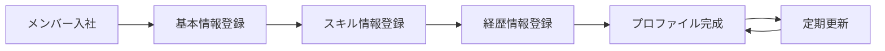

**ビジネス状態遷移**:
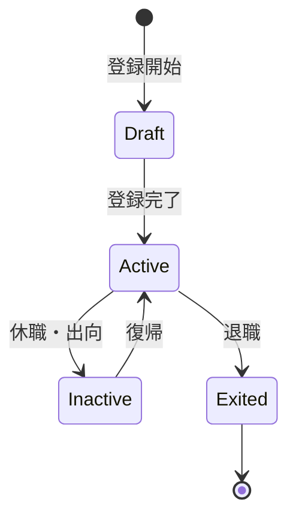

**KPI**:
- **登録完了率**: 入社後3営業日以内に100%登録
- **情報更新頻度**: 四半期毎に更新
- **プロファイル完全性**: 必須項目100%入力
- **情報正確性**: 定期監査での誤り率1%以下

**ビジネスルール**:
- 必須項目: 氏名、メールアドレス、所属部門、役職、入社日
- スキル情報: 最低3つのスキルを登録
- 経歴情報: 過去のプロジェクト参加履歴
- 更新責任: メンバー自身が四半期毎に更新

**入力**:
- 基本情報（氏名、連絡先、所属）
- スキル情報（スキル名、レベル、取得日）
- 経歴情報（プロジェクト履歴、役割）
- 資格情報（資格名、取得日）

**出力**:
- メンバープロファイル
- スキルマップ
- 経歴レポート

**例外処理**:
- **重複登録**: 既存データとのマージ処理
- **情報不備**: 登録保留、追加情報要求
- **退職処理**: データアーカイブ、アクセス権削除

**派生ユースケース**:
1. メンバーを新規登録する
2. メンバー情報を更新する
3. メンバー情報を検索する
4. メンバー情報を削除する（退職処理）

---

### オペレーション1-2: パフォーマンスを評価する

**パターン**: Workflow + Analytics

**目的**: メンバーのパフォーマンスを公正に評価し、フィードバックする

**ゴール**: 評価が完了し、メンバーにフィードバックされ、次の目標が設定される

**関係者とロール**:
- **マネージャー**: 評価実施、フィードバック
- **メンバー**: 自己評価、目標設定
- **人事管理者**: 評価プロセス管理、調整

**プロセスフロー**:
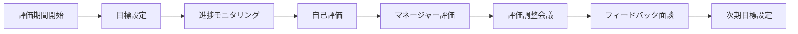

**ビジネス状態遷移**:
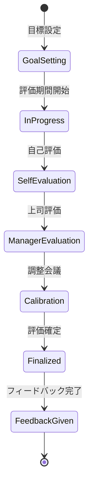

**KPI**:
- **評価完了率**: 評価期間終了後2週間以内に100%完了
- **フィードバック実施率**: 評価確定後1週間以内に100%実施
- **目標達成率**: 全メンバーの平均70%以上
- **評価の公正性**: 評価分布が正規分布に近似

**ビジネスルール**:
- 評価サイクル: 年2回（上半期・下半期）
- 評価基準: 目標達成度、行動評価、コンピテンシー
- 評価段階: 5段階評価（S/A/B/C/D）
- 相対評価: 部門内で分布を調整

**入力**:
- 評価期間の目標
- プロジェクト成果データ
- 自己評価コメント
- 360度フィードバック（該当者のみ）

**出力**:
- 評価結果（評価点、評価コメント）
- フィードバックレポート
- 次期目標
- 育成計画

**例外処理**:
- **評価異議申し立て**: 再評価プロセス開始
- **評価遅延**: エスカレーション、期限延長
- **低評価継続**: 改善計画の策定、支援強化

**派生ユースケース**:
1. 目標を設定する
2. 自己評価を実施する
3. マネージャー評価を実施する
4. フィードバック面談を実施する

---

### オペレーション1-3: キャリアを開発し支援する

**パターン**: Workflow

**目的**: メンバーのキャリア目標を明確化し、実現に向けた支援を提供する

**ゴール**: キャリアパスが明確になり、具体的な育成計画が実行される

**関係者とロール**:
- **メンバー**: キャリア目標の設定
- **マネージャー**: キャリア相談、育成計画策定
- **人事管理者**: キャリアパス設計、研修提供

**プロセスフロー**:
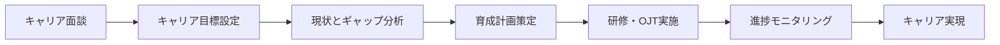

**ビジネス状態遷移**:
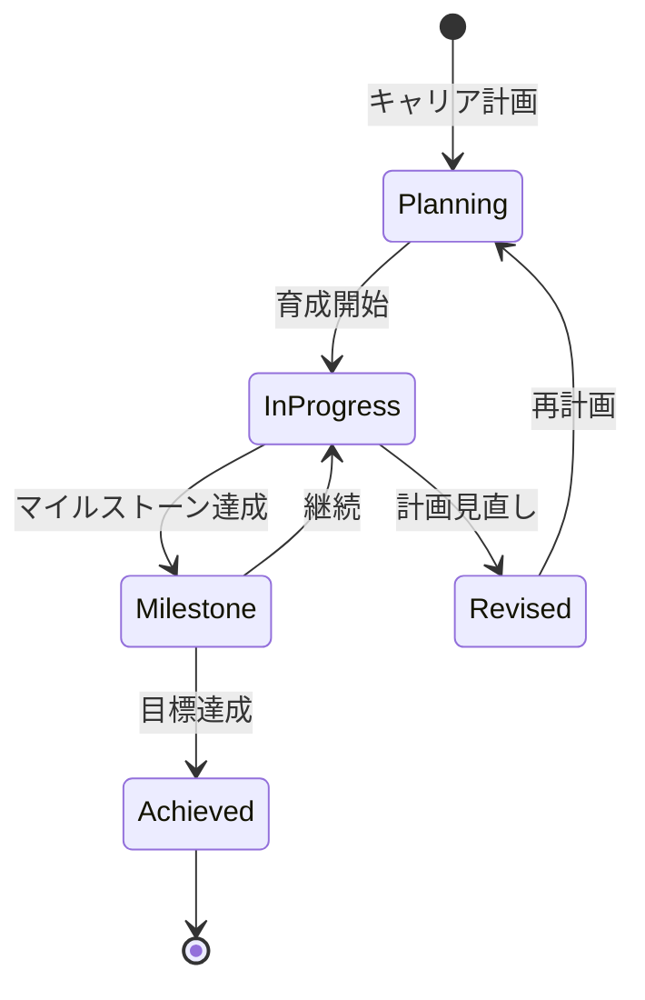

**KPI**:
- **キャリア面談実施率**: 年1回以上全メンバーと実施
- **育成計画実行率**: 策定した計画の80%以上を実行
- **キャリア目標達成率**: 3年以内の目標達成率60%以上
- **社内異動率**: 計画的な異動・昇進率20%/年

**ビジネスルール**:
- キャリアパス: 専門職、マネジメント、スペシャリストの3コース
- 面談頻度: 年1回以上実施
- 育成予算: メンバー1人あたり年間20万円
- 社内公募: 希望者は社内ポジションに応募可能

**入力**:
- メンバーのキャリア希望
- 現在のスキル・経験
- パフォーマンス評価結果
- 組織のニーズ

**出力**:
- キャリアプラン
- 育成計画書
- 研修推奨リスト
- 進捗レポート

**例外処理**:
- **キャリア変更希望**: 新たなキャリアパスの設計
- **育成計画未達**: 原因分析、計画見直し
- **組織ニーズ変化**: キャリアパスの柔軟な調整

**派生ユースケース**:
1. キャリア面談を実施する
2. キャリアプランを策定する
3. 育成計画を実行する
4. キャリア進捗を確認する

---

## 2. チームを編成し最適化する能力

### 定義
プロジェクトやタスクに最適なチームを編成し、チームの生産性を最大化する組織能力

### 責務
- プロジェクトに必要なスキルの特定
- 最適なメンバーの選定とアサイン
- チームバランスの調整
- チームパフォーマンスの監視

### 提供価値
- **プロジェクト成功率向上**: 最適なチーム編成により、プロジェクトの成功確率を向上
- **メンバー満足度向上**: 適性とキャリアに合ったアサインにより、満足度を向上
- **生産性最大化**: チームシナジーを最大化し、生産性を向上

### 実現手段
以下のビジネスオペレーションで実現：
- チームを編成する
- チームパフォーマンスを監視する
- チーム構成を最適化する

---

### オペレーション2-1: チームを編成する

**パターン**: Workflow

**目的**: プロジェクトに最適なメンバーを選定し、チームを編成する

**ゴール**: プロジェクトに必要なスキルを持つメンバーで構成されたチームが編成される

**関係者とロール**:
- **PM**: チーム要件の定義、メンバー選定
- **リソースマネージャー**: メンバーの可用性確認、調整
- **メンバー**: アサイン受諾、辞退

**プロセスフロー**:
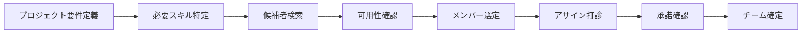

**ビジネス状態遷移**:
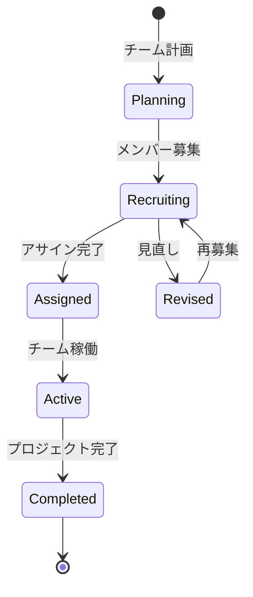

**KPI**:
- **チーム編成リードタイム**: プロジェクト開始2週間前に確定
- **スキル充足率**: 必要スキルの95%以上をカバー
- **メンバー承諾率**: 打診の80%以上が承諾
- **チーム安定性**: プロジェクト期間中のメンバー変更10%以下

**ビジネスルール**:
- チームサイズ: 5-7名を標準とする
- スキルバランス: シニア:ミドル:ジュニア = 2:3:2
- 稼働率上限: 1メンバーの合計稼働率は100%以下
- アサイン期間: 最低3ヶ月以上

**入力**:
- プロジェクト要件（期間、スコープ、予算）
- 必要スキルリスト
- メンバープール（利用可能なメンバー）
- 既存アサイン状況

**出力**:
- チーム編成表
- メンバープロファイル
- スキルマップ
- アサイン計画

**例外処理**:
- **スキル不足**: 外部調達、研修による育成
- **アサイン辞退**: 代替候補の選定
- **稼働率超過**: 既存アサインの調整、優先順位付け

**派生ユースケース**:
1. プロジェクト要件を定義する
2. 必要スキルを特定する
3. 候補者を検索する
4. メンバーをアサインする

---

### オペレーション2-2: チームパフォーマンスを監視する

**パターン**: Analytics

**目的**: チームのパフォーマンスを継続的に監視し、問題を早期に発見する

**ゴール**: チームパフォーマンスが可視化され、課題が早期に特定される

**関係者とロール**:
- **PM**: チームパフォーマンスの監視、対策実施
- **リソースマネージャー**: データ分析、改善提案
- **メンバー**: パフォーマンスデータの提供

**プロセスフロー**:
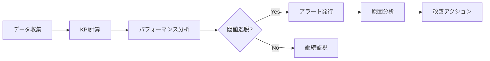

**ビジネス状態遷移**:
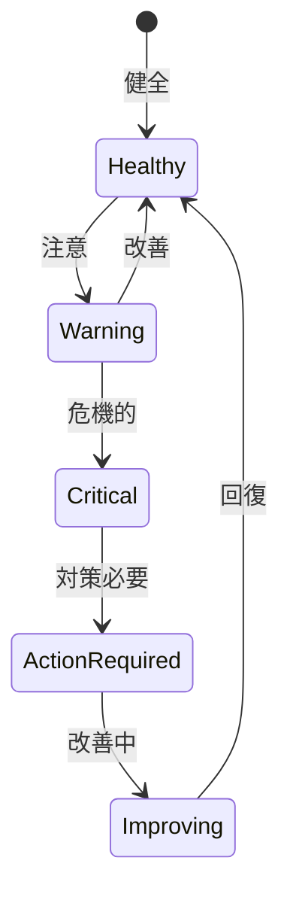

**KPI**:
- **ベロシティ**: スプリント毎のストーリーポイント消化率80%以上
- **品質**: バグ混入率5%以下
- **士気**: チームモラールスコア4.0以上（5点満点）
- **稼働率**: チーム平均稼働率75-85%

**ビジネスルール**:
- 監視頻度: 週次でKPIを更新
- アラート閾値: KPIが目標の80%未満で警告
- エスカレーション: 2週連続で閾値未達は上位報告

**入力**:
- タスク完了データ
- 工数実績データ
- 品質データ（バグ数、レビュー指摘）
- チームモラールサーベイ結果

**出力**:
- チームパフォーマンスレポート
- KPIダッシュボード
- アラート通知
- 改善提案

**例外処理**:
- **データ欠損**: 暫定値で監視、後日補正
- **突然の低下**: 緊急ヒアリング、原因特定
- **継続的低下**: チーム再編成の検討

**派生ユースケース**:
1. チームパフォーマンスを確認する
2. KPIを分析する
3. パフォーマンス低下を検知する
4. 改善アクションを実施する

---

### オペレーション2-3: チーム構成を最適化する

**パターン**: Workflow + Analytics

**目的**: チームパフォーマンスに基づき、チーム構成を最適化する

**ゴール**: チーム構成が最適化され、パフォーマンスが改善される

**関係者とロール**:
- **PM**: チーム最適化の判断、実行
- **リソースマネージャー**: メンバー調整、再配置
- **メンバー**: 新たなアサインの受諾

**プロセスフロー**:


**ビジネス状態遷移**:
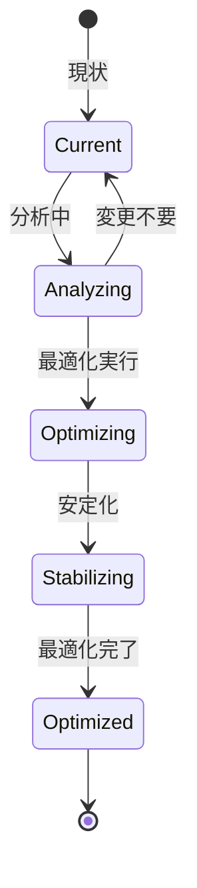

**KPI**:
- **最適化効果**: 再編成後、パフォーマンス20%向上
- **安定化期間**: 再編成後2週間以内に安定
- **メンバー満足度**: 再編成後の満足度4.0以上（5点満点）
- **最適化実施率**: 課題特定の60%で最適化を実施

**ビジネスルール**:
- 最適化トリガー: パフォーマンス目標未達が2週連続
- メンバー変更: 1回の最適化で30%以下の変更に抑制
- タイミング: マイルストーン間での実施を推奨

**入力**:
- チームパフォーマンスデータ
- メンバーフィードバック
- スキルギャップ分析
- プロジェクト状況

**出力**:
- 最適化提案書
- 新チーム編成表
- 移行計画
- 効果測定レポート

**例外処理**:
- **メンバー抵抗**: 丁寧な説明、代替案提示
- **最適化失敗**: 原因分析、再最適化
- **プロジェクト影響**: 最小限の変更に抑制

**派生ユースケース**:
1. チーム課題を特定する
2. 最適化案を策定する
3. チームを再編成する
4. 最適化効果を測定する

---

## 3. スキルを可視化し開発する能力

### 定義
組織のスキル全体を可視化し、必要なスキルを計画的に開発する組織能力

### 責務
- 組織のスキルマップ作成
- スキルギャップの特定
- スキル開発計画の策定
- スキル習得の支援と認定

### 提供価値
- **スキル可視化**: 組織のスキル保有状況を可視化し、強み・弱みを把握
- **戦略的育成**: 不足スキルを計画的に開発し、組織能力を強化
- **スキルマッチング**: プロジェクトに必要なスキルを持つメンバーを迅速に特定

### 実現手段
以下のビジネスオペレーションで実現：
- スキルを定義し体系化する
- スキルギャップを分析する
- スキル開発を計画し実行する

---

### オペレーション3-1: スキルを定義し体系化する

**パターン**: CRUD

**目的**: 組織に必要なスキルを定義し、体系的に分類する

**ゴール**: スキル体系が確立され、すべてのメンバーが共通のスキル定義を使用する

**関係者とロール**:
- **人事管理者**: スキル体系の設計、管理
- **技術リーダー**: 技術スキルの定義、レベル設定
- **マネージャー**: スキル要件の提供

**プロセスフロー**:


**ビジネス状態遷移**:
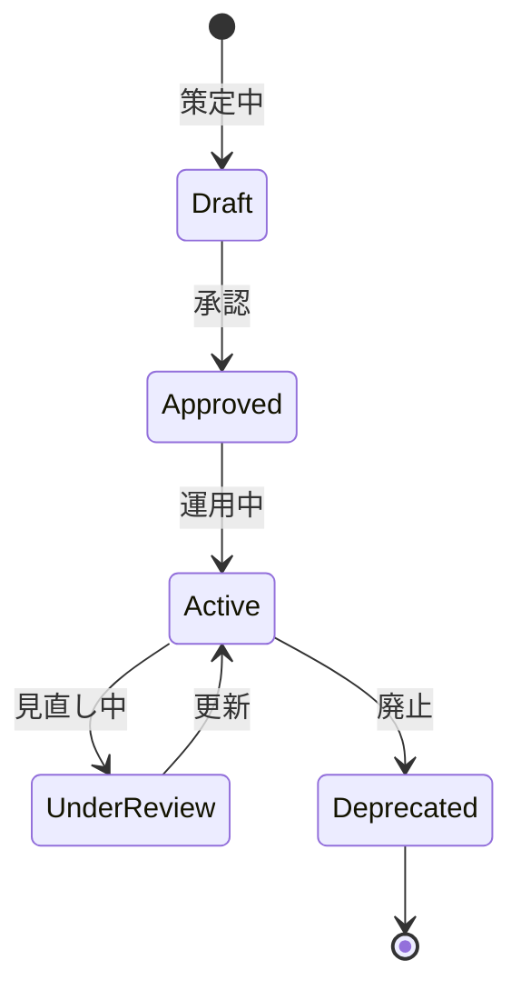

**KPI**:
- **スキルカバー率**: 必要スキルの95%以上を定義
- **定義更新頻度**: 年2回の見直し実施
- **利用率**: 全メンバーの90%以上がスキル登録
- **レベル判定精度**: レベル判定の一致率80%以上

**ビジネスルール**:
- スキルカテゴリ: 技術、ビジネス、ヒューマンの3大カテゴリ
- スキルレベル: 5段階（初級・中級・上級・エキスパート・マスター）
- 評価基準: 各レベルで具体的な行動指標を定義

**入力**:
- 業界標準スキルフレームワーク
- 自社のプロジェクト要件
- 技術トレンド情報
- メンバーからのスキル提案

**出力**:
- スキル体系図
- スキルレベル定義書
- 評価基準書
- スキルマスタデータ

**例外処理**:
- **新技術出現**: スキル体系への即時追加
- **スキル廃止**: 段階的な廃止プロセス
- **定義曖昧**: 明確化のための改訂

**派生ユースケース**:
1. 新スキルを定義する
2. スキルレベルを設定する
3. スキル体系を更新する
4. スキルを廃止する

---

### オペレーション3-2: スキルギャップを分析する

**パターン**: Analytics

**目的**: 組織の現状スキルと必要スキルのギャップを分析する

**ゴール**: スキルギャップが定量的に把握され、育成の優先順位が明確になる

**関係者とロール**:
- **人事管理者**: スキルギャップ分析の実施
- **経営層**: 必要スキルの方針決定
- **マネージャー**: 部門別ギャップの確認

**プロセスフロー**:
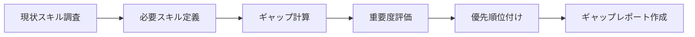

**ビジネス状態遷移**:
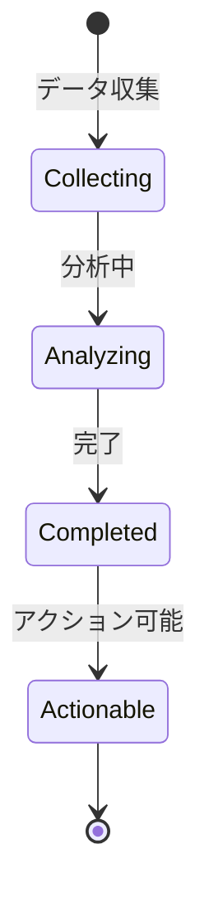

**KPI**:
- **分析頻度**: 四半期毎に実施
- **ギャップ解消率**: 年間で特定ギャップの50%以上を解消
- **予測精度**: プロジェクト要件の80%以上を予測
- **対応率**: 特定したギャップの70%以上に対策実施

**ビジネスルール**:
- ギャップ重要度: ビジネスインパクト × 緊急度で評価
- 優先順位: 高重要度かつ習得容易なスキルを優先
- 閾値: ギャップが20%以上のスキルを重点対象

**入力**:
- メンバーの現状スキルデータ
- プロジェクト要件データ
- ビジネス戦略・計画
- 市場トレンド情報

**出力**:
- スキルギャップ分析レポート
- 優先スキルリスト
- スキルマップ（現状 vs 目標）
- 育成推奨リスト

**例外処理**:
- **データ不足**: サンプル調査、推定値使用
- **急激な環境変化**: 緊急分析の実施
- **ギャップ大**: 外部調達の検討

**派生ユースケース**:
1. 現状スキルを調査する
2. 必要スキルを定義する
3. ギャップを計算する
4. 優先順位を決定する

---

### オペレーション3-3: スキル開発を計画し実行する

**パターン**: Workflow

**目的**: スキルギャップに基づき、具体的な開発計画を策定し実行する

**ゴール**: スキル開発計画が実行され、メンバーのスキルが向上する

**関係者とロール**:
- **人事管理者**: 開発計画の策定、研修提供
- **マネージャー**: OJT計画、進捗管理
- **メンバー**: スキル習得、認定取得

**プロセスフロー**:


**ビジネス状態遷移**:
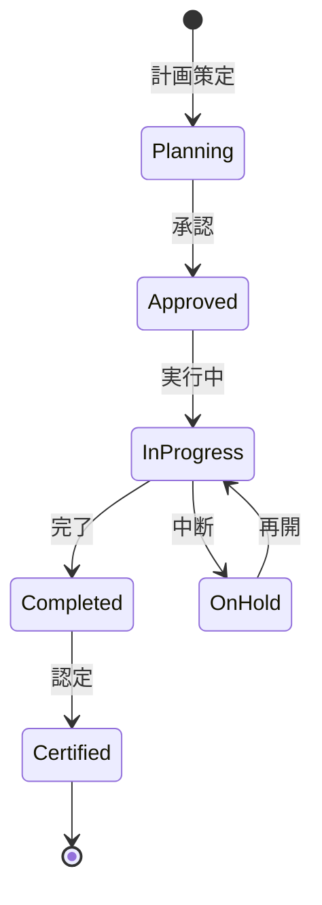

**KPI**:
- **計画実行率**: 策定した計画の85%以上を実行
- **スキル習得率**: 研修受講者の70%以上が目標レベル達成
- **認定取得率**: 計画対象者の60%以上が認定取得
- **育成期間**: 1スキル習得に平均3ヶ月

**ビジネスルール**:
- 開発方法: 研修（30%）、OJT（50%）、自己学習（20%）
- 認定基準: 実践プロジェクトでの適用と評価
- 予算: メンバー1人あたり年間20万円

**入力**:
- スキルギャップ分析結果
- メンバーの希望・適性
- 研修プログラムカタログ
- OJT機会（プロジェクト）

**出力**:
- スキル開発計画書
- 研修スケジュール
- OJT計画
- スキル認定証

**例外処理**:
- **研修キャンセル**: 代替研修の手配
- **OJT機会不足**: 社外プロジェクト参加
- **習得困難**: 個別指導、メンター配置

**派生ユースケース**:
1. スキル開発計画を策定する
2. 研修を実施する
3. OJTを実施する
4. スキルを認定する

---

## 4. リソースを最適に配分する能力

### 定義
限られた人的リソースをプロジェクトに最適に配分し、組織全体の生産性を最大化する組織能力

### 責務
- プロジェクト要求の把握と調整
- メンバーの稼働率管理
- リソースの公平な配分
- 稼働率とパフォーマンスの最適化

### 提供価値
- **リソース最適化**: 限られたリソースの最大限の活用により、組織全体の生産性を向上
- **公平な配分**: 公正な配分により、メンバーの不満を解消
- **稼働率適正化**: 適切な稼働率維持により、燃え尽きを防止

### 実現手段
以下のビジネスオペレーションで実現：
- リソース需要を予測する
- リソースを配分し調整する
- 稼働率を監視し最適化する

---

### オペレーション4-1: リソース需要を予測する

**パターン**: Analytics

**目的**: 将来のプロジェクトに必要なリソースを予測する

**ゴール**: 精度の高いリソース需要予測が作成され、計画的な配分が可能になる

**関係者とロール**:
- **リソースマネージャー**: 需要予測の作成
- **PM**: プロジェクト計画の提供
- **経営層**: 事業計画の提供

**プロセスフロー**:
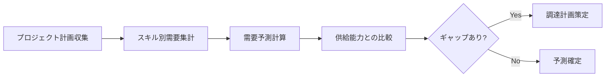

**ビジネス状態遷移**:
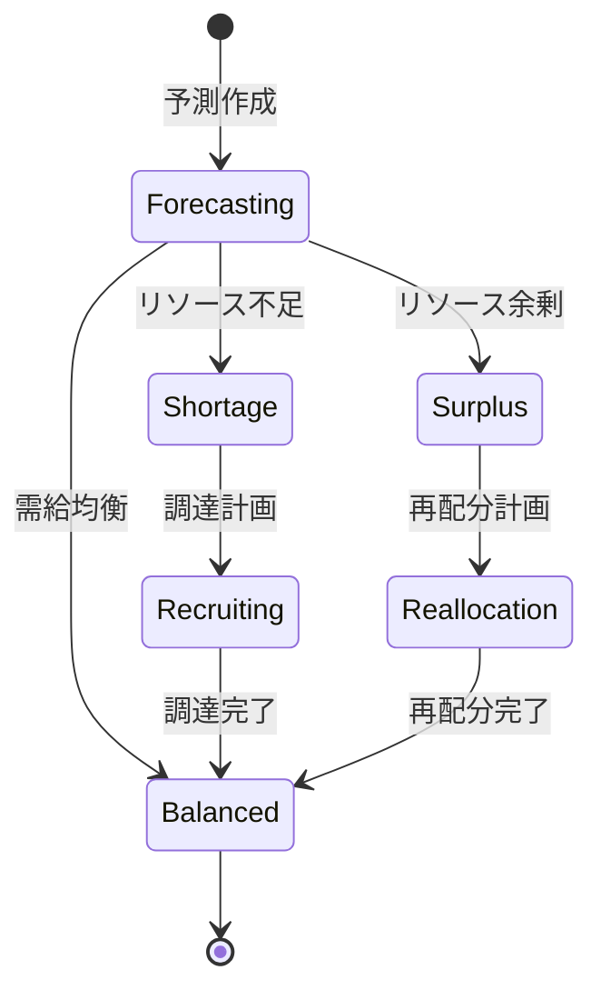

**KPI**:
- **予測精度**: 実績との乖離15%以内
- **予測期間**: 6ヶ月先までを月次更新
- **リソース不足率**: 需要の95%以上を充足
- **早期警告**: リソース不足を2ヶ月前に検知

**ビジネスルール**:
- 予測シナリオ: 楽観的、現実的、悲観的の3シナリオ
- 更新頻度: 月次で予測を更新
- 閾値: 需給ギャップが20%以上で調達計画

**入力**:
- プロジェクト計画（期間、規模、スキル要件）
- 営業パイプライン情報
- 現在のリソース状況
- 過去の需要実績

**出力**:
- リソース需要予測レポート
- スキル別需要グラフ
- 需給ギャップ分析
- 調達計画提案

**例外処理**:
- **急な大型案件**: 緊急予測更新
- **予測精度低下**: 予測モデルの見直し
- **データ不足**: 類似プロジェクトデータで補完

**派生ユースケース**:
1. プロジェクト計画を収集する
2. スキル別需要を集計する
3. 需給ギャップを分析する
4. 調達計画を策定する

---

### オペレーション4-2: リソースを配分し調整する

**パターン**: Workflow

**目的**: プロジェクトにリソースを配分し、状況に応じて調整する

**ゴール**: すべてのプロジェクトに必要なリソースが配分され、稼働が開始される

**関係者とロール**:
- **リソースマネージャー**: リソース配分の決定、調整
- **PM**: リソース要求、受入
- **メンバー**: アサイン受諾

**プロセスフロー**:
```mermaid
flowchart LR
    A[リソース要求] --> B[優先順位評価]
    B --> C[利用可能リソース確認]
    C --> D[配分案作成]
    D --> E[調整会議]
    E --> F[配分決定]
    F --> G[アサイン実行]
```

**ビジネス状態遷移**:
```mermaid
stateDiagram-v2
    [*] --> Requested: 要求
    Requested --> UnderReview: 審査中
    UnderReview --> Allocated: 配分決定
    Allocated --> Assigned: アサイン完了
    Assigned --> Active: 稼働中
    Active --> Completed: 完了
    Completed --> [*]

    Active --> Reallocated: 再配分
    Reallocated --> Assigned: 再アサイン
```

**KPI**:
- **配分リードタイム**: 要求から配分まで1週間以内
- **充足率**: リソース要求の90%以上を充足
- **公平性**: PMのリソース満足度4.0以上（5点満点）
- **変更率**: プロジェクト期間中の変更10%以下

**ビジネスルール**:
- 優先順位: 戦略重要度、緊急度、契約条件で評価
- 配分期間: 最低3ヶ月以上の配分を推奨
- 稼働率: 1メンバーの合計稼働率は100%以下
- 調整会議: 週次で配分調整会議を開催

**入力**:
- リソース要求（スキル、期間、人数）
- プロジェクト優先順位
- 現在のリソース配分状況
- メンバーの可用性

**出力**:
- リソース配分計画
- アサインメント一覧
- 配分理由書
- 調整議事録

**例外処理**:
- **要求過多**: 優先順位による取捨選択
- **スキル不足**: 外部調達、育成による対応
- **配分競合**: 調整会議でのネゴシエーション

**派生ユースケース**:
1. リソースを要求する
2. 優先順位を評価する
3. リソースを配分する
4. 配分を調整する

---

### オペレーション4-3: 稼働率を監視し最適化する

**パターン**: Analytics

**目的**: メンバーの稼働率を監視し、適正範囲に維持する

**ゴール**: 全メンバーの稼働率が適正範囲に維持され、燃え尽きが防止される

**関係者とロール**:
- **リソースマネージャー**: 稼働率監視、最適化
- **マネージャー**: メンバーの状況確認、調整
- **メンバー**: 稼働率報告

**プロセスフロー**:
```mermaid
flowchart LR
    A[稼働率データ収集] --> B[稼働率計算]
    B --> C[閾値チェック]
    C --> D{異常あり?}
    D -->|Yes| E[アラート発行]
    D -->|No| F[継続監視]
    E --> G[原因分析]
    G --> H[最適化アクション]
```

**ビジネス状態遷移**:
```mermaid
stateDiagram-v2
    [*] --> Optimal: 適正
    Optimal --> Underutilized: 低稼働
    Optimal --> Overutilized: 過稼働
    Underutilized --> Optimal: 調整
    Overutilized --> Critical: 危機的
    Critical --> Optimal: 緊急調整
    Optimal --> [*]
```

**KPI**:
- **適正稼働率**: 75-85%の範囲に90%以上のメンバーが収まる
- **過稼働率**: 100%超過メンバー5%以下
- **低稼働率**: 50%未満メンバー10%以下
- **アラート対応時間**: アラート発行後24時間以内に対策

**ビジネスルール**:
- 適正稼働率: 75-85%を目標
- 警告閾値: 90%超過または50%未満で警告
- 危機的閾値: 100%超過または30%未満で緊急対応
- 監視頻度: 週次で稼働率を更新

**入力**:
- 工数実績データ
- アサインメント情報
- プロジェクト予定
- 休暇・休職情報

**出力**:
- 稼働率レポート
- 稼働率ダッシュボード
- アラート通知
- 最適化提案

**例外処理**:
- **急激な過稼働**: 即座にアサイン調整、支援追加
- **継続的低稼働**: 新規アサイン、社内プロジェクト参加
- **データ遅延**: 暫定データで監視、後日精算

**派生ユースケース**:
1. 稼働率を確認する
2. 過稼働を検知する
3. 低稼働を検知する
4. 稼働率を最適化する

---

## まとめ

タレント最適化サービスは、4つのビジネスケーパビリティと12のビジネスオペレーションから構成され、組織の人的リソースを最大限に活用し、チームの生産性を最大化します。

各オペレーションは明確なゴール、KPI、ビジネスルールを持ち、プロセスフローと状態遷移が定義されています。これにより、メンバー管理からチーム編成、スキル開発、リソース配分まで、人材管理の全プロセスが体系的に管理されます。