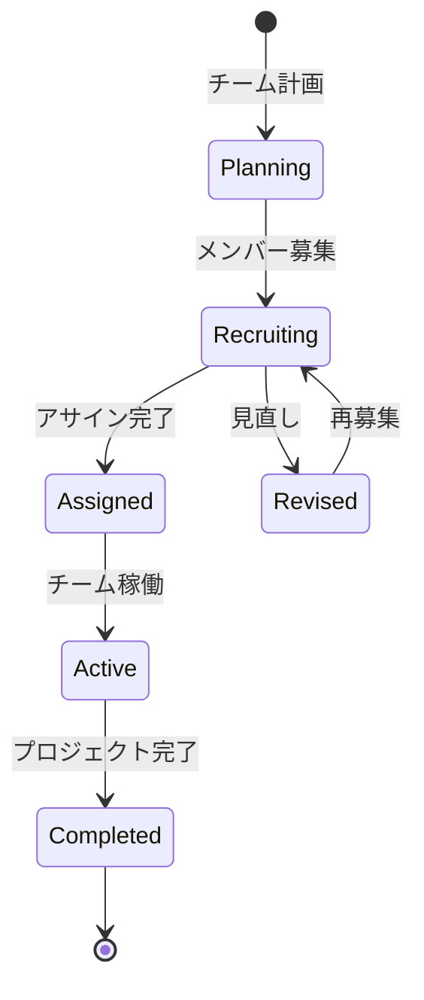

# ビジネスオペレーション: チームを編成する

**バージョン**: 1.0.0
**更新日**: 2025-10-01

## 概要

**目的**: プロジェクトに最適なメンバーを選定し、チームを編成する

**パターン**: Workflow

**ゴール**: プロジェクトに必要なスキルを持つメンバーで構成されたチームが編成される

## 関係者とロール

- **PM**: チーム要件の定義、メンバー選定
- **リソースマネージャー**: メンバーの可用性確認、調整
- **メンバー**: アサイン受諾、辞退

## プロセスフロー

> **重要**: プロセスフローは必ず番号付きリスト形式で記述してください。
> Mermaid形式は使用せず、テキスト形式で記述することで、代替フローと例外フローが視覚的に分離されたフローチャートが自動生成されます。

1. システムがプロジェクト要件定義を処理する
2. システムが必要スキル特定を処理する
3. システムが候補者検索を処理する
4. システムが可用性確認を実行する
5. システムがメンバー選定を処理する
6. システムがアサイン打診を処理する
7. システムが承諾確認を実行する
8. システムがチーム確定を処理する

## 代替フロー

### 代替フロー1: 情報不備
- 2-1. システムが情報の不備を検知する
- 2-2. システムが修正要求を送信する
- 2-3. ユーザーが情報を修正し再実行する
- 2-4. 基本フロー2に戻る

## 例外処理

### 例外1: システムエラー
- システムエラーが発生した場合
- エラーメッセージを表示する
- 管理者に通知し、ログに記録する

### 例外2: 承認却下
- 承認が却下された場合
- 却下理由をユーザーに通知する
- 修正後の再実行を促す

## ビジネス状態

## KPI

- **チーム編成リードタイム**: プロジェクト開始2週間前に確定
- **スキル充足率**: 必要スキルの95%以上をカバー
- **メンバー承諾率**: 打診の80%以上が承諾
- **チーム安定性**: プロジェクト期間中のメンバー変更10%以下

## ビジネスルール

- チームサイズ: 5-7名を標準とする
- スキルバランス: シニア:ミドル:ジュニア = 2:3:2
- 稼働率上限: 1メンバーの合計稼働率は100%以下
- アサイン期間: 最低3ヶ月以上

## 入出力仕様

### 入力

- **プロジェクト要件**: 期間、スコープ、予算、納期
- **必要スキルリスト**: スキル名、レベル、必要人数
- **メンバープール**: 利用可能なメンバーのリスト
- **既存アサイン状況**: メンバーの現在の稼働率

### 出力

- **チーム編成表**: メンバー名、役割、稼働率、期間
- **メンバープロファイル**: 各メンバーのスキルと経験
- **スキルマップ**: チーム全体のスキルカバー状況
- **アサイン計画**: 詳細なアサインスケジュール

## 例外処理

- **スキル不足**: 外部調達検討、研修による短期育成、スコープ調整
- **アサイン辞退**: 代替候補の選定、条件調整
- **稼働率超過**: 既存アサインの調整、優先順位付け、期間調整

## 派生ユースケース

このビジネスオペレーションから以下のユースケースが派生します：

1. プロジェクト要件を定義する
2. 必要スキルを特定する
3. 候補者を検索する
4. メンバーをアサインする
