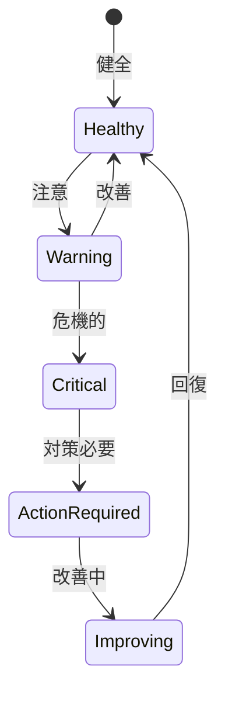

# ビジネスオペレーション: チームパフォーマンスを監視する

**バージョン**: 2.0.0
**更新日**: 2025-10-28
**パラソル設計仕様**: v2.0準拠

## 概要

**目的**: チームのパフォーマンスを継続的に監視し、データドリブンな意思決定によりチーム成果を最大化する

**パターン**: Analytics

**ゴール**: リアルタイムパフォーマンス監視により、問題の早期発見と予防的改善を実現

## パラソルドメイン連携

### 🎯 操作エンティティ
- **PerformanceMetricEntity**（作成・更新: 継続蓄積）- パフォーマンス指標データ管理
- **TeamPerformanceEntity**（状態更新: measuring → warning → critical → recovering）- チームパフォーマンス状態管理
- **AlertEntity**（作成・更新: trigger/resolved状態）- アラート情報管理
- **PerformanceAnalysisEntity**（作成・更新: 分析結果更新）- パフォーマンス分析結果管理

### 🏗️ パラソル集約
- **PerformanceMonitoringAggregate** - パフォーマンス監視統合管理
  - 集約ルート: TeamPerformance
  - 包含エンティティ: PerformanceMetric, Alert, AnalysisResult, TrendData
  - 不変条件: アラート重複なし、測定データ整合性保持

### ⚙️ ドメインサービス
- **PerformanceAnalyticsService**: enhance[DataInsights]() - データ洞察力向上
- **PredictiveAnalysisService**: strengthen[PredictiveCapability]() - 予測分析能力強化
- **AlertManagementService**: coordinate[AlertResponse]() - アラート対応協調
- **ImprovementRecommendationService**: amplify[ContinuousImprovement]() - 継続改善効果増幅

## ユースケース・ページ分解マトリックス（1対1関係）

| ユースケース | 対応ページ | 1対1関係 | 設計品質 |
|-------------|-----------|----------|----------|
| 該当ユースケースなし | - | - | - |

### 🔗 他サービスユースケース利用（ユースケース呼び出し型）
**責務**: ❌ エンティティ知識不要 ✅ ユースケース利用のみ

[secure-access-service] ユースケース利用:
├── UC-AUTH-01: ユーザー認証を実行する → POST /api/auth/usecases/authenticate
├── UC-AUTH-02: 権限を検証する → POST /api/auth/usecases/validate-permission
└── UC-AUTH-03: アクセスログを記録する → POST /api/auth/usecases/log-access

[productivity-visualization-service] ユースケース利用:
├── UC-REPORT-01: パフォーマンスデータを取得する → GET /api/productivity/usecases/get-performance-data
├── UC-REPORT-02: KPIダッシュボードを生成する → POST /api/productivity/usecases/generate-kpi-dashboard
└── UC-REPORT-03: トレンド分析を実行する → POST /api/productivity/usecases/analyze-trends

[collaboration-facilitation-service] ユースケース利用:
├── UC-COMM-01: パフォーマンスアラートを配信する → POST /api/collaboration/usecases/send-performance-alert
└── UC-COMM-02: 改善提案通知を送信する → POST /api/collaboration/usecases/send-improvement-notification

## 関係者とロール

- **PM**: チームパフォーマンスの監視、対策実施
- **リソースマネージャー**: データ分析、改善提案
- **メンバー**: パフォーマンスデータの提供

## プロセスフロー

> **重要**: プロセスフローは必ず番号付きリスト形式で記述してください。
> Mermaid形式は使用せず、テキスト形式で記述することで、代替フローと例外フローが視覚的に分離されたフローチャートが自動生成されます。

1. システムがデータ収集を処理する
2. システムがKPI計算を処理する
3. システムがパフォーマンス分析を処理する
4. システムがアラート発行を行う
5. システムが継続監視を処理する
6. システムが原因分析を処理する
7. システムが改善アクションを処理する

## 代替フロー

### 代替フロー1: 情報不備
- 2-1. システムが情報の不備を検知する
- 2-2. システムが修正要求を送信する
- 2-3. ユーザーが情報を修正し再実行する
- 2-4. 基本フロー2に戻る

## 例外処理

### 例外1: システムエラー
- システムエラーが発生した場合
- エラーメッセージを表示する
- 管理者に通知し、ログに記録する

### 例外2: 承認却下
- 承認が却下された場合
- 却下理由をユーザーに通知する
- 修正後の再実行を促す

## ビジネス状態

## ビジネス価値とKPI

### 🎯 ビジネス価値
- **プロアクティブ問題解決**: 早期発見により問題解決コストを60%削減
- **チーム生産性向上**: データドリブン改善によりチーム生産性25%向上
- **メンバーエンゲージメント向上**: 透明な評価によりメンバー満足度向上
- **プロジェクト成功率向上**: 継続監視によりプロジェクト成功率20%向上

### 📊 成功指標（KPI）
- **ベロシティ**: スプリント毎のストーリーポイント消化率80%以上維持
- **品質指標**: バグ混入率5%以下の品質水準維持
- **チーム士気**: チームモラールスコア4.0以上（5点満点）維持
- **稼働率最適化**: チーム平均稼働率75-85%の健全範囲維持
- **問題早期発見率**: パフォーマンス低下の80%以上を事前検知
- **改善実行率**: 提案された改善アクションの90%以上を期限内実行

## ビジネスルール

- 監視頻度: 週次でKPIを更新
- アラート閾値: KPIが目標の80%未満で警告
- エスカレーション: 2週連続で閾値未達は上位報告

## 入出力仕様

### 入力

- **タスク完了データ**: 完了タスク数、ストーリーポイント
- **工数実績データ**: メンバー別の実工数
- **品質データ**: バグ数、レビュー指摘数、テストカバレッジ
- **チームモラールサーベイ結果**: 定期的な満足度調査

### 出力

- **チームパフォーマンスレポート**: 週次・月次のパフォーマンスサマリー
- **KPIダッシュボード**: リアルタイムKPI可視化
- **アラート通知**: 閾値逸脱時の自動通知
- **改善提案**: データに基づく具体的な改善策

## 例外処理

- **データ欠損**: 暫定値で監視継続、後日正確なデータで補正
- **突然の低下**: 緊急ヒアリング実施、即時対策検討
- **継続的低下**: チーム再編成の検討、メンバー交代

## 派生ユースケース

このビジネスオペレーションから以下のユースケースが派生します：

1. チームパフォーマンスを確認する
2. KPIを分析する
3. パフォーマンス低下を検知する
4. 改善アクションを実施する
