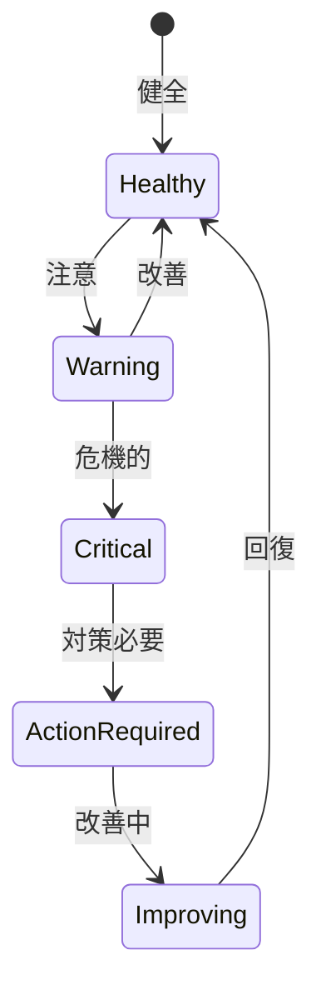

# ビジネスオペレーション: チームパフォーマンスを監視する

**バージョン**: 1.0.0
**更新日**: 2025-10-01

## 概要

**目的**: チームのパフォーマンスを継続的に監視し、問題を早期に発見する

**パターン**: Analytics

**ゴール**: チームパフォーマンスが可視化され、課題が早期に特定される

## 関係者とロール

- **PM**: チームパフォーマンスの監視、対策実施
- **リソースマネージャー**: データ分析、改善提案
- **メンバー**: パフォーマンスデータの提供

## プロセスフロー

> **重要**: プロセスフローは必ず番号付きリスト形式で記述してください。
> Mermaid形式は使用せず、テキスト形式で記述することで、代替フローと例外フローが視覚的に分離されたフローチャートが自動生成されます。

1. システムがデータ収集を処理する
2. システムがKPI計算を処理する
3. システムがパフォーマンス分析を処理する
4. システムがアラート発行を行う
5. システムが継続監視を処理する
6. システムが原因分析を処理する
7. システムが改善アクションを処理する

## 代替フロー

### 代替フロー1: 情報不備
- 2-1. システムが情報の不備を検知する
- 2-2. システムが修正要求を送信する
- 2-3. ユーザーが情報を修正し再実行する
- 2-4. 基本フロー2に戻る

## 例外処理

### 例外1: システムエラー
- システムエラーが発生した場合
- エラーメッセージを表示する
- 管理者に通知し、ログに記録する

### 例外2: 承認却下
- 承認が却下された場合
- 却下理由をユーザーに通知する
- 修正後の再実行を促す

## ビジネス状態

## KPI

- **ベロシティ**: スプリント毎のストーリーポイント消化率80%以上
- **品質**: バグ混入率5%以下
- **士気**: チームモラールスコア4.0以上（5点満点）
- **稼働率**: チーム平均稼働率75-85%

## ビジネスルール

- 監視頻度: 週次でKPIを更新
- アラート閾値: KPIが目標の80%未満で警告
- エスカレーション: 2週連続で閾値未達は上位報告

## 入出力仕様

### 入力

- **タスク完了データ**: 完了タスク数、ストーリーポイント
- **工数実績データ**: メンバー別の実工数
- **品質データ**: バグ数、レビュー指摘数、テストカバレッジ
- **チームモラールサーベイ結果**: 定期的な満足度調査

### 出力

- **チームパフォーマンスレポート**: 週次・月次のパフォーマンスサマリー
- **KPIダッシュボード**: リアルタイムKPI可視化
- **アラート通知**: 閾値逸脱時の自動通知
- **改善提案**: データに基づく具体的な改善策

## 例外処理

- **データ欠損**: 暫定値で監視継続、後日正確なデータで補正
- **突然の低下**: 緊急ヒアリング実施、即時対策検討
- **継続的低下**: チーム再編成の検討、メンバー交代

## 派生ユースケース

このビジネスオペレーションから以下のユースケースが派生します：

1. チームパフォーマンスを確認する
2. KPIを分析する
3. パフォーマンス低下を検知する
4. 改善アクションを実施する
