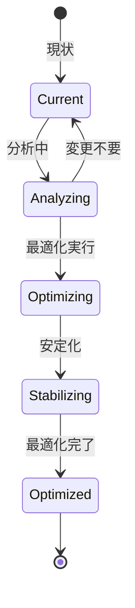

# ビジネスオペレーション: チーム構成を最適化する

**バージョン**: 1.0.0
**更新日**: 2025-10-01

## 概要

**目的**: チームパフォーマンスに基づき、チーム構成を最適化する

**パターン**: Workflow + Analytics

**ゴール**: チーム構成が最適化され、パフォーマンスが改善される

## 関係者とロール

- **PM**: チーム最適化の判断、実行
- **リソースマネージャー**: メンバー調整、再配置
- **メンバー**: 新たなアサインの受諾

## プロセスフロー

> **重要**: プロセスフローは必ず番号付きリスト形式で記述してください。
> Mermaid形式は使用せず、テキスト形式で記述することで、代替フローと例外フローが視覚的に分離されたフローチャートが自動生成されます。

1. システムがパフォーマンス課題特定を処理する
2. システムが要因分析を処理する
3. システムが最適化案策定を処理する
4. システムが影響評価を処理する
5. システムが承認を行う
6. システムがメンバー調整を処理する
7. システムがチーム再編成を処理する
8. システムが効果測定を処理する

## 代替フロー

### 代替フロー1: 情報不備
- 2-1. システムが情報の不備を検知する
- 2-2. システムが修正要求を送信する
- 2-3. ユーザーが情報を修正し再実行する
- 2-4. 基本フロー2に戻る

## 例外処理

### 例外1: システムエラー
- システムエラーが発生した場合
- エラーメッセージを表示する
- 管理者に通知し、ログに記録する

### 例外2: 承認却下
- 承認が却下された場合
- 却下理由をユーザーに通知する
- 修正後の再実行を促す

## ビジネス状態

## KPI

- **最適化効果**: 再編成後、パフォーマンス20%向上
- **安定化期間**: 再編成後2週間以内に安定
- **メンバー満足度**: 再編成後の満足度4.0以上（5点満点）
- **最適化実施率**: 課題特定の60%で最適化を実施

## ビジネスルール

- 最適化トリガー: パフォーマンス目標未達が2週連続
- メンバー変更: 1回の最適化で30%以下の変更に抑制
- タイミング: マイルストーン間での実施を推奨

## 入出力仕様

### 入力

- **チームパフォーマンスデータ**: KPI、ベロシティ、品質指標
- **メンバーフィードバック**: チーム内の課題・不満
- **スキルギャップ分析**: 現状スキルと必要スキルの差
- **プロジェクト状況**: 進捗、納期、リスク

### 出力

- **最適化提案書**: 課題、解決策、期待効果
- **新チーム編成表**: 変更後のチーム構成
- **移行計画**: 再編成のスケジュールと手順
- **効果測定レポート**: 再編成前後のパフォーマンス比較

## 例外処理

- **メンバー抵抗**: 丁寧な説明、代替案提示、個別面談
- **最適化失敗**: 原因分析、再最適化または元に戻す
- **プロジェクト影響**: 最小限の変更に抑制、段階的実施

## 派生ユースケース

このビジネスオペレーションから以下のユースケースが派生します：

1. チーム課題を特定する
2. 最適化案を策定する
3. チームを再編成する
4. 最適化効果を測定する
