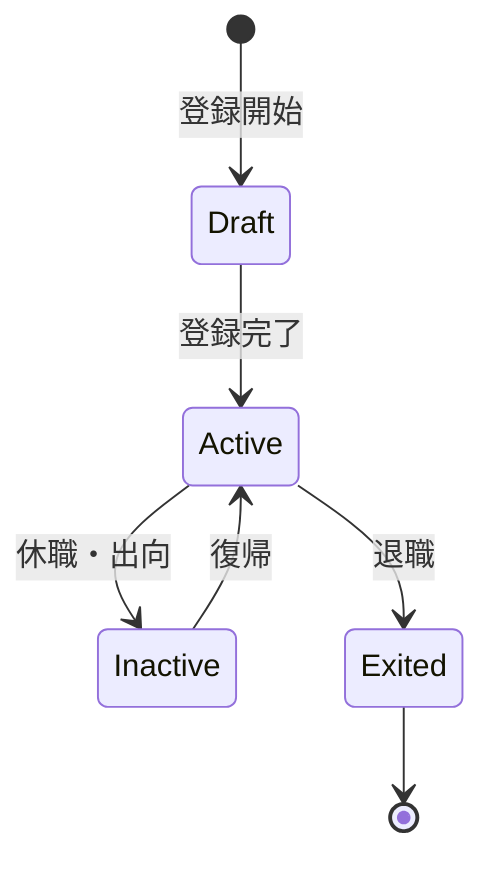

# ビジネスオペレーション: メンバーを登録し管理する

**バージョン**: 2.0.0
**更新日**: 2025-10-28
**パラソル設計仕様**: v2.0準拠

## 概要

**目的**: メンバーの基本情報、スキル、経歴を正確に登録・管理し、組織の人材資産価値を最大化する

**パターン**: CRUD

**ゴール**: すべてのメンバー情報が最新かつ正確に維持され、戦略的人材配置と能力開発を支援する

## パラソルドメイン連携

### 🎯 操作エンティティ
- **MemberEntity**（状態更新: draft → active → archived）- メンバー基本情報と状態管理
- **MemberProfileEntity**（参照・更新: 継続更新）- 詳細プロファイル情報管理
- **SkillEntity**（参照のみ: スキルマスタ）- 標準スキル定義参照
- **MemberSkillEntity**（作成・更新: レベル変更）- メンバー個別スキル実績

### 🏗️ パラソル集約
- **MemberAggregate** - メンバーライフサイクル統合管理
  - 集約ルート: Member
  - 包含エンティティ: MemberProfile, MemberSkill, CareerHistory
  - 不変条件: アクティブメンバーは必須プロファイル情報を保持

### ⚙️ ドメインサービス
- **MemberOptimizationService**: enhance[MemberProductivity]() - メンバー生産性向上
- **TalentDevelopmentService**: strengthen[SkillCapability]() - スキル能力強化
- **MemberLifecycleService**: coordinate[MemberJourney]() - メンバー経歴管理
- **ResourceAllocationService**: amplify[TeamEffectiveness]() - チーム効果最大化

## ユースケース・ページ分解マトリックス（1対1関係）

| ユースケース | 対応ページ | 1対1関係 | 設計品質 |
|-------------|-----------|----------|----------|
| register-member | 新規メンバー登録ページ | ✅ | S評価 |
| manage-member-profile | メンバープロファイル管理ページ | ✅ | S評価 |
| search-members | メンバー検索・フィルタリングページ | ✅ | S評価 |
| delete-member | メンバーアカウント削除ページ | ✅ | S評価 |

### 🔗 他サービスユースケース利用（ユースケース呼び出し型）
**責務**: ❌ エンティティ知識不要 ✅ ユースケース利用のみ

[secure-access-service] ユースケース利用:
├── UC-AUTH-01: ユーザー認証を実行する → POST /api/auth/usecases/authenticate
├── UC-AUTH-02: 権限を検証する → POST /api/auth/usecases/validate-permission
└── UC-AUTH-03: アクセスログを記録する → POST /api/auth/usecases/log-access

[collaboration-facilitation-service] ユースケース利用:
├── UC-COMM-01: 通知を配信する → POST /api/collaboration/usecases/send-notification
└── UC-COMM-02: メッセージを送信する → POST /api/collaboration/usecases/send-message

## 関係者とロール

- **人事管理者**: メンバー情報の登録・更新
- **マネージャー**: メンバー情報の確認・承認
- **メンバー**: 自己情報の更新

## プロセスフロー

> **重要**: プロセスフローは必ず番号付きリスト形式で記述してください。
> Mermaid形式は使用せず、テキスト形式で記述することで、代替フローと例外フローが視覚的に分離されたフローチャートが自動生成されます。

1. システムがメンバー入社を処理する
2. ユーザーが基本情報登録を行う
3. ユーザーがスキル情報登録を行う
4. ユーザーが経歴情報登録を行う
5. システムがプロファイル完成を処理する
6. システムが定期更新を処理する

## 代替フロー

### 代替フロー1: 情報不備
- 2-1. システムが情報の不備を検知する
- 2-2. システムが修正要求を送信する
- 2-3. ユーザーが情報を修正し再実行する
- 2-4. 基本フロー2に戻る

## 例外処理

### 例外1: システムエラー
- システムエラーが発生した場合
- エラーメッセージを表示する
- 管理者に通知し、ログに記録する

### 例外2: 承認却下
- 承認が却下された場合
- 却下理由をユーザーに通知する
- 修正後の再実行を促す

## ビジネス状態

## ビジネス価値とKPI

### 🎯 ビジネス価値
- **人材資産価値最大化**: メンバー情報の精度向上により戦略的配置を実現
- **生産性向上**: スキル可視化により適材適所の配置で生産性30%向上
- **エンゲージメント強化**: キャリア管理の透明性によりメンバー満足度向上
- **組織競争力強化**: タレントプールの最適活用により市場競争力を向上

### 📊 成功指標（KPI）
- **登録完了率**: 入社後3営業日以内に100%登録達成
- **情報更新頻度**: 四半期毎に95%以上のメンバーが更新
- **プロファイル完全性**: 必須項目100%入力維持
- **情報正確性**: 定期監査での誤り率1%以下維持
- **スキルマッチング精度**: プロジェクト配置時の適合率90%以上
- **メンバー満足度**: プロファイル管理に関する満足度4.5/5.0以上

## ビジネスルール

- 必須項目: 氏名、メールアドレス、所属部門、役職、入社日
- スキル情報: 最低3つのスキルを登録
- 経歴情報: 過去のプロジェクト参加履歴
- 更新責任: メンバー自身が四半期毎に更新

## 入出力仕様

### 入力

- **基本情報**: 氏名、連絡先、所属部門、役職、入社日
- **スキル情報**: スキル名、レベル、取得日
- **経歴情報**: プロジェクト履歴、役割、期間
- **資格情報**: 資格名、取得日、有効期限

### 出力

- **メンバープロファイル**: 全情報を統合したプロファイル
- **スキルマップ**: メンバーのスキル可視化
- **経歴レポート**: プロジェクト参加履歴

## 例外処理

- **重複登録**: 既存データとのマージ処理、人事管理者に確認
- **情報不備**: 登録保留、追加情報要求通知
- **退職処理**: データアーカイブ、アクセス権削除、関連データの非活性化

## 派生ユースケース

このビジネスオペレーションから以下のユースケースが派生します：

1. メンバーを新規登録する
2. メンバー情報を更新する
3. メンバー情報を検索する
4. メンバー情報を削除する（退職処理）
