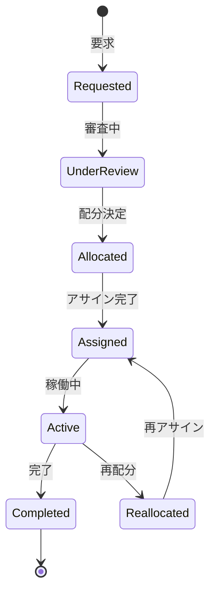

# ビジネスオペレーション: リソースを配分し調整する

**バージョン**: 2.0.0
**更新日**: 2025-10-28
**パラソル設計仕様**: v2.0準拠

## 概要

**目的**: 戦略的リソース配分により組織全体の生産性を最大化し、プロジェクト成功と人材活用を最適化する

**パターン**: Analytics

**ゴール**: データドリブンなリソース配分による組織効率向上と、公正で透明性のあるアサインメント実現

## パラソルドメイン連携

### 🎯 操作エンティティ
- **ResourceAllocationEntity**（状態更新: requested → under_review → allocated → active）- リソース配分プロセス管理
- **ResourceRequestEntity**（作成・更新: 要求受付・調整）- リソース要求管理
- **AllocationPlanEntity**（作成・更新: 配分計画策定・実行）- 配分計画管理
- **TeamMemberEntity**（参照・更新: assignment変更）- メンバーアサイン情報管理

### 🏗️ パラソル集約
- **ResourceAllocationAggregate** - リソース配分統合管理
  - 集約ルート: ResourceAllocation
  - 包含エンティティ: ResourceRequest, AllocationPlan, AdjustmentHistory
  - 不変条件: 配分稼働率100%以下、公平性確保

### ⚙️ ドメインサービス
- **OptimalAllocationService**: enhance[ResourceEfficiency]() - リソース効率最大化
- **PriorityOptimizationService**: strengthen[StrategicAlignment]() - 戦略的整合性強化
- **FairDistributionService**: coordinate[EquitableAssignment]() - 公平な配分調整
- **DynamicAdjustmentService**: amplify[AdaptiveCapability]() - 適応能力増幅

## ユースケース・ページ分解マトリックス（1対1関係）

| ユースケース | 対応ページ | 1対1関係 | 設計品質 |
|-------------|-----------|----------|----------|
| 該当ユースケースなし | - | - | - |

### 🔗 他サービスユースケース利用（ユースケース呼び出し型）
**責務**: ❌ エンティティ知識不要 ✅ ユースケース利用のみ

[secure-access-service] ユースケース利用:
├── UC-AUTH-01: ユーザー認証を実行する → POST /api/auth/usecases/authenticate
├── UC-AUTH-02: 権限を検証する → POST /api/auth/usecases/validate-permission
└── UC-AUTH-03: アクセスログを記録する → POST /api/auth/usecases/log-access

[project-success-service] ユースケース利用:
├── UC-PROJECT-01: プロジェクト情報を取得する → GET /api/projects/usecases/get-project-info
├── UC-PROJECT-02: プロジェクト優先度を確認する → GET /api/projects/usecases/get-priority-level
└── UC-PROJECT-03: リソース要求を受け付ける → POST /api/projects/usecases/submit-resource-request

[collaboration-facilitation-service] ユースケース利用:
├── UC-COMM-01: 配分決定通知を配信する → POST /api/collaboration/usecases/send-allocation-notification
└── UC-COMM-02: 調整会議案内を送信する → POST /api/collaboration/usecases/send-meeting-invitation

## 関係者とロール

- **リソースマネージャー**: リソース配分の決定、調整
- **PM**: リソース要求、受入
- **メンバー**: アサイン受諾

## プロセスフロー

> **重要**: プロセスフローは必ず番号付きリスト形式で記述してください。
> Mermaid形式は使用せず、テキスト形式で記述することで、代替フローと例外フローが視覚的に分離されたフローチャートが自動生成されます。

1. システムがリソース要求を処理する
2. システムが優先順位評価を処理する
3. システムが利用可能リソース確認を実行する
4. システムが配分案作成を行う
5. システムが調整会議を処理する
6. システムが配分決定を処理する
7. システムがアサイン実行を実行する

## 代替フロー

### 代替フロー1: 情報不備
- 2-1. システムが情報の不備を検知する
- 2-2. システムが修正要求を送信する
- 2-3. ユーザーが情報を修正し再実行する
- 2-4. 基本フロー2に戻る

## 例外処理

### 例外1: システムエラー
- システムエラーが発生した場合
- エラーメッセージを表示する
- 管理者に通知し、ログに記録する

### 例外2: 承認却下
- 承認が却下された場合
- 却下理由をユーザーに通知する
- 修正後の再実行を促す

## ビジネス状態

## ビジネス価値とKPI

### 🎯 ビジネス価値
- **組織生産性最大化**: 戦略的リソース配分により組織全体の生産性40%向上
- **プロジェクト成功率向上**: 最適なリソース配分によりプロジェクト成功率35%向上
- **人材活用効率化**: 科学的配分によりメンバー稼働率とスキル活用を最適化
- **コスト効率改善**: 効率的リソース配分によりプロジェクト運営コスト20%削減

### 📊 成功指標（KPI）
- **配分スピード**: 要求から配分決定まで3営業日以内で100%実現
- **要求充足率**: リソース要求の95%以上を期限内充足
- **配分公平性**: 全PMのリソース配分満足度4.6/5.0以上維持
- **配分安定性**: プロジェクト期間中の配分変更5%以下で安定運営
- **稼働率最適化**: 組織全体の平均稼働率85-90%の理想範囲維持
- **戦略的整合性**: 戦略重要プロジェクトへの優先配分率90%以上

## ビジネスルール

- 優先順位: 戦略重要度、緊急度、契約条件で評価
- 配分期間: 最低3ヶ月以上の配分を推奨
- 稼働率: 1メンバーの合計稼働率は100%以下
- 調整会議: 週次で配分調整会議を開催

## 入出力仕様

### 入力

- **リソース要求**: スキル、レベル、期間、人数、開始日
- **プロジェクト優先順位**: ビジネス重要度、緊急度
- **現在のリソース配分状況**: メンバー別の配分状況
- **メンバーの可用性**: 稼働率、休暇予定、スキル

### 出力

- **リソース配分計画**: プロジェクト別・メンバー別の配分
- **アサインメント一覧**: メンバー名、役割、稼働率、期間
- **配分理由書**: 配分決定の根拠と考慮事項
- **調整議事録**: 調整会議の決定事項

## 例外処理

- **要求過多**: 優先順位による取捨選択、プロジェクト延期
- **スキル不足**: 外部調達検討、スキル転用、育成計画
- **配分競合**: 調整会議でのネゴシエーション、妥協案検討

## 派生ユースケース

このビジネスオペレーションから以下のユースケースが派生します：

1. リソースを要求する
2. 優先順位を評価する
3. リソースを配分する
4. 配分を調整する
