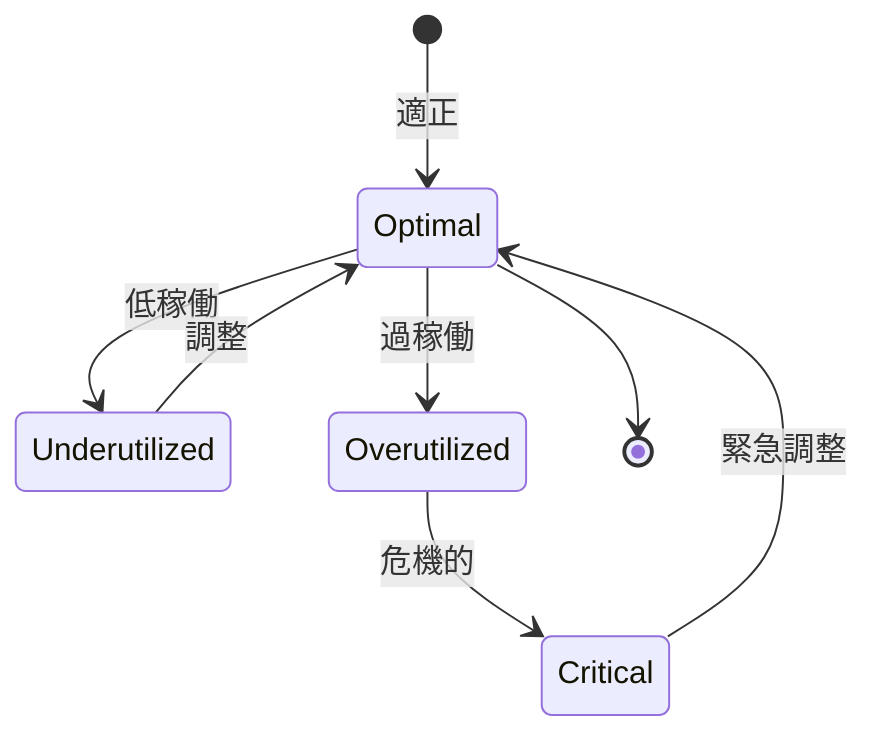

# ビジネスオペレーション: 稼働率を監視し最適化する

**バージョン**: 1.0.0
**更新日**: 2025-10-01

## 概要

**目的**: メンバーの稼働率を監視し、適正範囲に維持する

**パターン**: Analytics

**ゴール**: 全メンバーの稼働率が適正範囲に維持され、燃え尽きが防止される

## 関係者とロール

- **リソースマネージャー**: 稼働率監視、最適化
- **マネージャー**: メンバーの状況確認、調整
- **メンバー**: 稼働率報告

## プロセスフロー

> **重要**: プロセスフローは必ず番号付きリスト形式で記述してください。
> Mermaid形式は使用せず、テキスト形式で記述することで、代替フローと例外フローが視覚的に分離されたフローチャートが自動生成されます。

1. システムが稼働率データ収集を処理する
2. システムが稼働率計算を処理する
3. システムが閾値チェックを処理する
4. システムがアラート発行を行う
5. システムが継続監視を処理する
6. システムが原因分析を処理する
7. システムが最適化アクションを処理する

## 代替フロー

### 代替フロー1: 情報不備
- 2-1. システムが情報の不備を検知する
- 2-2. システムが修正要求を送信する
- 2-3. ユーザーが情報を修正し再実行する
- 2-4. 基本フロー2に戻る

## 例外処理

### 例外1: システムエラー
- システムエラーが発生した場合
- エラーメッセージを表示する
- 管理者に通知し、ログに記録する

### 例外2: 承認却下
- 承認が却下された場合
- 却下理由をユーザーに通知する
- 修正後の再実行を促す

## ビジネス状態

## KPI

- **適正稼働率**: 75-85%の範囲に90%以上のメンバーが収まる
- **過稼働率**: 100%超過メンバー5%以下
- **低稼働率**: 50%未満メンバー10%以下
- **アラート対応時間**: アラート発行後24時間以内に対策

## ビジネスルール

- 適正稼働率: 75-85%を目標
- 警告閾値: 90%超過または50%未満で警告
- 危機的閾値: 100%超過または30%未満で緊急対応
- 監視頻度: 週次で稼働率を更新

## 入出力仕様

### 入力

- **工数実績データ**: メンバー別のプロジェクト別工数
- **アサインメント情報**: 各メンバーの配分計画
- **プロジェクト予定**: 今後の予定工数
- **休暇・休職情報**: 休暇予定、傷病休暇等

### 出力

- **稼働率レポート**: 週次・月次の稼働率サマリー
- **稼働率ダッシュボード**: リアルタイム稼働率可視化
- **アラート通知**: 閾値逸脱時の自動通知
- **最適化提案**: データに基づく具体的な調整案

## 例外処理

- **急激な過稼働**: 即座にアサイン調整、支援メンバー追加、休暇取得推奨
- **継続的低稼働**: 新規アサイン検討、社内プロジェクト参加、スキル開発
- **データ遅延**: 暫定データで監視継続、後日正確なデータで精算

## 派生ユースケース

このビジネスオペレーションから以下のユースケースが派生します：

1. 稼働率を確認する
2. 過稼働を検知する
3. 低稼働を検知する
4. 稼働率を最適化する
